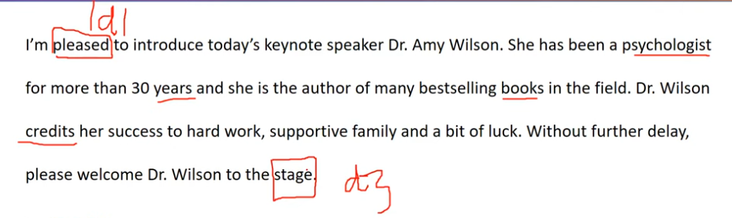
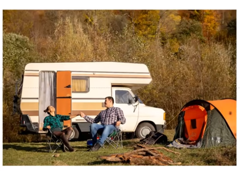
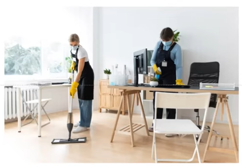
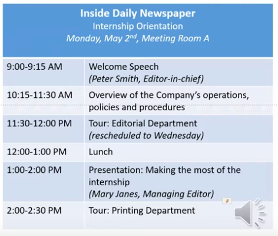

_Link https://www.youtube.com/watch?v=vLhxqi_FybM&list=PL4m9evEVyQlKGhW2_29dd6yNQS_qA8Vi8&index=4_

## Question 1

I'm pleased to introduce today's keynote speaker Dr. Amy Wilson. She has been a psychologist for more than 30 years and she is the author of many bestselling books in the field. Dr.Wilson credits her success to hard work, supportive family and a bit of luck. Without further delay, please welcome Dr. Wilson to the stage.

## Question 2

Welcome to Sanford Supermarket. Today only, you'll get a 50% discount on all fruits and vegetables. Also, don't forget to visit our new bakery section. There is a variety of fresh bread, cookies and pastries for you to choose from. Have a great time and thank you for shopping with us!

## Question 3

To hand = to give

This picture was taken at a camping site. There are 2 people in this picture. They are smiling and holding hands. They are wearing plaid shirts. Both of them are sitting on some chairs and holding hands. On the left, the woman is looking at the sky (the woman has her hair in a bun). On the right, the man is looking at her (wearing jeans). Behind them, I can see a camping car.

## Question 4

This picture was taken in/at an office. There are two people in the picture. They are wearing aprons and yellow gloves/ They are wearing masks. On the left, a woman is mopping the floor. On the right, a woman is holding a spray bottle/ a woman is cleaning/ wiping the table. In the foreground, I can see a white chair./ Around them, I can see some chairs and tables./ On the table, I can see a computer screen./ In the background, I can see a wooden cabinet.

## Question 5

Imagine that a marketing firm is doing some research in your area. You have agreed to participate in a telephone interview about furniture.

What was the last piece of furniture you brought, and where did you buy it?

The last piece of furniture I brought was a table. I brought it at a furniture store near my house. I wanted to give it to my farther on his birthday.

## Question 6

When you want to buy new furniture, do you visit one store or several stores?

I often visit several stores. This is because it allows me to compare many things such as prices and features.

## Question 7

Do you prefer to buy furniture online or in a store?

I prefer to buy furniture online. First, it is time-saving. I do not need to leave the house. Second, it helps me save money. Online stores usually offer customers discounts.

## Question 8

Where will the orientation be held and what time will it start?

The orientation will be held/ will take place in meeting room A and it will start at 9 AM.

## Question 9

I heard that there will be a tour of the editorial department during the orientation. Is that right?

No, you have the wrong information. This tour (the tour of editorial department)/ It has been rescheduled to Wednesday.

## Question 10

Could you give me the details of the sessions after lunch?

There are 2 sessions after lunch. The first session is a presentation on making the most of the internship. It will be given by Mary Janes, the managing director. The second session is a tour of the printing department at 2 PM. It will be led by Ken Thompson, a reporter of the company.

## Question 11

What are some advantages of living in a big city?

There are several advantages of living in a big city. First, there are many job opportunities. This is because many companies are located in a big city. Second, it's good for children. A big city often has many schools. Therefore, children can receive/ get a better education. Take my cousin as example. She was born and grew up in a small city. After graduating from college, she had trouble finding a job/ she struggled to find a job. This is because there were few companies in her city. Therefore, she decided to move to a big city. After only a few months here, she was able to get a good job.
