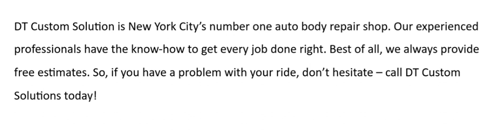

_Link https://www.youtube.com/watch?v=qeoOcfaIw2w&list=PLiqLRyAoFR0CsjN4rtojrmqWYeQCyLJSH_

_Link https://www.youtube.com/watch?v=eCNGw4F4_xM&list=PLiqLRyAoFR0CsjN4rtojrmqWYeQCyLJSH&index=2_

## Question 1

DT Custom Solution is New York City's number one auto body repair shop. Our experienced professional have the know-how to get every job done right. Best of all, we always provide free estimates. So, if you have a problem with your ride, don't hesitate - call DT Custom Solutions today!

## Question 2

 As some of you may know, Derek Murphy is officially leaving Taylor and Kim at the end of the month. To thank Derek for his twenty-five excellent years of service and to say goodbye, the firm is hosting a farewell dinner. So please join us at Sal's Restaurant next Friday at seven thirty P.M.

## Question 3

This is a picture taken in an outdoor park. There is a woman in the picture. In the middle of the picture, a woman with brown hair is having lunch with a salad. She is sitting on a long bench. Next to her, there are a backpack, a notebook and a pen. In the background, I can see the grass and a small house. She seems to be enjoy her lunch with a happy smile.

> park - 1 person/ a woman
>
> sitting on the bench
>
> having/ eating salad
>
> smiling
>
> overalls (and white blouse)
>
> next, a backpack, a notebook, a pen
>
> a lawn surrounded by a fence happy

## Question 4

This is a picture taken in a meeting room. There are 4 people in the picture. In the middle of the picture, a woman with brown hair is giving a presentation. She is also pointing at the projector screen behind her. In front of her, people is gathering around the table and listening to her presentation. One of them is making gesture. On the table, I can see some glasses and documents. It seems they are busy.

> meeting room - 4 people
>
> middle, giving a presentation
>
> pointing at the projector screen - behind her
>
> vest/ glass
>
> in front of her, gathering around the table and listening to her
>
> one of them/ a man on the left making a gesture
>
> on the table, glasses of water (and documents)
>
> busy, having a important meeting

## Question 5

Imagine that a friend is in your town for a few days. You're having a phone conversation about places to go to.

What is a good place to visit in your area, how far is it from the bus station?

A good place to visit in my area is Do Son beach. It is 10 Km from the bus station. I often go to Do Son beach with my family.

Well, I think the good place to visit my area is park named Pac Bo. It is about 100 meters away from the bus station.

> part
>
> tourist attraction
>
> historical site
>
> museum

## Question 6

It sounds like an interesting place. What are some things I can do there?

You can swim and enjoy the seafood. The seafood there is very fresh and tasty.

Let me see. At the park, you can do exercise. You can walk the dog. Or you can have a picnic there. It is an idea place for a picnic.

> do exercise
>
> walk the dog
>
> stoll
>
> have a picnic
>
> who/ what time

## Question 7

If I want to buy some gifts and souvenirs, where would you suggest I go?

I think you should go to the shopping mall. Because there are some souvenir stores there. They offer a variety of items and they have good customer service. Moreover, the prices are really reasonable. I bet that you will find your idea souvenir for your friend if you go there.

> souvenir store/ shop
>
> market
>
> supermarket
>
> shopping mall
>
> offer a variety of items
>
> good customer service = the staff are really nice and friendly
>
> reasonable price

## Question 8

Hi, this is William Reed. I'm staying your hotel next month and I just want to confirm a few details. Can you help me with that where is your hotel located and when is the check-in date?

Our hotel locates at 12 Technology Street in Atlanta. Your check in date is June eighth.

## Question 9

As far as I remember the breakfast buffer start at 6 o'clock in the morning. Is that correct?

No actually, the breakfast buffet starts at 6 AM each morning and ends at 9:30. So, please remember that.

## Question 10

I need to make sure there are no problems with my reservation. Can you confirm the details for me?

You have reserved a King Suite for one night, a facial massage. You agree to use our packing and wifi service. So you have to pay $333 in total. I hope that information will help you.

## Question 11

Do you prefer to eat out at restaurants or to eat at home? Support your answer with reasons or examples.

> restaurant
>
> convenient: go shopping, cook, clean
>
> try many different dishes: require a lot of/ rare ingredients, cooking process is complicated

> home
>
> cleaner: make sure that ... refresh and clean ingredients
>
> save money, eat, spend 100

I prefer to eat out at restaurants for several reasons. Firstly, it is much more convenient. This is because when I eat at restaurant, I just need to go there, make an order and wait for the food to be serve. Compare it to cook at home, I have to go shopping ingredients, prepare and cook the meal and clean after that. Secondly, I can try many different dishes if I eat at the restaurants. There are a lot of dishes that require rare ingredients. All the cooking process is complicated. So it is difficult to cook them at home. Therefore, I want to try that at the restaurants. That's why I think so.

I prefer to eat at home for several reasons. Firstly, it is cleaner. When cooking at home, I make sure that all the ingredients I use are fresh and clean. However, when you eat out at the restaurants, you rarely see them cook or see them shopping. So, it hard for you to know where are the ingredients or they are use fresh or not. Secondly, I can save money if I eat at home. For example, when I and my friends come over to have a hot pot. We only need to pay one hundred thousand VND. But if we go to restaurant, It will cost two hundred thousand VND. That's why I think so.
