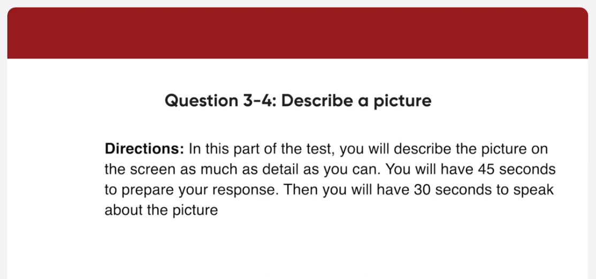
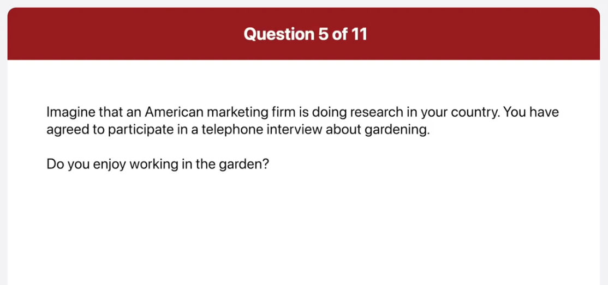

_Link: https://www.youtube.com/watch?v=DychccgHR4Aj_

This is Ian Galloway with this morning's commuter update. Serve traffic congestion in the uptown area is causing major delays for motorists trying to enter the city center. Those heading out now are advised to take an alternative route if possible. In addition, there has also been a major accident involving a truck and a passenger vehicle on old Western Boulevard. Traffic in this area is heavy but flowing steadily and should be back to normal soon.

And now it's time to present the Employee of the Year award. This prestigious prize goes to the employee who has made the biggest contribution to our company's performance over the last year. The recipient is given a one thousand dollars bonus, five extra days of vacation leave and a certificate signed by the CEO. I'd like you all to applaud Jan Henderson from Administration. Jan, please come up on stage to collect your award.

Here is a picture taken at a big lecture hall. In the foreground, there are students sitting in wooden seats and the class looks very full. Most of the students are looking down, so they are probably taking notes. In the middle, I can see some long tables with papers and other items on them. In the background, a teacher is standing with his back to the students. He's wearing a brown sweater and blue jeans and he is writing something on the blackboard with chalk. Overall, it looks like a typical classroom scene.

The image shows a classroom setting where students are seated and facing a blackboard filled with mathematical equations and text. In the foreground, you can see the backs of students’ heads, some of whom are using laptops. The middle ground features rows of desks, and in the background, a lecturer is writing on the blackboard.
This scene captures a typical higher education environment, particularly in mathematics or science-related courses, where complex problems are being taught and solved.

The blackboard contains several lines of mathematical work involving algebraic expressions and equations.

This is a snapshot taken on a sidewalk in a city. What I noticed first in the picture is a father and his young son going somewhere together. The father is pushing a stroller and the little child is helping his father push the stroller. The sidewalk they are walking on looks very neat and clean, and I can also see a bench on it. In the background, there are some cars parked on both sides of the road. Overall, it looks like a clean city street and the father and son made me smile.

The image captures a moment in an urban setting featuring an adult and a child in a stroller. The adult, whose face is not visible, stands beside the stroller, while the child appears to be reaching out towards them. Behind them, there are parked cars, including a blue one directly behind and red ones further away. The background also includes buildings with windows, street lamps, and a bench on the right side. Other people are visible in the distance, though they are not clearly discernible.

This scene seems to highlight a typical day in the city, possibly focusing on themes of caregiving and daily life.

Do you enjoy working in the garden?

Well. Yes, I do very much because I find it relaxing. So, whenever I have free time on the weekend, I plant some flowers and water and trim them.

How often do you do gardening at home?

Well, I usually do gardening once or twice a week on the weekends. I am so busy during the week, so the only time I can devote to gardening is on the weekends.

Would you rather spend time in your own garden or visit a large public garden?

For me, I would prefer to visit a large public garden. The reason is that public gardens have a wide variety of beautiful plants and flowers while my own garden has only a limited variety. For example, when I went to the Botanical Garden near my house, I was amazed by all the different kinds of flowers and plants, and I had a great time there. 

I have an appointment after work. When exactly will we get back from the venue?

We are scheduled to get back to the office at 4 40 in the afternoon, so you are free to go after that.

I heard we are expected to organize our own transportation to the Essex Corporate Center. Is this correct?

Actually it's not. You will ride in a private coach arranged by the company. Just wait outside the office at 9 00 am and you'll be picked up. And don't be late.

I've never been to a team building day before. What sorts of things does it involve?

There will be three kinds of sessions. You're going to attend. First of all, you'll be taking part in teamwork exercise and games in the morning. Next, in the afternoon, there will be a seminar on communicating at work and finally a brainstorming session on improving cooperation. I'm sure you're going to enjoy the programs.

In my opinion, I think I would definitely accept an offer to work abroad. First of all, it would be interesting and beneficial to live in another country. I could learn about an unfamiliar culture and meet people who are totally different from me. It would also help me establish responsibility and make myself a stronger person, through it would be a bit tough and challenging at times. Second, it would give me an advantage in the job market for a promotion or career advancement. These days, employers prefer employees who have work experience abroad because that means they are capable of working in a variety of environments and speaking second languages. Therefore, I think I'd happily accept an opportunity to work abroad.

