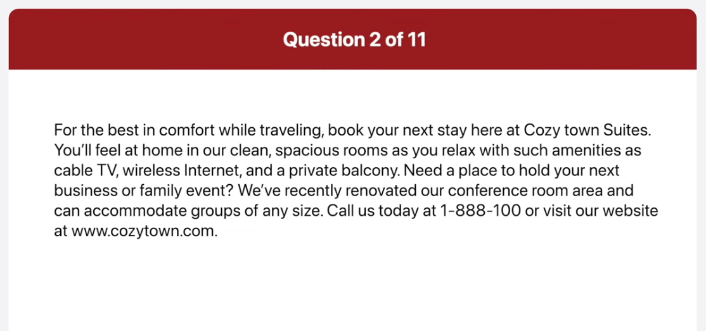
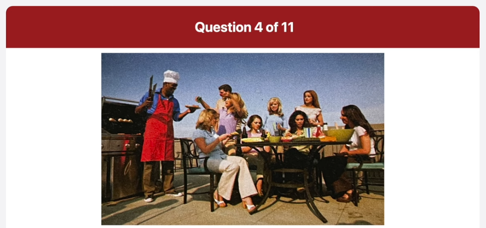
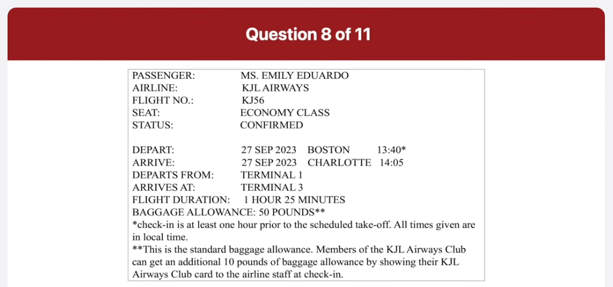
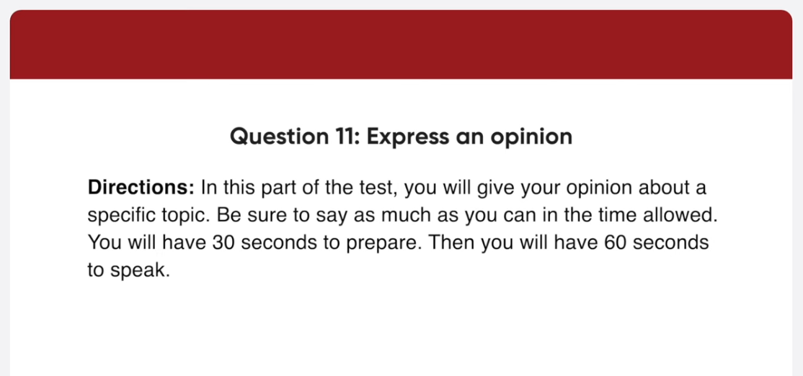
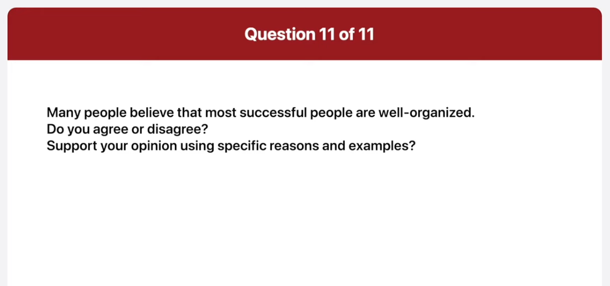

_Link: https://www.youtube.com/watch?v=asa5rJekhqU_

May I have your attention, please? New-Con Corporation would like to remind employees of the mandatory safety workshop on July 14th from 10 AM to 12 PM. It is our priority here at New-Con to provide a safe and pleasant working environment for everyone. This training will cover handling equipment, emergency safety procedures, and basic first aid. Thanks, and have a great day.

For the best in comfort while traveling, book your next day here at Cozy Town Suites. You'll feel at home in our clean, spacious rooms as you relax with such amenities as cable TV, wireless internet, and a private balcony. Need a place to hold your next business or family event? We've recently renovated our conference room area and can accommodate groups of any size. Call us today at 1-888-100 or visit our website at www.cozytown.com.

This picture was taken at a busy office. The main focus of the picture is many employees concentrating on their work. The woman on the left is looking over a man's shoulders and he seems to be showing her something on his monitor. Beside them there is a woman talking on the phone and using the computer at the same time. Next to her is another woman sitting and talking to the man who's leaning over her desk. Overall, I guess it looks like a typical scene of the office.

The image shows a modern office environment with several people working at their desks. The office has an industrial design, featuring exposed brick walls and large windows that let in plenty of natural light. Each desk is equipped with computers, and there are various papers and work-related items scattered around, indicating a busy and active workspace. The faces of the individuals have been obscured with brown rectangles for privacy.

This scene captures a typical day in a bustling office, highlighting the collaborative and dynamic nature of the work being done.

This picture was taken at a barbecue party outdoors. The main focus of the picture is a group of people attending the party. The man on the left is serving the barbecue, holding a cooking utensil in one hand. The others are enjoying the food and gossiping about something together next to him. In the background, I can also find a deep blue sky without any clouds. Overall, I guess it looks like a casual party among close friend.

The image shows a group of people gathered around a table outdoors. Their faces are obscured by brown rectangular censor bars. One person is standing at a barbecue grill, wearing a chef’s hat and holding cooking utensils. Another person, seated at the table, is wearing a blue top and a red apron, seemingly engaged in conversation or an activity with the others around the table. The setting suggests a social gathering or meal being prepared and enjoyed outside under clear skies.

Which department store do you usually go to?

I usually go to the ABC departments store downtown. That's because it has all the best shops and products. Therefore, it is always crowded with lots of customers.

How much money do you normally spend on a trip to the department store?

I think I usually spend around one million Vietnam dong at the department store, but the amount differs depending on the situation. Sometimes, I just go window shopping and buy nothing.

Do you think large chain departments are bad for local businesses?

Actually, I think large chain department stores are good for local businesses. That's because they attract lots of customers to the area. It is true that customers spend most of their money at the department store. However, many people still buy things at local shops and eat out at coffee shops and restaurants in the area. Thus, I definitely think having a big department store nearby is good for the surrounding local stores.

What date exactly is the flight on and what's the flight number?

Your flight will be on September 27th, and the flight number is KJ56. The flight will be departing at 1 40 PM and will be arriving in Charlotte at 2:05 PM.

As far as I remember the baggage weight limit is 60 pounds. Is that right?

I'm afraid not. The standard baggage allowance is 50 pounds. However, if you are a member of KJL Airways Clud, you'll be able to take 60 pounds of baggage at no extra cost.

When should I tell them to come?

Your flight leaves at Boston at terminal 1 at 1 40 PM. Local time, but you should arrive at the airport at least one hour prior to the scheduled take-off time. After 1 hour and 25 minute flight, you'll arrive in Charlotte at 2 05 PM local time there. So you'll need to be picked up soon after that. Your arrival gate is in terminal 3.

Well, I totally agree with the idea that most successful people are well organized. The main reason is that people who are organized prioritize tasks. This helps them to meet their objectives more efficiently. For example, if you have a specific plan of what to do, you'll get right down to the work and save time and energy. The other reason is that organized people know how to stay focused on the project until it is finished properly. In my experience, disorganized people have a lot of difficulty staying disciplined and following through the tasks. This makes it much harder for them to meet important deadlines. That's why I definitely think that most successful people are well-organized.

