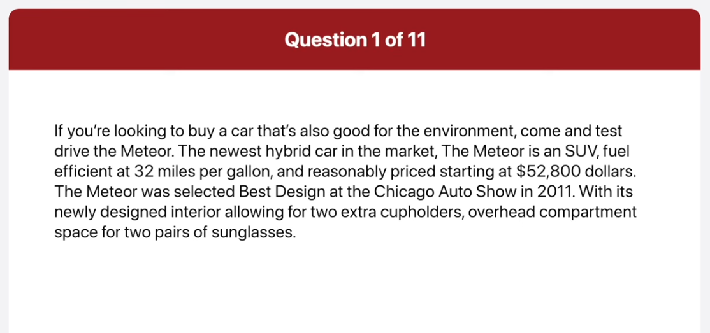
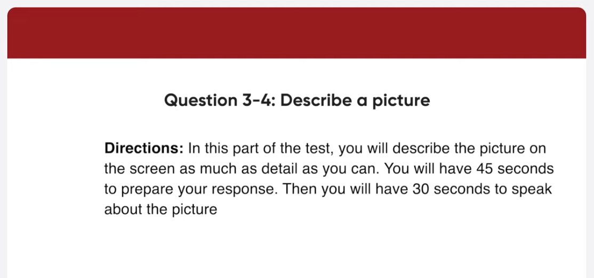
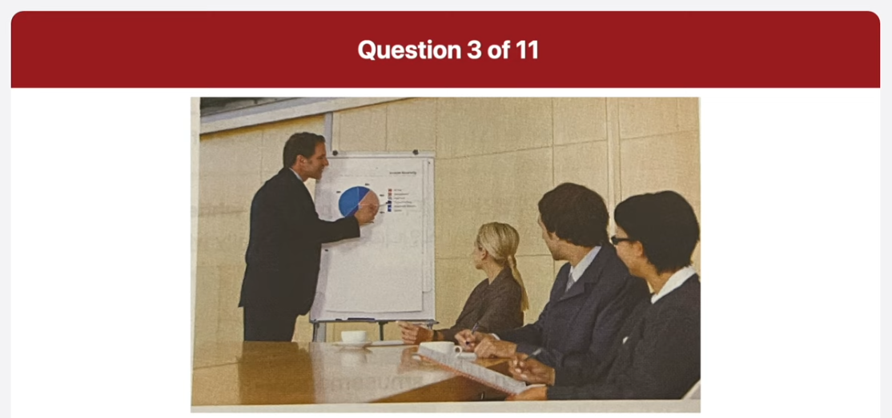
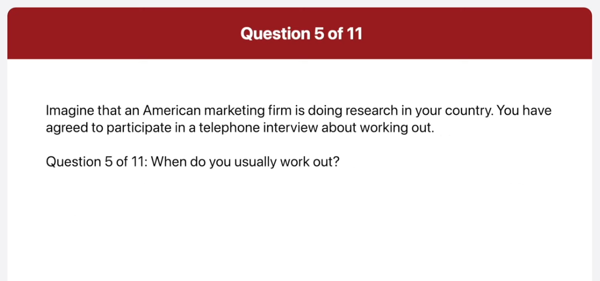
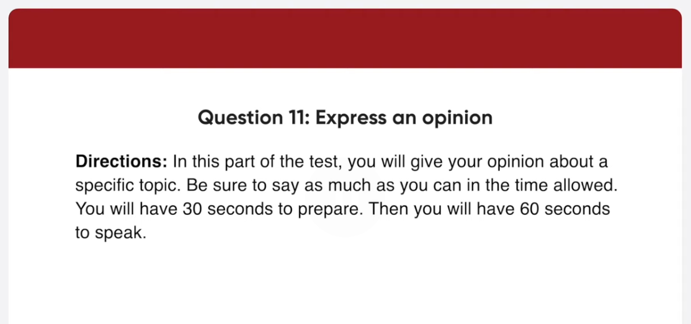

_Link: https://www.youtube.com/watch?v=\_ghzcTca-28_

If you are looking to buy a car that's also good for the environment, come and test drive the Meteor. The newest hybrid car in the market, the Meteor is an SUV, fuel efficient at 32 miles per gallon, and reasonably priced starting at 52800 dollars. The Meteor was selected Best design at the Chicago Auto Show in 2011. With its newly designed interior allowing for two extra cupholders, overhead compartment space for two pairs of sunglasses.

The city of Wilmington will be holding its annual Photos of the City Life Exhibition at the City Hall Museum located at 45 Groveston Street. This exhibition starts on September 1st and will run until December 31st. The museum is open from 9 AM to 5 PM on weekdays. The admission fee is ten dollars. Children under the age of five are free. For more information, call 800-422-4538 or visit www.wilmus.org.

This picture was taken in a conference room. A man is standing at a flipchart, giving a presentation. He porting at a pie graph on the flip chart. Three people are sitting at a wooden table watching the presentation. There are two coffee cups on the table. In the background, I can see a wood-paneled wall. The presentation seems to be going well, as the audience seems to be focused on what the presenter is telling them.

The image shows a professional setting where a presentation is taking place. There are five individuals in the room; one is standing by a whiteboard, pointing at a pie chart, and four others are seated at a conference table facing the presenter. The identities of all individuals have been obscured with brown rectangular blocks over their faces for privacy. The room has beige walls, and the overall atmosphere suggests a business or educational scenario where information is being shared and discussed.

This picture was taken in a kitchen. There are four sourcepans of various sites on a gas range. Three of the saucepan contained foods which is being cooked. In the background, there are some bottles and salt and pepper shakers. There are also some kitchen utensils and a container full of wine bottle corks. The kitchen looks well equipped. And it looks like a very busy kitchen.

The image shows a kitchen scene centered on a stovetop with several cooking pots and pans. On the left, there’s a large frying pan filled with sautéed vegetables. Next to it, there are two pots: the front one has a metal lid slightly askew, revealing what looks like a tomato-based sauce inside, and the back pot is covered with a lid. Various kitchen utensils like spatulas and ladles are visible. Above the stovetop, hanging utensils such as pots and colanders can be seen. To the far left, on the counter, there are condiment bottles and shakers, possibly containing spices or oils. The lighting gives off a warm hue, suggesting an indoor setting with artificial light. It looks like an active cooking process in a home or restaurant kitchen, showcasing different stages of meal preparation.

When do you usually work out?

Well, I usually try to work out every evening after school. But when I have appointment with my friends or an assignment to finish, I often skip it. So, I think I work out about two or three times a week.

What sorts of exercises do you do during a workout?

I normally just use the exercise bike or the treadmill since these two things are the easiest for me to work out on. Also, they are good for burning calories and losing weight.

Do you prefer to work out at a gym or at home?

Actually, I prefer working out at home. The main reason is that it's inconvenient to make them effort to go all the way to the gym. For example, when I signed up for a gym membership last month, I rarely went there. The other reason is that I can exercise whenever I want regardless of the business hours of the gym. That's why I like to work out at home.

When is the conference and what time does it begin?

The conference is on Tuesday, August 23rd and it starts at 1 PM.

Will there be any breaks between the presentation?

Yes, there will be a 10 minute break after each presentation.

How many presentations will there be and when do I present?

There will be four presentations during the day, and you will be the last presenter. You will present after Andrea Sundance talk on reducing pollution.

Well, I agree with that statement. I think schools are the most important factor when choosing a place to live. There are few reasons why I believe this. First of all, I have children and I want to ensure that they get the best education possible. I would take a lower paying job to make sure my children have access to better schools. With better schools, my children have a better chance to success when they get older. Another reason for me is surrounding area of the good school. Good schools are typically a nicer and safer areas of town. I want my family to be safe and live in a nice community. You probably won't find a great school in a bad part of town. There could be, of course, some other factors to consider than finding a good school, but for me my family is the most important thing in my life. So I strongly agree that a good school is the most important factor when choosing a new place to live. 

Yeah, to be honest I disagree with this statement. In my opinion, there are other factor that are more important than finding a good school when you choose a place to live. One of the most important things, I think, is good public transportation. I would want to work in a place that has a great bus and ideally subway system. I prefer taking the bus or train driving and sitting in traffic or long previous of time. I can save money and time by living in a city with a great transportation system. Another factor, I consider is the enviroment. I want to live in a city with a lot of green space such as the park, recreation areas and plety of plants and trees around the city. Health is very important things for me and my family. We want to have the proper facilities to be able to get outside, exercise, and enjoy the weather.

