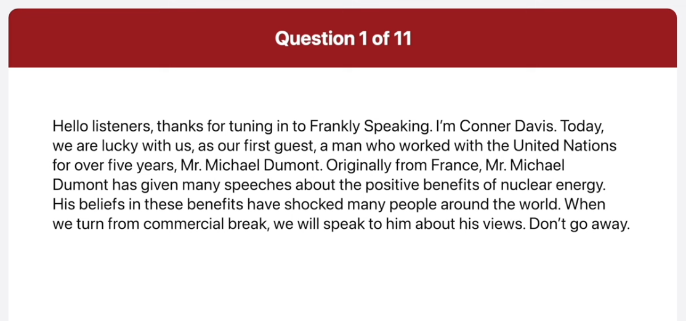
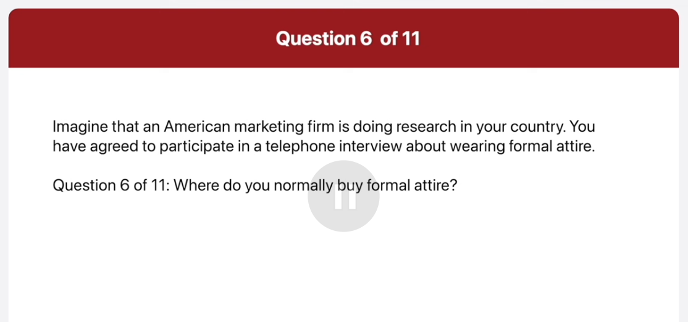
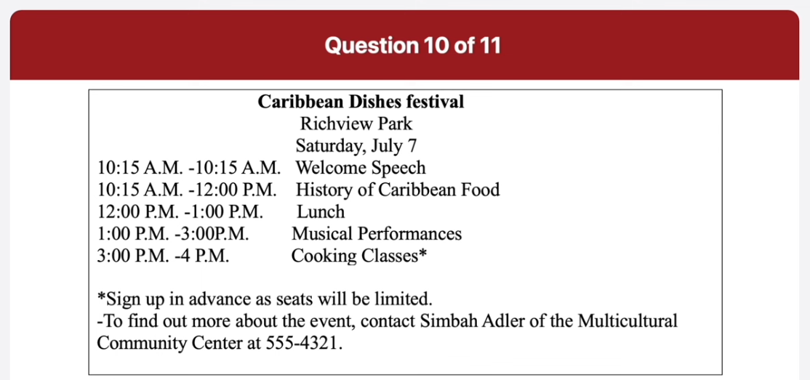
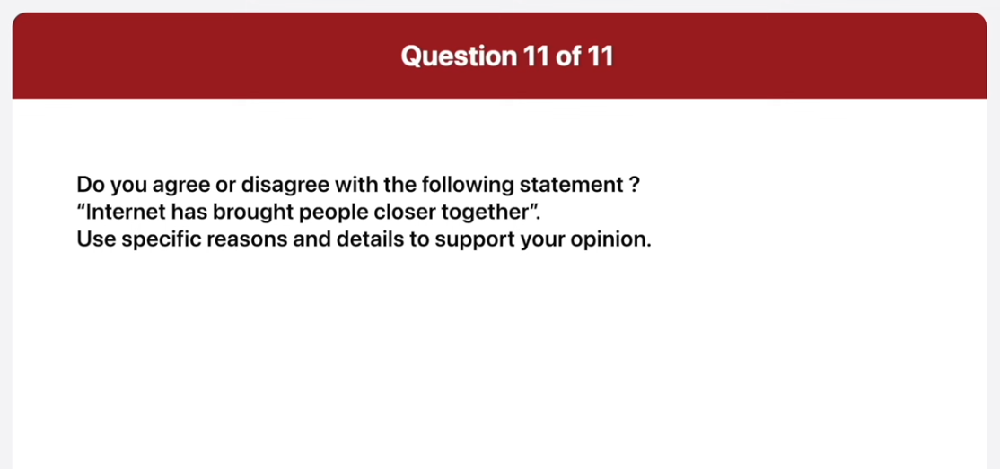

_Link: https://www.youtube.com/watch?v=jpTcezHC4z4_

Hello listeners, thanks for tuning in to Frankly Speaking. I'm Corner Davis. Today, we're lucky with us, as our first guest, a man who worked with the United Nations for over five years, Mr Michael Dumont. Originally from France, Mr. Michael Dumont has given many speeches about the positive benefits of nuclear energy. His beliefs in this benefits have shocked many people around the world. When we turn from commercial break, we will speak to him about his views. Don't go away.

On tonight's show, we'll hear comments from three people who are trying to get the government to pay more attention to solar energy. As we all know, solar power is a good source of energy because it is clean and cheap. Our guests will talk about the other benefits of solar energy and why businesses and average family need to start using this natural source of power. When you come by from this commercial break, I will introduce our guests. Please stay tuned.

This picture was taken in a street outside a cafe. In the foreground, six people are seated around a table. The people are all wearing jackets or coats, the table is covered by a yellow tablecloth. There are two coffee cups and saucers on the table and some sugar. In the background, and see the cafe and some other stores. There are some trees lining the road. On the sidewalker, people are passing by. It looks like a nice place to have a coffee with friends.

The image shows an outdoor café scene with several people seated at tables with yellow tablecloths, enjoying drinks and conversations. The café has a sign that reads “Café Gourmet,” and the setting appears to be a pedestrian street lined with trees and other buildings. Some faces have been pixelated for privacy.

This is the picture of a subway station. There are two train tracks and a platform on either side of the tracks. The station is covered by a dome-shaped roof. People are waiting on both platforms for trains. About one of the platforms, I can see a map of the train line. In the distance, I can see the opening of the station. They're a bright light outside the station looks clean and well organized.

The image shows an indoor train station with a curved, arched roof featuring a series of windows that allow natural light to illuminate the space. There are two sets of train tracks converging into the distance, creating a vanishing point that draws the eye forward. Platforms are on either side of the tracks, with benches and passengers waiting. The architecture suggests it could be an older, possibly historic station due to its design and materials.

I wear a former suit four times a week. Monday through Thursday to go to work. On Fridays, we can dress more casually.

Well I usually buy a attire from a variety of places. I enjoy shopping at both physical retail stores and online platforms. Some of my go-to stores include department stores, boutique stores and popular clothing brands. 

Yes I think you should always wear a formal attire. When working in an office, if everyone wears former attire, it creates a more professional atmosphere in the workplace. Also for me personally, I think wearing formal clothing makes me focus more on work.

Hi. I heard that some kind of food festival is going to be held next week. I'd like to find out more about it. Could you answer some questions for me. What is the theme of the festival and where is it going to be held?

It is Caribbean dishes festival and it's going to be held at Ridgefield Park

Can you tell me the schedule for the afternoon?

Sure there will be musical performances from 1 to 3 pm and from 3 P.M to 4 pm. There will be cooking classes

I'd like to find more information about the musical performances.

Sorry but I don't have that information with me. If you'd like to find more about the musical performances, call the Monte cultural Community Center at 555-4321 and speak to Simba Adlera.

I definitely agree with the statement that internet has brought people closer together firstly the internet makes it much easier to stay in touch with people in the past if you had to move along this little way it was difficult to keep in touch with family and friends you have to send letters or make expensive long distance phone calls now you can easily contact everyone by email and instant messaging secondly the internet has made it much easier to make new friends a even if you don't know a person very well you can add them as friend on the social networking site and get to know them better that way the internet has done a lot to bring people closer together

