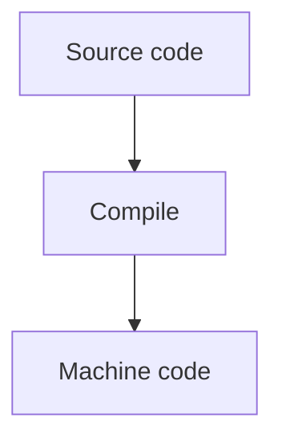

# Introduction to C++ programming language

C++ is a general-purpose programming language that was developed as an enhancement of the C language to include object-oriented paradigm. It is an imperative and a compiled language.

> C++ là một ngôn ngữ lập trình đa mục đích được phát triển như một sự mở rộng của ngôn ngữ lập trình C bao gồm cả lập trình hướng đối tượng. Nó là một trình ngôn ngữ biên dịch và mệnh lệnh.

C++ is a general-purpose programming language that was developed as an enhancement of the C language to include object-oriented paradigm. It is an imperative and a compiled language.
Indeed, C++ is a versatile programming language with a rich history. It combines the features of both low-level and high-level programming languages, making it suitable for system programming as well as application programming. C++ supports object-oriented programming (OOP), which allows developers to create modular and reusable code. It also includes features like polymorphism, inheritance, and encapsulation, which are fundamental to OOP.

1. C++ is a high-level, general-purpose programming language designed for system and application programming. It was developed by Bjarne Stroustrup at Bell Labs in 1983 as an extension of the C programming language. C++ is an object-oriented, multi-paradigm language that supports procedural, functional, and generic programming styles.

> C++ là một ngôn ngữ lập trình bậc cao, đa mục đích, được thiết kế cho chương trình hệ thống và ứng dụng. Nó được phát triển bới Bjarne Stroustrup tại Bell Labs năm 1983 như một bản mở rộng của ngôn ngữ lập trình C.

2. One of the key features of C++ is its ability to support low-level, system-level programming, making it suitable for developing operating systems, device drivers, and other system software. At the same time, C++ also provides a rich set of libraries and features for high-level application programming, making it a popular choice for developing desktop applications, video games, and other complex applications.

> Một trong những đặc điểm mạch của C++ là có khả năng hỗ trợ chương trình cấp độ thấp và các cấp độ hệ thống, biến nó trở thành phù hợp cho việc phát triển hệ thống thực thi, các driver thiết bị và các phần mềm hệ thống khác.jj

3. C++ has a large, active community of developers and users, and a wealth of resources and tools available for learning and using the language.

4. Object-Oriented Programming: C++ supports object-oriented programming, allowing developers to create classes and objects and to define methods and properties for these objects.

5. Templates: C++ templates allow developers to write generic code that can work with any data type, making it easier to write reusable and flexible code.

6. Standard Template Library (STL): The STL provides a wide range of containers and algorithms for working with data, making it easier to write efficient and effective code.

7. Exception Handling: C++ provides robust exception handling capabilities, making it easier to write code that can handle errors and unexpected situations.

---

Overall, C++ is a powerful and versatile programming language that is widely used for a range of applications and is well-suited for both low-level system programming and high-level application development. If you wish to learn C++ then you can enroll in our C++ Course provides a comprehensive introduction to the C++ programming language, covering its fundamentals and best practices.

---

C++ is a middle-level language rendering it the advantage of programming low-level (drivers, kernels) and even higher-level applications (games, GUI, desktop apps etc.). The basic syntax and code structure of both C and C++ are the same.

Some of the features & key-points to note about the programming language are as follows:

-   Simple: It is a simple language in the sense that programs can be broken down into logical units and parts, has a rich library support and a variety of data-types.

-   Machine Independent but Platform Dependent: A C++ executable is not platform-independent (compiled programs on Linux won’t run on Windows), however they are machine independent.

-   Mid-level language: It is a mid-level language as we can do both systems-programming (drivers, kernels, networking etc.) and build large-scale user applications (Media Players, Photoshop, Game Engines etc.)

-   Rich library support: Has a rich library support (Both standard ~ built-in data structures, algorithms etc.) as well 3rd party libraries (e.g. Boost libraries) for fast and rapid development.

-   Speed of execution: C++ programs excel in execution speed. Since, it is a compiled language, and also hugely procedural. Newer languages have extra in-built default features such as garbage-collection, dynamic typing etc. which slow the execution of the program overall. Since there is no additional processing overhead like this in C++, it is blazing fast.

-   Pointer and direct Memory-Access: C++ provides pointer support which aids users to directly manipulate storage address. This helps in doing low-level programming (where one might need to have explicit control on the storage of variables).

-   Object-Oriented: One of the strongest points of the language which sets it apart from C. Object-Oriented support helps C++ to make maintainable and extensible programs. i.e. Large-scale applications can be built. Procedural code becomes difficult to maintain as code-size grows.

-   Compiled Language: C++ is a compiled language, contributing to its speed.
