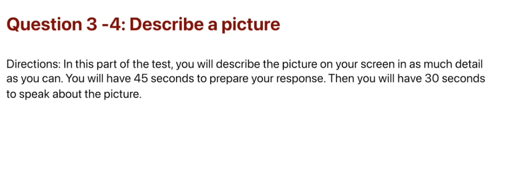
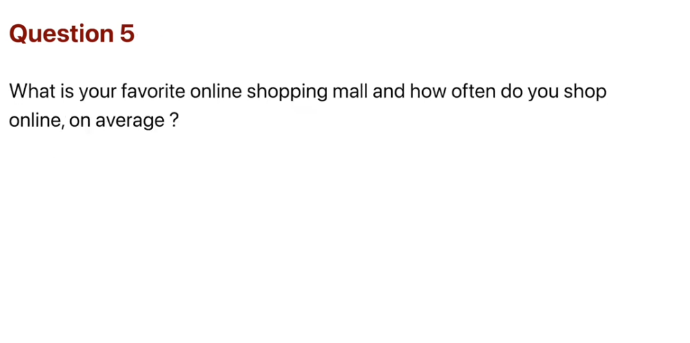
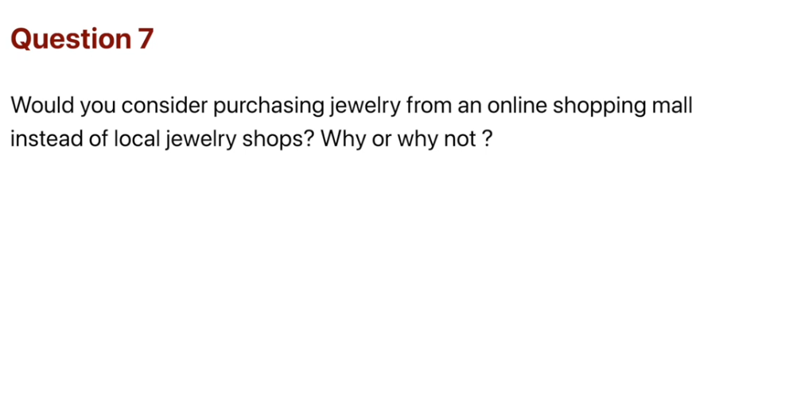
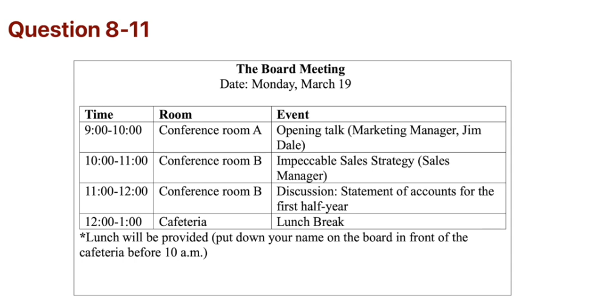
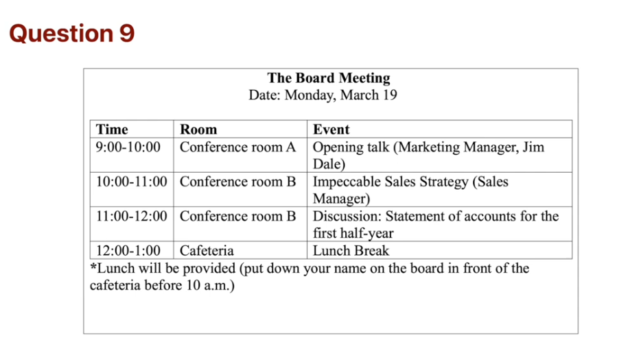
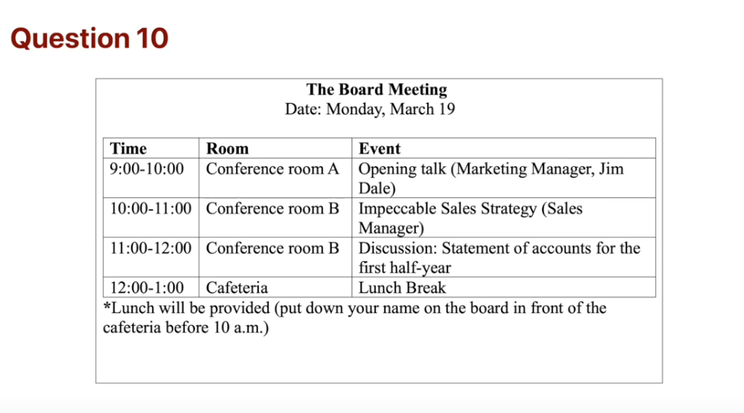
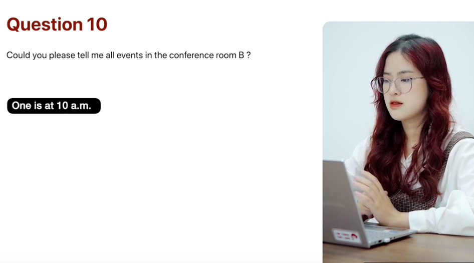

_Link: https://www.youtube.com/watch?v=vRm77DETg-s_

 

Attention all just for feet customers we are having a huge sale with great deals in every single Department kids shoes are 50 of the regular price and women's sport shoes at 25 percent up please take advantage of the great bargains because the sale is only available for the two-day holiday weekend have a great holiday and thanks for shopping at Just 4 feet

Good morning and welcome to home decor House West Superstore we're helping you build and perfect your home is our pleasure this month we have our annual spring sale which offers some great bargains in the kitchen Department we have a 20 discount on all dishwashers refrigerators and other kitchen appliances if that's product you don't see on a warehouse floor we will audit for you free of charge and delivered to your home within three days please enjoy your shopping experience at home decor and come again

This is a picture of two people sitting in chairs by the water. They seem to be relaxing in the Sun and enjoying the nice day the man is drinking something and the woman appears to be sitting with her legs crossed. There's a black back on the grass next to the woman and the trees is casting a shadow across the grass I think it is a clear bright possibly in the spring or the fall.

This picture shows a square with many people doing various things in the middle of the picture a father and his two children are playing by in the fountain on the right there are two teenagers sitting on a bench watching the family play in the background several people are sitting under umbrellas and one of them appears to be eating ice cream it looks like a very relaxing afternoon in this

Well I usually shop a list twice a week since I generally love buying things online. I particularly like shopping at Vinmart. They offer pretty good items at competitive prices.

Well it was a laptop computer and it's cost me more than one thousand dollars.

Well I don't think that any harm in buying jewelry online as long as you do some careful research before buying anything. I'm buying from a reputable online jewelry store is probably the cheapest most convenient way to get jewelry these days.

Well the bot meeting will be had on March 19th and you should go to conference rooms A and B question 9 is there lunch time begin preparing now.

You will have lunch in the cafeteria at noon you should put your name down on the board in front of the cafeteria before 10 am.

Again speaking now sure there are two events in conference room B. Once is at 10 am the sales manager will give a speech called impeccable sales strategy. The other will start at 11 am. All participants will discuss statement of accounts for the first half year. 

Well I would much rather work in a group. One main reason is that I don't have another person there pushing me. Then I get distracted too easily often I have projects to do alone but can't get started or can't stay working on them consistently, so I get distracted and wander up to complete another task. The other main reason why I like working with a group is that I find it much easier to brainstorm for ideas when you have several people with different personalities and all talking together and trying to figure out. I really enjoy having someone else to talk and modeling over different ideas and thoughts to see what can work or what can't work. For such reason, I prefer to work in a group.

