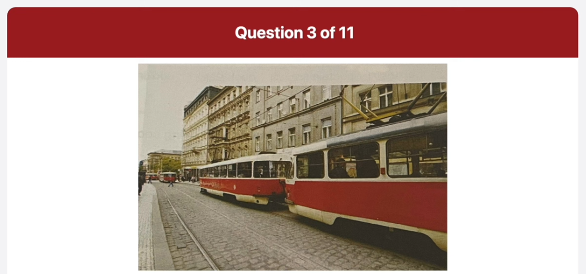
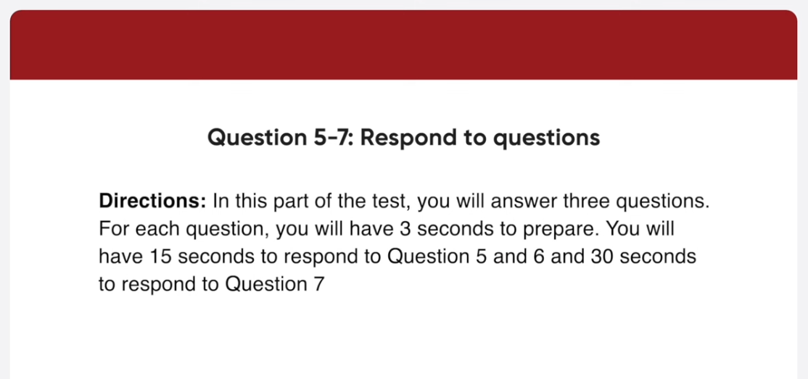
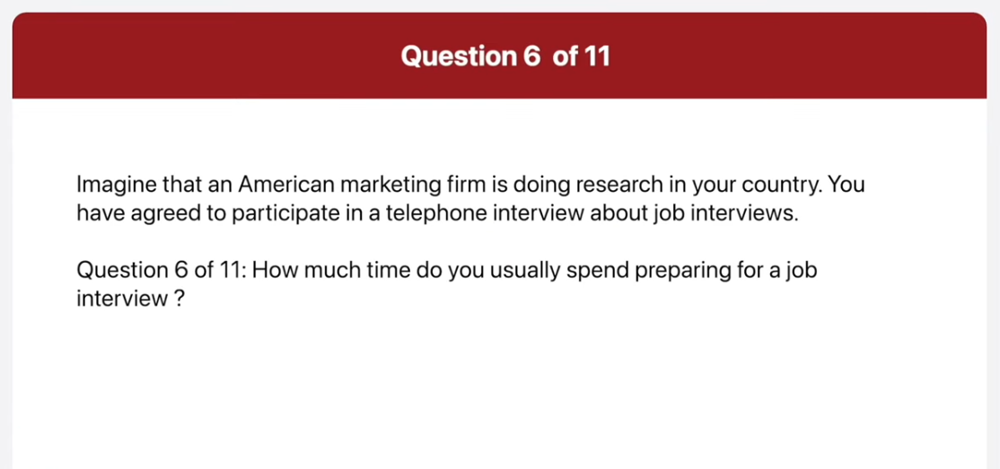

_Link: https://www.youtube.com/watch?v=lScVsWNRPA4_

Ferry's Men store has been providing the area with some of the finest man's fashions for the last 50 years. This weekend, Ferry's will have a winter clearance sale to make room for their entire spring collection. During the sale, shoppers will enjoy the scouts up to 50% on all winter items. To make sure that the store's valued customers can enjoy the weekend sale, Ferry's will be open from 10:00 A.M to 10 P.M.

The 23rd annual Movie Critics Awards will take place next Saturday at 700 p.m. at the Grand Hotel. The event will award today's top actors directors and others who have worked to create some of the best files of the year if you wish to attend please contact the hotel as soon as possible since seting for the public will be limited cameras will not be allowed Inside the Hotel photos can be only taken Outdoors before or after the event.

This is a picture of a street there are two trm racks on the road and there is a trm on one of the tracks the trm is white with a red drive along the side of each carriage in the background there are four large buildings on the left hand side of the road I can see a man walking on the sidewalk there are also some other buildings in the background the trim looks like a good way to get around the city begin preparing

now this picture was taken in a cboard area outside a restaurant some tables have been set up outside the restaurant each table has four wooden chairs arounded brightly colored table clothes has been placed on the tables and cuty and glasses with napkins inside have been laid down in the background there is an old brick War there is an rectangular ho in the war it seems like a nice place to have a meal outdoors in this part of the test you

now begin speaking now well I normally visit the carrier sessions of specific companies that interest me many organizations post job openings directly on their websites providing detailed information about the posision requirements company cultures and and application process how much time do you usually

Now well the amount time I spend preparing for a job interview can vary depending on various factors such as the level of job the industry and some cuman but normally I spend about two or three days preparing for a job interview when applying for a job which aspect concerns you the most begin preparing

now well the aspect that I'm concerned with is the scenary although the other factors are Point important they don't matter if you don't have enough money to have a good life also it will allow me to open my business with the money in the future so I can say that I prefer to have a job with good pay than a job with loss of occas or other nonfinancial benefits in this part of the test you

Hi I'm a huge fan of Michael Osman and I heard he's going to be at your bookstore for a book signing event can I ask a few questions about it when do I have to be there to get an autograph from Mr Osman begin preparing

Now you should be there on Monday April 10th between 7 and 800 p.m. will there be a chance to ask questions to be author begin preparing now

00:10:05.480 now yes there will be a 15minute Q&A
00:10:09.240 session after the book
00:10:13.440 Sign can you tell me about the rest of
00:10:15.800 the authors that will be at the

00:10:27.160 now certainly pral will be there on
00:10:31.360 Tuesday and Grand yamasaki will be there
00:10:34.560 on Wednesday on Thursday atricia Port
00:10:38.560 will be there and on Friday Molen
00:10:41.360 Johnson will be there but keep in mind
00:10:43.880 that they all be there at different
00:10:48.240 times in this part of the test you will

now well I agree that children should not be allowed to use cell phones at school for the following reasons first of all it can be a major distraction in school for example when students send text messages to one another in class the sounds of phones be being all vibrating make it difficult for students and teachers to concentrate another reason is that cell phones discourage children from being social for instance with the Advent of the smartphones many children spend more time playing with their phones than spending time with friends for this reason I believe children should not be allowed to use selfness School

