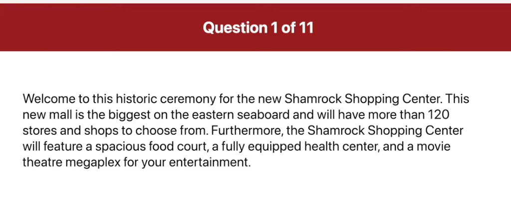
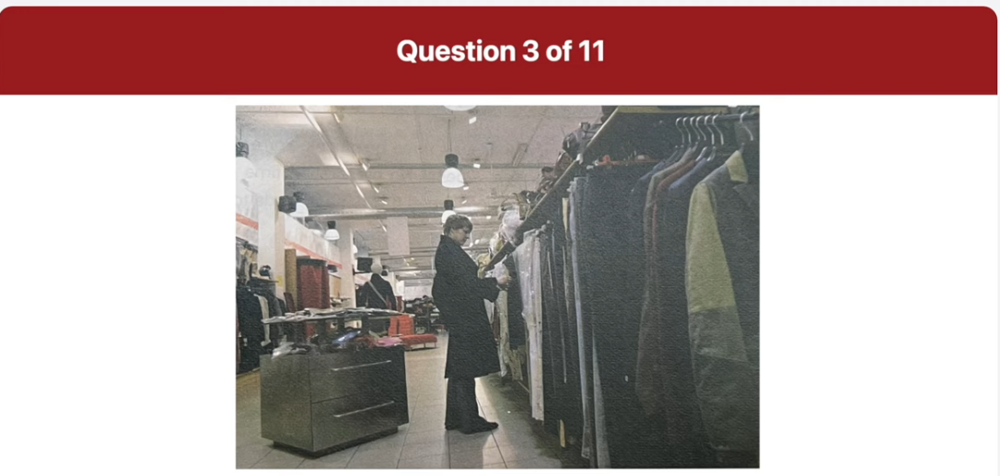
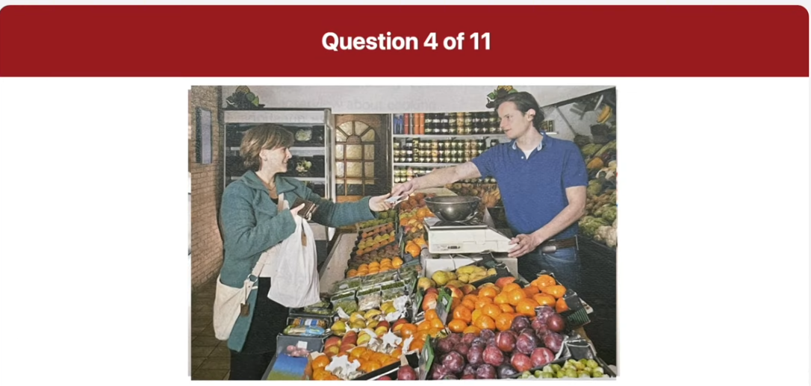
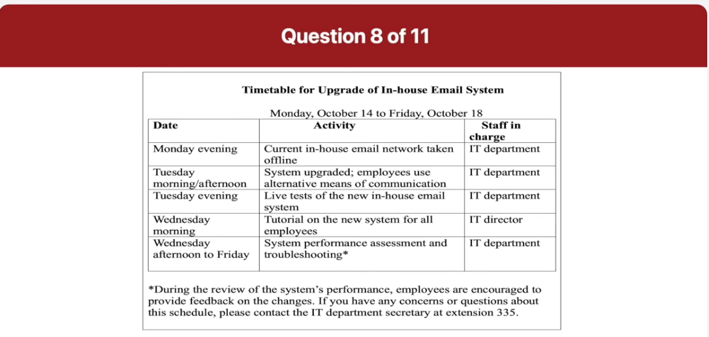

_Link: https://www.youtube.com/watch?v=zlvSKxX02Ac_

Welcome to this historic ceremony for the new Shamrock Shopping Center. This new mall is the biggest on the eastern seaboard and will have more than 120 stores and shops to choose from. Furthermore, the Shamrock Shopping Center will feature a spacious food court, a fully equipped health center, and a movie theater Megaplex for your entertainment.

All passengers, please listen to the following two announcements. First, departures to Orlando, New Orleans, and Nashville will now begin boarding at Gate 78. Please proceed to Gate 78 for boarding if you already have checked in with security and have your boarding pass. Second, Flight 411 to San Diego is now departing from Gate 19. Thank you.

This picture was taken at a large clothing store. On the right side of the picture, there is a long clothing rack with men's attire. There's a woman in the middle of the picture who is looking at some of the items on the rack. she's wearing a long black coat and dark pants Behind The woman there is a small table with two horizontal handles which may be for draws on the sailing there are a lot bright lights and in the background you can see a small red colored seat begin

This picture was taken at a grocery store you can see a row of fruit on display for customers such as oranges and plumens there are two people in this picture one female customer is on the left and a tall man is on the right he appears to be an employee of the grocery store the woman looks like she just bought some produce and is receiving her change in the background there's a display of jars or Gems or jellies

how many credit cards do you have and how often do you use them begin

I only have one card and I think I use it nearly every day I use it quite often because I don't like to carry lots of cash also it's very useful when I'm running out of cash

what do you use your credit card for

well of course I use it to pay for items I buy at stores or on the internet I also use it to buy food every day so my credit card is absolutely necessary in my daily life

how could your credit card service be improved

well I think the security of credit cards should be improved the reason is that if it's stolen it can be used by strangers and cause a big problem for the owner for example I have a friend who's was host credit card was stolen recently and it was used to buy thousands of dollars worth of stuff therefore I definitely wish that credit cards were safer

Can employees access the current email system

the current in-house email network will be taken offline on Monday evening so employees will be able to use the old system until then often there are problems when new computer systems are implemented something is going to be done about this isn't it

sure the IT team will review the performance of the system and handle all problems from Wednesday afternoon to Friday employees are welcome to express their opinion about changes then I'm supposed to go on a business trip on Tuesday and planning to be back on Wednesday afternoon

I'm worried about missing important system upgrades could you tell me the details of what's going to happen begin preparing now

there will be three system upgrade schedules first of all on Tuesday Morning the IT department will upgrade the system so employees will have to use alternative means of transportation following that in the evening live tests of the new in-house email system will be conducted finally all employees will attend a tutorial on the new system on Wednesday morning

well I agree with the idea that University students out to work part-time to get prepared for the business world the main reason is that working part-time teaches students important skills they will need in the future for example they can discover how to cooperate with their co-workers finish tasks on time deal with customers and so on the other reason is that working part-time jobs help students plan their future career what I mean is through work experience they can discover what sorts of work they like or dislike as well as what they're good at therefore I think it's a great idea for students to have various change chances to work part-time

