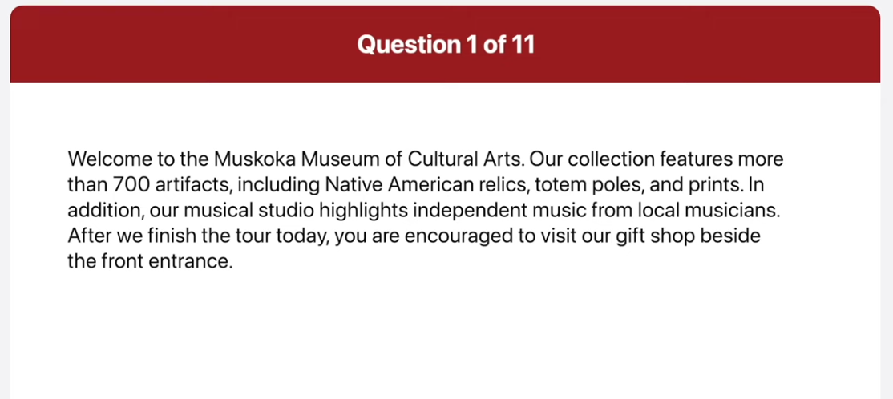
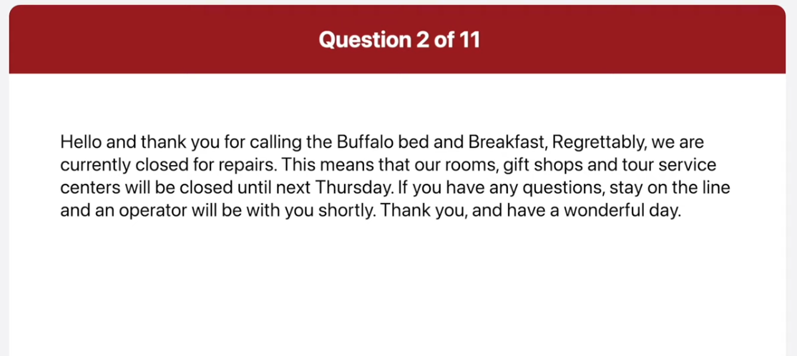
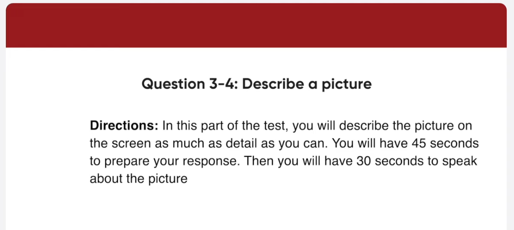
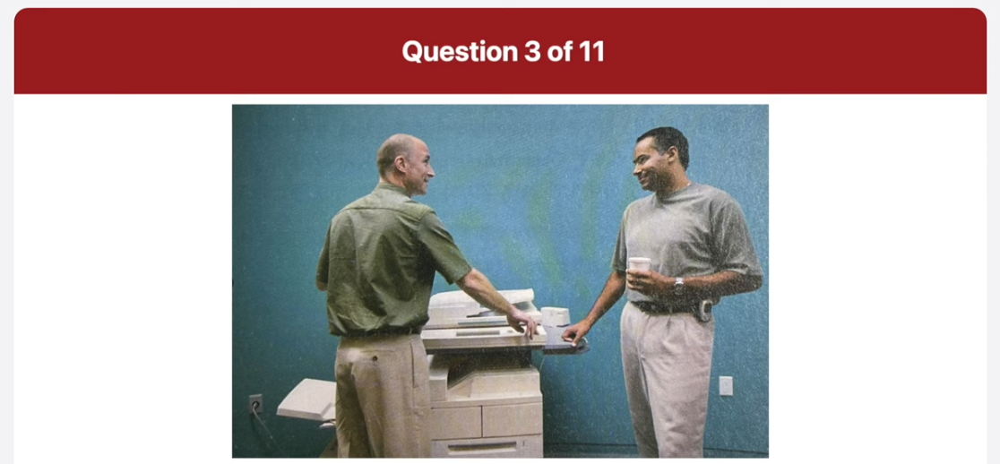
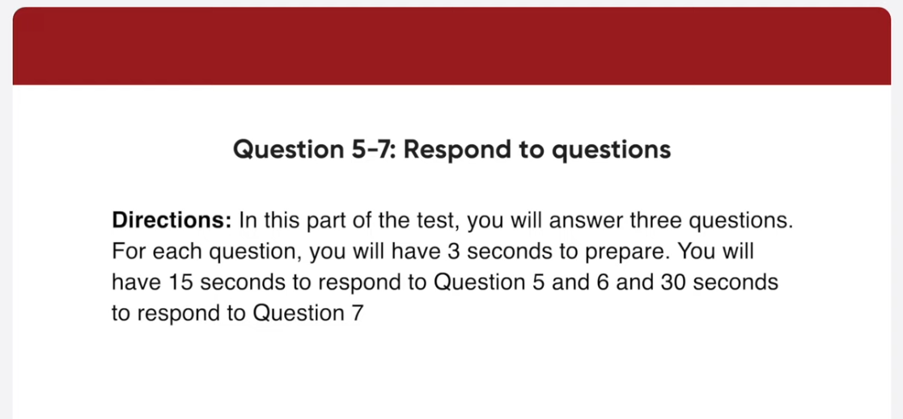
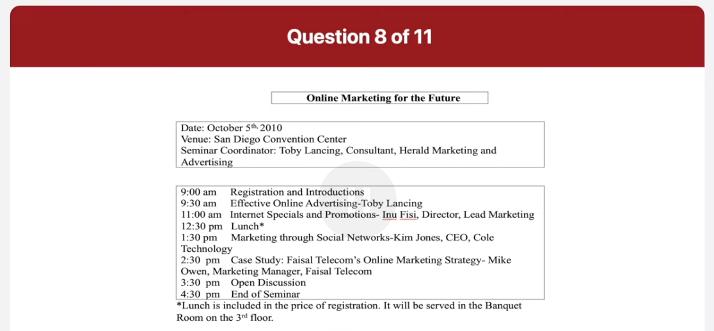
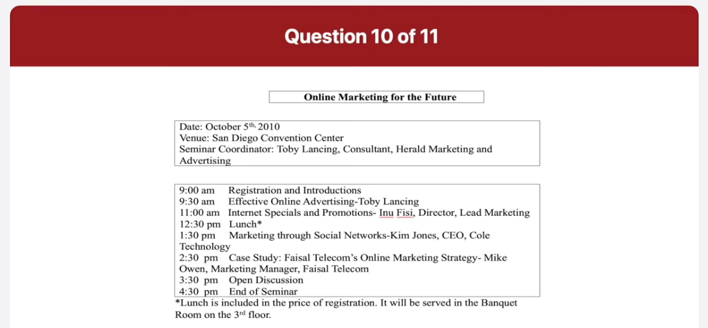

_Link: https://www.youtube.com/watch?v=1qC1H1QsccU_

Welcome to the Muskoka Museum of Cultural Arts. Our collection features more than 700 artifacts, including Native American relics, totem poles, and prints. In addition, our musical studio highlights independent music from local musicians. After we finish the tour today, you are encouraged to visit our gift shop beside the front entrance.

Hello and thank you for calling the Buffalo bed and breakfast. Regretably, we are commonly closed for repairs. This means that our rooms, gift shops and tour service centers will be closed until next Thursday. If you have any questions, stay on the line and an operator will be with you shortly. Thank you, and have a wonderful day.

There are two men in a blue-colored room, looking at one another in this picture. They are both wearing light colored khakis and standing in front of a photocopier. The man on the left a ball and is wearing a short sleeve collared shirt. The man on the right is wearing a t-shirt and is holding a cup in his left hand. Both men are smiling at each other

There are two women in this picture. The woman on the left has long blonde hair, and the woman on the right has long brown hair. They appear to be in a woman's clothing shop. The blonde woman is wearing a shiny silver overcoat that is tied around her waist. She appears to be helping the other soman shop. The brunette is holding up a light blue blouse to her chest to check how it would look on her.

How often do you take a vacation and who do you usually go with?

Well. I take a vacation about once a year with my close friends. I usually go during my summer break because that's the only time I can have a long vacation.

Do you prefer to go on vacation in your own country or abroad?

I generally prefer to go on vacation abroad, because that way I can get to experience an exciting and different culture. Last year, I spent my vacation in Thailand and I had a great time there. 

Some people like to go on vacation to relax While others prefer excitement and adventure. What do you look for in a vacation?

Well. For me, I prefer to experience excitement and adventure on my vacation. That's because I like to do challenging and exciting things to relieve stress and make my vacation unforgettable. For example, when I went to Thailand, I tried various water sport and local food. It was so much fun to have new experiences. Therefore, I think it's better for me to go somewhere through fun and interesting activities.

How long will the seminar last?

The seminar will begin at nine o'clock and end at 4 30, so it should last around seven and a half hours in total.

I'm thinking of bringing a packed lunch tomorrow because you know the cafeteria will be packed during lunch time will there be a spot. Where I can eat my lunch?

Actually, it won't be necessary for you to bring along lunch. Lunch will be available at no extra cost and will be served in the Banquet Room on the third floor at 12:30. 

Unfortunately I have to leave it two in the afternoon because I'm scheduled to take part in an important telephone conference with some clients from Hong Kong can you tell me what part of the program I'll miss out on begin preparing now

well you will be missing three sections headphone 2 pm to 4 30 PM first you will be missing part of Kim jong's talk about marketing through social networks next you won't hear the case study about Fido Telecom online marketing strategy given by Mike Owen finally you were missed out on an open discussion starting at 3 30 pm

personally I would rather get news
online than read it in a newspaper for
starters it's more convenient in many
ways for example I can read all the word
next new papers from anywhere via my
laptop or mobile phone so I don't even
have to go out to the store to buy them
moreover mostly is free to read online
the other thing is that news websites
are more current than papers
newspaper only give an update on a
situation at the time of printing
whereas online news is totally up to the
minute therefore you can get the latest
news without waiting that is why I think
it's better to catch up with current
events to online news instead of a
newspaper

