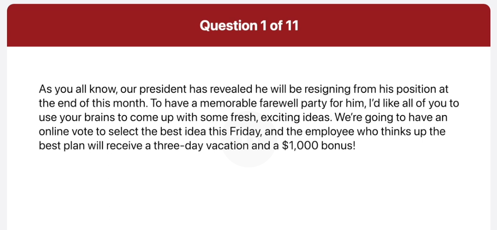
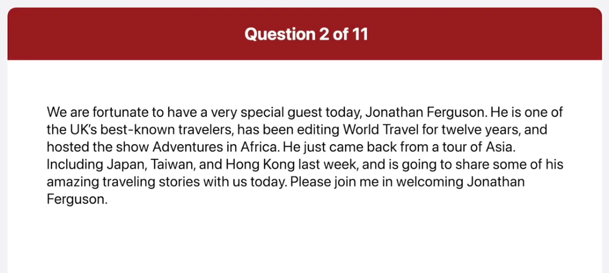
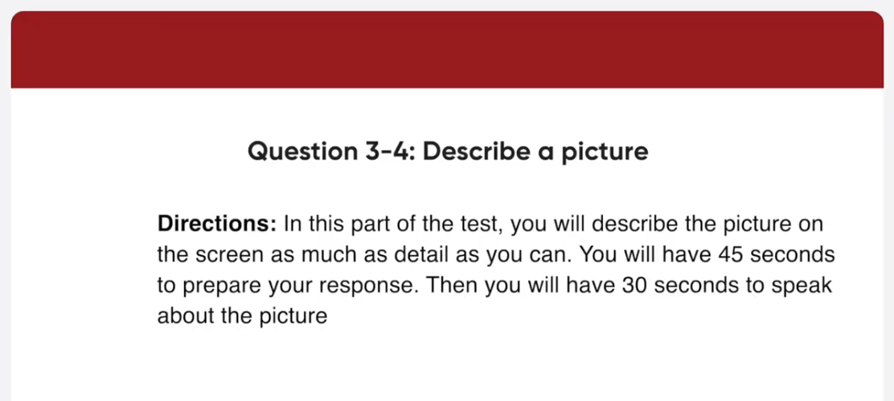
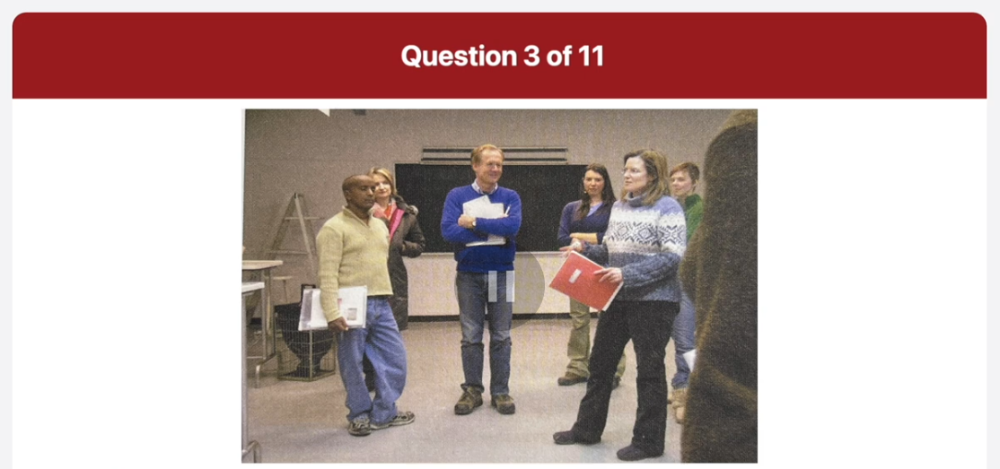
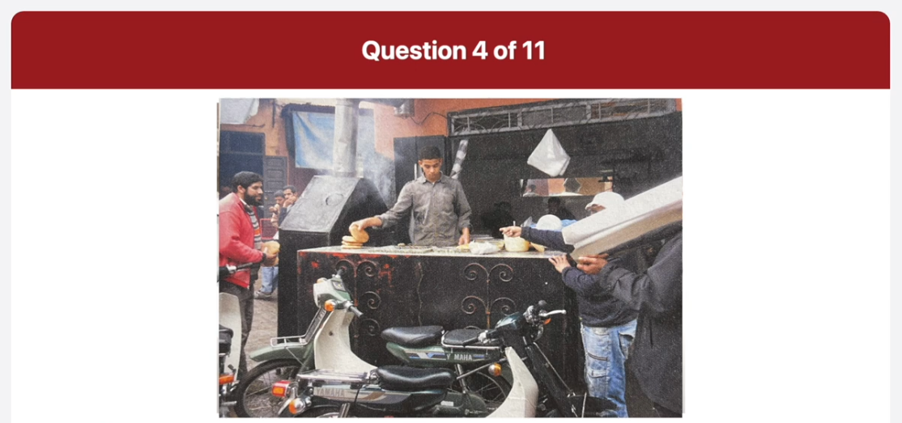
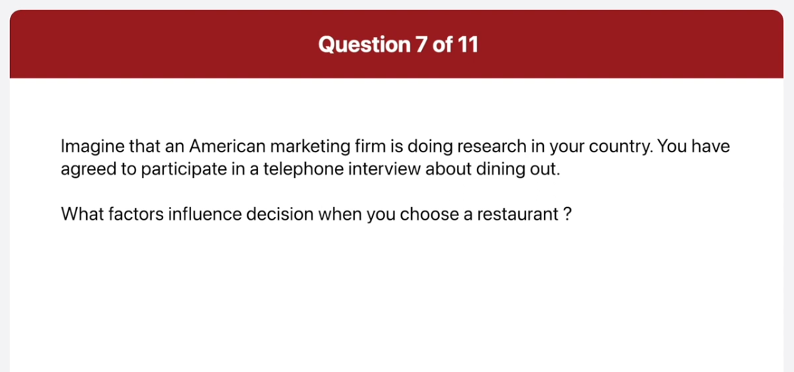
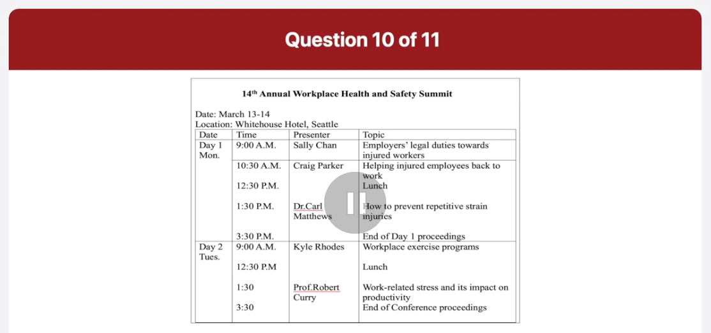
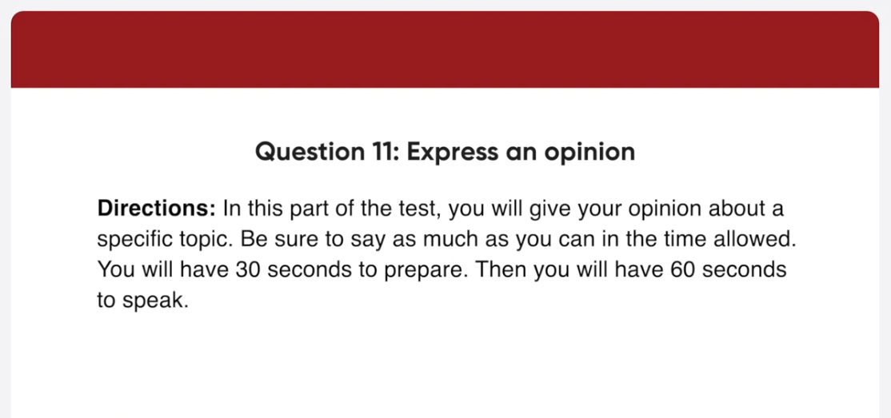

_Link: https://www.youtube.com/watch?v=FABqSYiZQkY_

As you all know, our president has revealed he will be resigning from his position at the end of this month. To have a memorable farewell party for him, I would like all of you to use your brains to comes up with some fresh, exciting ideas. We're going to have an online vote to select the best idea this Friday, and the employee who thinks up the best plan will receive a three-day vacation and a $1000 bonus.

We are fortunate to have a very special guest today, Jonathan Ferguson. He is one of the UK's best known travelers, has been editing World Travel for twelve years, and hosted the show Adventures in Africa. He just came back from a tour of Asia. Including Japan, Taiwan, and Hong Kong last week, and is going to share some of his amazing traveling stories with us today. Please join me in welcoming Jonathan Ferguson.

This picture was taken in a classroom. Some people who seem to be students are in a group discussing something. A woman on the right is holding a red folder and gesturing. I think she's giving a lecture or an explanation to the class. Next to her a man in a blue sweater is folding his arms and looking at the lecture. The rest of the students are also looking at her and listening carefully

This is a picture of a food vendor preparing a meal. On the left, a main in a red jacket seems to be buying some bread. There are two people on the right side of the picture. One is pointing at the vendor and the other is carrying something on his shoulder. Two motorbikes are parked in front of the shop. I can see a few men passing by in the back. The people look busy so I guess this picture was taken in the morning

When was the last time you ate out?

Well, I ate out at a Chinese restaurant with my parents last Sunday. We had noodles with black bean salt, and sweet, and sour pork, which is the most popular Chinese food in Vietnam.

What is your favorite restaurant and why?

Actually, the restaurant I like the best is a little Japanese place downtown that specializes in raw fish and sushi. I like that place because it use fresh ingredients and its prices are reasonable.

What factors influence decision when you choose a restaurant?

The two main factors I consider when choosing a restaurant are healthiness and cost. First, I don't eat a restaurant that is a lot of artificial seasonings or too much salt, as is very unhealthy. Furthermore, I hate spending too much money when dining out because I have a tight budget. Therefore, I think it's important to check whether the restaurant serves healthy food at a reasonable price.

Can you tell me where and when the conference is being held?

The conference will be at the White Hotel in Seattle on March 13th and 14th. It runs from 9am to 3 30 pm on both days. 

I understand what world famous academic Dr. Robbert Curry is giving a talk on Monday afternoon. What will his talk be about?

Actually, Dr. Robbert Curry will speak on Tuesday afternoon, the second day of the conference. His talk will start at 1 30 pm and it will focus on work-related stress and its impact on productivity.

Unfortunately I have some urgent business in the morning on Monday and Tuesday so I won't be able to make it until lunchtime. What will I be missing out on?

In that case you won't be able to attend three sections. First you will miss out on Sally Chan's presentation on employer's legal duties towards injured workers beginning at 9 00 am on Monday. Furthermore, you won't be able to make it to Craig Parker's talk scheduled at 10 30 a.m. Finally, you won't be able to attend the talk about workplace exercise programs presented by Kyle Rhodes on Tuesday morning.

Well. I agree that an employee's performance appraisal should be based mainly on the manager's evaluation. The main reason is that the manager is in the best position to assess a worker's performance. I mean, managers aside and monitor employee's work directly. Therefore, they know how quickly and effectively employees perform tasks. In addition, managers are the best people to give the detailed and constructive feedback to employees. Performance appraisals should also aim to improve employee's skills. And considering managers' many years of work experience, they are able to provide workers with informative feedback. For these reasons, I think it's a great idea to allow managers to evaluate their employees performance.
