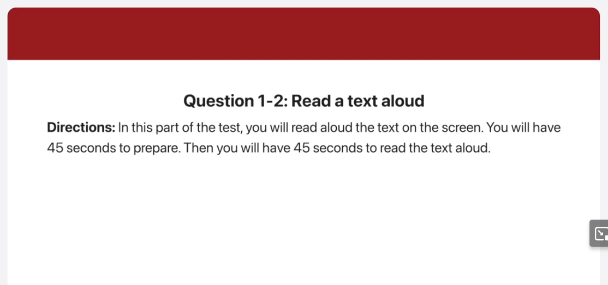
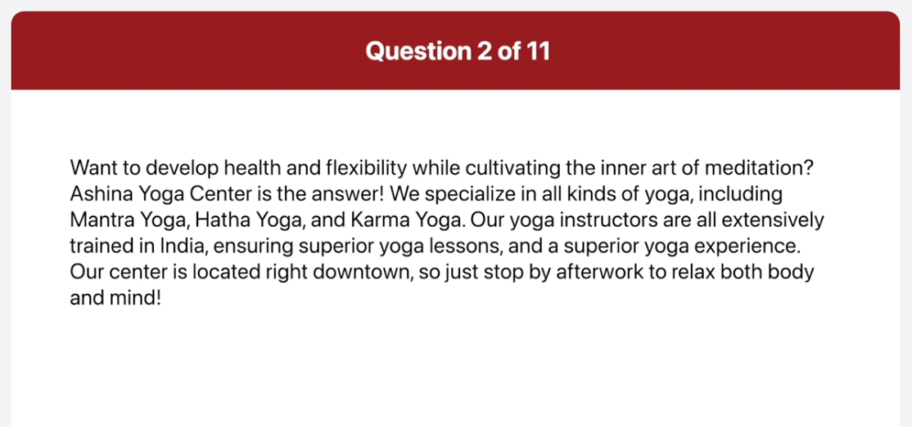
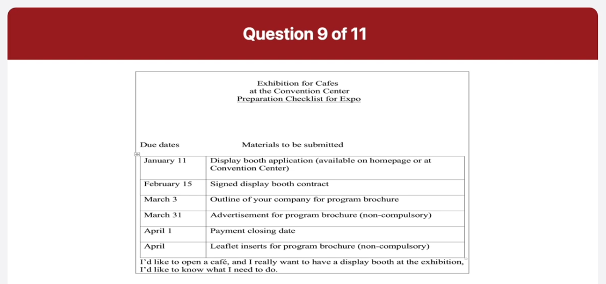

_Link: https://www.youtube.com/watch?v=yGwAgufQxyY_

hello thank you for calling Mountain Drive movie theater today our Cinema is showing two Classic Movies in the blue Cinema one of the all-time great comedies back to Barcelona starring Michael Miller will be shown while in the red Cinema we have everlasting starring Leonardo Hall and Kate Bennett showtimes are 6 8 and 9 30 in the evening please press 1 to reserve a ticket thank you

want to develop health and flexibility while cultivating the inner Arts of meditation ashina Yoga Center is the answer we specialize in all kinds of yoga including Manja yoga hands yoga and Karma Yoga our yoga instructors are all extensively trained in India ensuring Superior yoga lessons and a superior yoga experience our Center is located right downtown so just stop by after work to relax both body and mind

speaking now this is a picture of people relaxing on a beach some people are getting a 10 why others are enjoying the water I can see one woman on the right is lying on her side and there is an empty chair and a flock in the middle of the picture in the background there are palm trees and large houses on the side of the Hill um it looks like a hot summer day and it is important to remember to apply suntan lotion

this is a picture of a man giving a speech to an audience the man is standing on a stage with a big screen behind him I can see a woman sitting at a table that has microphones set up for others to have the discussion the entire audience is focused on his speech I can tell people in the audience are probably taking notes I think the man is giving a speech at a university

what is your favorite kind of movie

well I like watching romantic comedies
one of my favorites is your place and
mine on Netflix
who do you usually watch movies with and
when was the last time you saw a movie
begin preparing now
begin speaking now
well I usually watch movies with my
friends and the last time I saw a movie
was two weeks ago it was a touching
story about the friendship between a
girl and a dog

do you prefer to watch movies on the
computer or go to a movie theater
why

I prefer to watch movies on the computer
the biggest reason is that I am too busy
and it's hot to fight time to go to the
movie theater so I download some of some
of the films I don't want to miss on my
computer and watch them on my way home
on the bus
yeah

where can I find an application and when
do I need to send it there
begin preparing now
begin speaking now
write an application on the convention
Center's home page in addition you can
visit the convention center and pick up
an application form please send the
application in by January 11th
do I need to include my payment with the
display Booth application

um actually it is not necessary to
include your payments with the
application however the payment closing
date is
April 1st
I want to make sure that there's a lot
of information about my Cafe in the
program brochure
what can I do
begin preparing now
begin speaking now
well to ensure that there's enough
information about your Cafe in the
program brochure please Supply an outlog
of your business by March 3rd in
addition you can have advertisement
printed for the program brochure which
needs to be done by the end of the March
finally the program brochure can be
accompanied by leaflets inserts about
your Cafe as long as they are ready by
April 19th please note that the leaflets
are non-compulsory like the
advertisements in this part of the test

Well when I go on a
trip I usually do not make any plans I
am a spontaneous kind of person and a
fight that like to be surprised about
the interesting places and activities
available on my vacation well I went to
Ho Chi Minh City last spring with a
friend neither of us made any plans but
we had the best time of our lives we met
up with some other vocationals and
enjoyed some of the tours that they had
booked my friend and I did not
waste time researching about what to do
we relied on the suggestions of others
and we were never disappointed I think
that personal accounts are more
substantial than a brochure or Internet
information that would be available if
we were to plan my trip precisely also
on some days I just want to relax and do
nothing hence I don't bother making
precise plans and prefer to do whatever
I feel like doing

