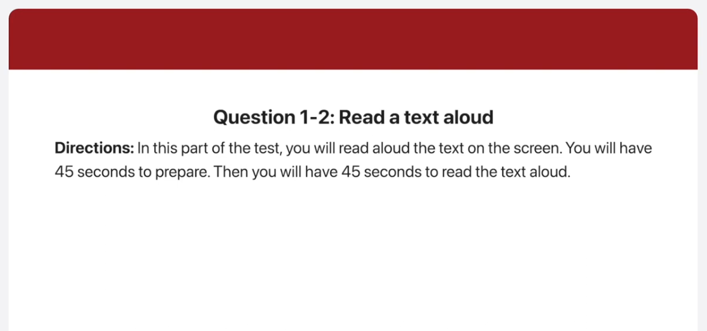
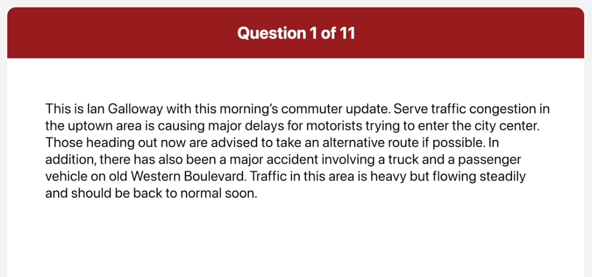
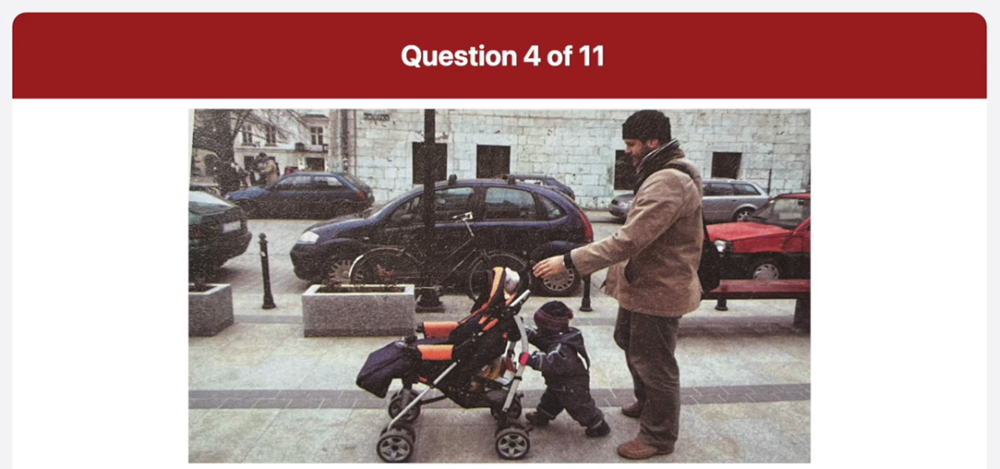
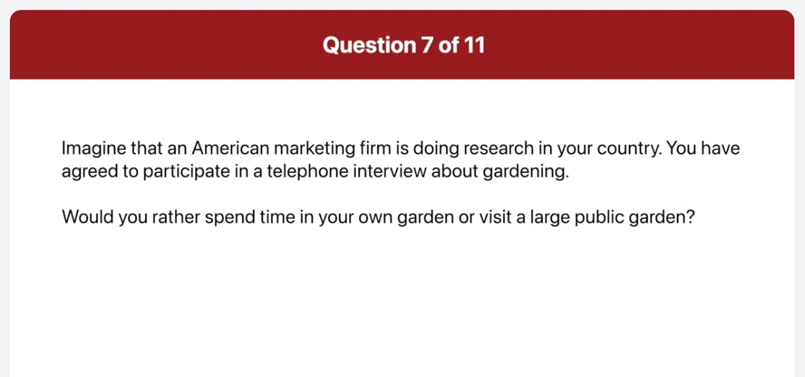
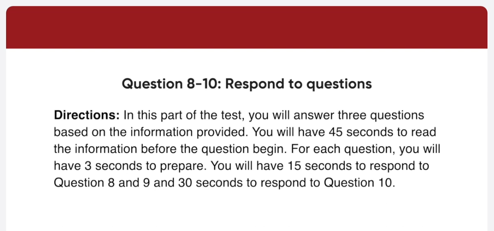

*Link: https://www.youtube.com/watch?v=DychccgHR4A

this is Ian Galloway with this morning's commuto update so traffic congestion in the Uptown area is causing major delays for motorists trying to enter the city center those heading out now are advised to take an alternative route if possible in addition there has also been a major accident involving a truck and a passenger vehicle on a Western Boulevard traffic in this area is heavy but flowing steadily and should be back to normal soon

It's time to present the employee of the year award this prestigious prize go to the employee who has made the biggest contribution to our company's performance over the last year the recipient is given a one thousand dollars bonus five extra days of vacation leave and a certificate signed by the CEO I'd like you all to applaud Jen Henderson from Administration Jen please come up on stage to collect your award

There is a picture taken at a big lecture hall in the foreground there are students sitting in wooden seats and the class looks very full most of the students are looking down so they're probably taking notes in the middle I can see some long tables with papers and other items on them in the background a teacher is standing with his back to the students he's wearing a brown sweater and blue jeans and is writing something on the Blackboard with chalk overall it looks like a typical classroom scene

This is a snapshot taken on a sidewalk in a city what I noticed first in the picture is the father and his young son going somewhere together the father is pushing a stroller and the little child is having his father push the stroller the sidewalk there walking on looks very neat and clean and I can also see a bench on it in the background there are some cars parked on both sides of the street overall it looks like a clean City and the father and son made me smile

respond to question seven imagine that an American marketing firm is doing research in your country you have agreed to participate in a telephone interview about gardening do you enjoy working in the garden

well yes I do very much because I find it relaxing so whenever I have free time on the weekend I plant some flowers and water and trim them

how often do you do gardening at home

well I usually do gardening once or twice a week on the weekends I am so busy during the week so the only time I can devote to gardening is on the weekends

would you rather spend time in your own garden or visit a large public garden

for me I would prefer to visit a large public garden the reason is that public gardens have a wide variety of beautiful plants and flowers while my own garden has only a limited variety for example when I went to the Botanical Garden near my house I was amazed by all the different kinds of flowers and plants and I had a great time there in this part of the test you will answer three questions based on the information provided

I have an appointment after work when exactly will we get back from the venue

um we are scheduled to get back to the office at 4 40 in the afternoon so you are free to go after that

I heard we are expected to organize our
own transportation to the Essex
Corporate Center
is this correct

actually it's not you will write in a private coach arranged by the company just wait outside the office at 9 00 am and you'll be picked up and don't be late I've never been to a team building day before

what sorts of things does it involve

there will be three kinds of sessions you're going to attend first of all you'll be taking part in teamwork exercise and games in the morning next in the afternoon there will be a seminar on communicating at work and finally a brainstorming session on improving cooperation I'm sure you're going to enjoy the programs

well in my opinion I think I would definitely accept an offer to work abroad first of all it would be interesting and beneficial to live in another country I could learn about an unfamiliar culture and meet people who are totally different from me it would also help me establish responsibility and make myself a stronger person although it would be a bit tough and challenging at times second it would give me an advantage in the job market for a promotion or career advancement these days employers prefer employees who have work experience abroad because that means they are capable of working in a variety of environments and speaking second languages therefore I think I'd happily accept an opportunity to work abroad

