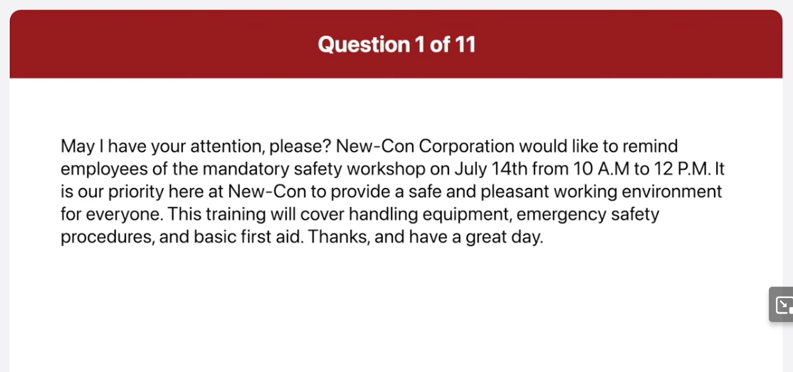
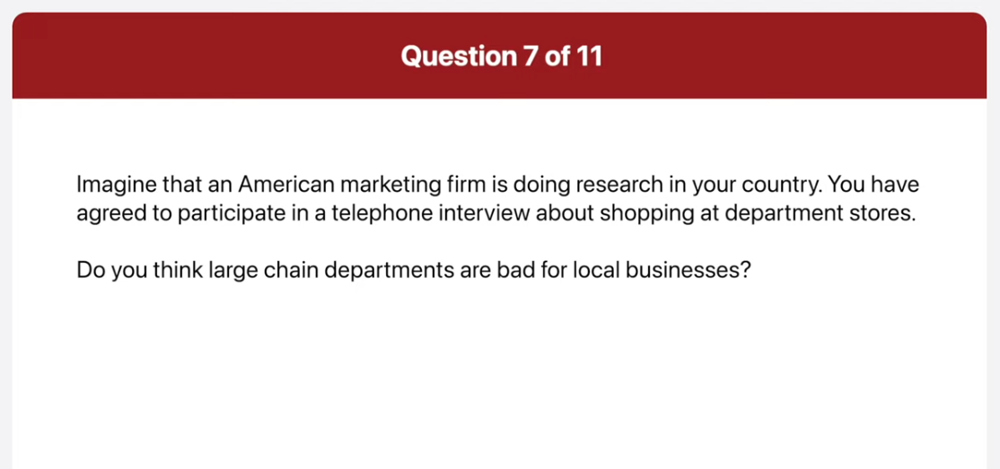
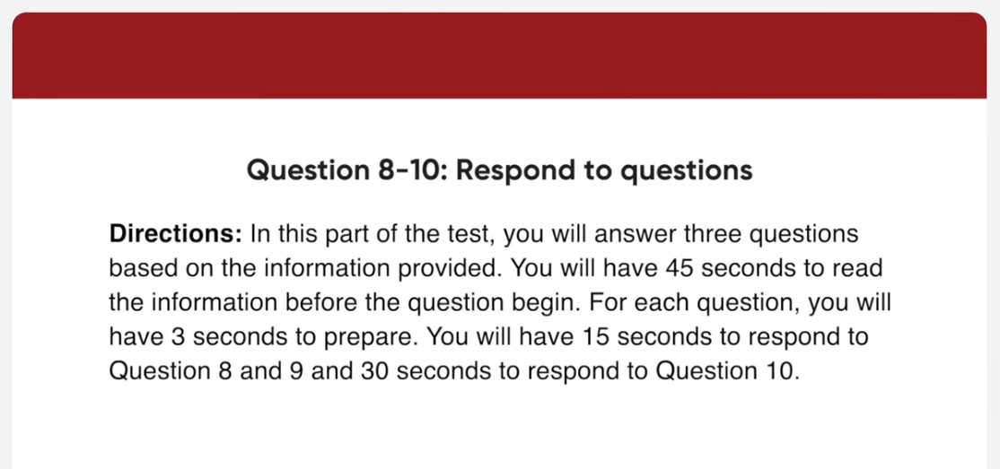
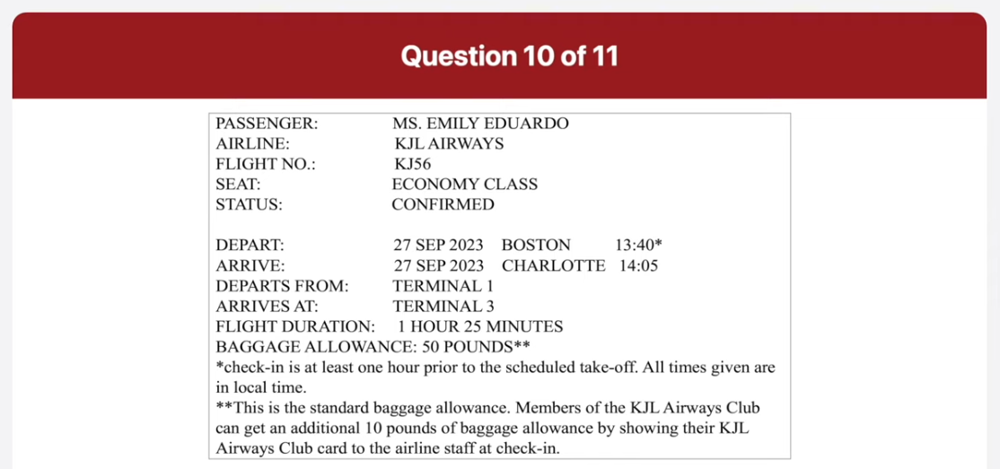

_Link: https://www.youtube.com/watch?v=asa5rJekhqU_

for the best in Comfort while traveling book your next day here at cozy Town Suites you feel at home in our clean spacious rooms as you relax with such amenities as cable TV wireless internet and a private balcony need a place to hold your next business or family event we've recently renovated our conference room area and can accommodate groups of any size call us today at 1-88-100 or visit our website at www.cozital.com

This picture was taken at a busy office the main focus of the picture is many employees concentrating on their work the woman on the left is looking over a man's shoulders and he seems to be showing her something on his monitor beside them there is a woman talking on the phone and using the computer at the same time next to her is another woman sitting and talking to the man who's leaning over her desk overall I guess it looks like a typical scene of the office

this picture was taken at a barbecue party Outdoors the main focus of the picture is a group of people attending the party the man on the left is serving the barbecue holding a cooking utensil in one hand the others are enjoying the food and gossiping about something together next to him in the background I can also find a deep blue sky without any clouds overall I get it looks like a casual party among close friend close friends

which department store do you usually go to

um I usually go to the ABC departments
store downtown that's because it has all
the best shops and products therefore it
is always crowded with lots of customers
how much money do you normally spend on
a trip to the department store

I think I usually spend around one
million Vietnam dong at the department
store but the amount differs depending
on the situation sometimes I just go
window shopping and buy nothing
do you think large chain departments are
bad for local businesses

well actually I think large chain
department stores are good for local
businesses that's because they attract
lots of customers to the area it is true
that customers spend most of their money
at the department store however many
people still buy things at local shops
and eat out at coffee shops and
restaurants in the area
Source I definitely think
having a big department store nearby is
good for the surrounding local stores

what date exactly is the flight on and
what's the flight number

while your flight will be on September
27th and the flight number is kj-56 the
flight will be departing at 1 40 pm and
will be arriving in Charlotte at 205 pm
as far as I remember the baggage weight
limit is 60 pounds
is that right

when should I tell them to come

well your flight leaves at Boston at
Terminal 1 at 1 40 PM local time but you
should arrive at the airport at least
one hour prior to the scheduled takeoff
time after 1 hour and 25 minute flight
you arrive in Charlotte at 205 PM local
time there so you need to be picked up
soon after that your arrival gate is in
terminal 3.

well I'm afraid not the standard baggage
allowance is 50 pounds however if you
are a member of the Khal Airways club
you will be able to take 60 pounds of
baggage at no extra costs
I'm arranging to have someone to pick me
up and drop me off at the airport in
Boston and Charlotte

well I totally agree with the idea that most successful people are well organized the main reason is that people who are organized prioritize tasks that helps them to meet their objectives more efficiently for example if you have a specific plan of what to do you'll get right down to the work and save time and energy the other reason is that organized people know how to stay focused on the project until it is finished properly in my experience disorganized people have a lot of difficulty staying disciplined and following through the tasks this makes it much harder for them to meet important deadlines that's why I definitely think that most successful people are well organized

