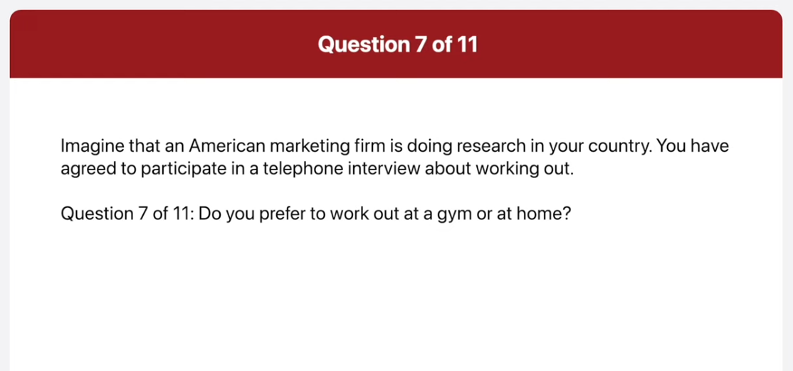
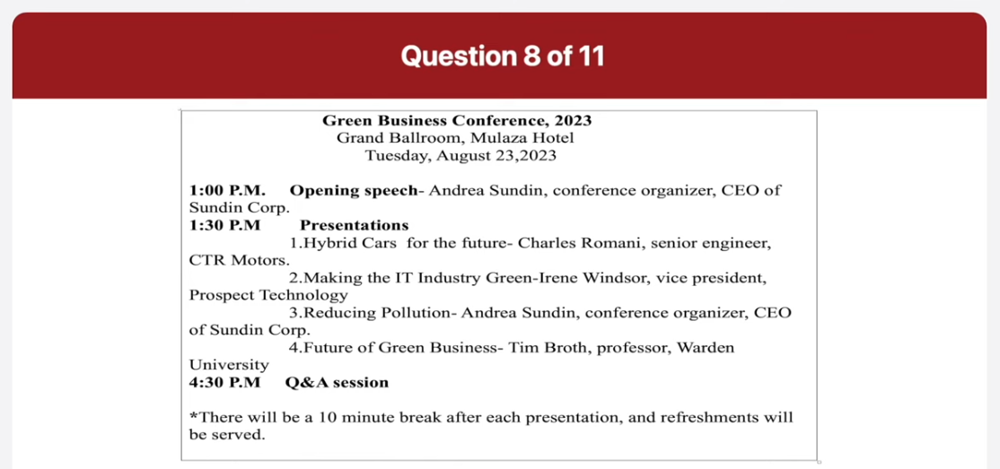

_Link: https://www.youtube.com/watch?v=_ghzcTca-28_

if you are looking to buy a car that's
also good for the environment come and
test drive the media the newest hybrid
car in the market the media is an SUV
fuel efficient at 32 miles per gallon
and reasonably priced starting at 52 and
800 dollars the media was selected Mass
design at the Chicago Auto Show in 2011
with its newly designed interior
allowing for two extra cup holders
overhead compartment space for two pairs
of sunglasses

the city of Wilmington will be holding
its Annual photos of the city life
Exhibition at the City Hall Museum
located at 45 Grove Weston Street this
division starts on September 1st and
will run until December 31st the museum
is open from 9am to 5 PM on weekdays the
admission fee is ten dollars children
under the age of five are free for more
information call
800-422-4538 or visit definitely
definitely definitely Dot willmoss.org

this picture was taken in a conference
room a man is standing at a flip chart
giving a presentation his porting at a
pie graph on the fleet chart three
people are sitting at a wooden table
watching the presentation there are two
coffee cups on the table in the
background I can see a wood panel word
the presentation seems to be going well
as the audience seems to be focused on
what the presenter is telling them

this picture was taken in a kitchen there are four substance of various sites on a gas range three of the saucepan contained foods which is being cooked in the background there are some bottles and salt and pepper shakers there are also some kitchen utensils and a container full of white bottle corks the kitchen looks well equipped and it looks like a very busy kitchen

when do you usually work out

well I usually try to work out every evening at the school but when I have appointment with my friends or an assignment to finish I often skip it so I think I work out about two or three times a week

what sorts of exercises do you do during a workout

I normally just use the SSI bike or the treadmill since these two things are the it is for me to work out on also they are good for burning calories and losing weight

do you prefer to work out at a gym or at home

actually I prefer working out at home the main reason is that it's inconvenient to make them effort to go all the way to the gym for example when I signed up for a gym membership last month I rarely went there the other reason is that I can exercise whenever I want regardless of the business hours at the gym that's why I like to work out at home

what time does it?

the conference is on Tuesday August 23rd
and it starts at 1pm

will there be any breaks between the presentation

yes there will be a 10 minute break
after each presentation

how many presentations will there be and when do I present

will be four presentations during the day and you will be the last presenter you will present after Andrea Sundance talk on reducing pollution

well I agree with that statement I think schools are the most important fighter when choosing a place to live there are few reasons why I believe this first of all I have children and I want to ensure that they get the best education possible I'll take a lower paying job to make sure my children have assessed to better schools with better schools my children have a better chance to success when they get older another reason for me is surrounding area of the good school good schools are typically a nicer and safer areas of Uptown I want my family to be safe and live in a nice Community you probably won't find a grass Going Back part of town that could be of course some other factors to consider than finding a good school but for me my family is the most important thing in my life so I strongly agree that a good school is the most important factor when choosing a new place to live yeah to be honest I disagree with this statement in my opinion there are other Fighters that are more important than finding a good school when you choose a place to live one of the most important things I think is good public transportation I'd want to work in a place that has a great best and ideally subway system I prefer taking the best or train driving and sitting in traffic or long previous attempt I can save money and time by living in a city with a great transportation system another figure I consider is the alignment I want to live in a city with a lot of Green Space such as the past the Greek creation areas and Blended plants and trees around the city health is very important things for me and my family we want to have the proper facilities to be able to get outside exercise and enjoy the weather

