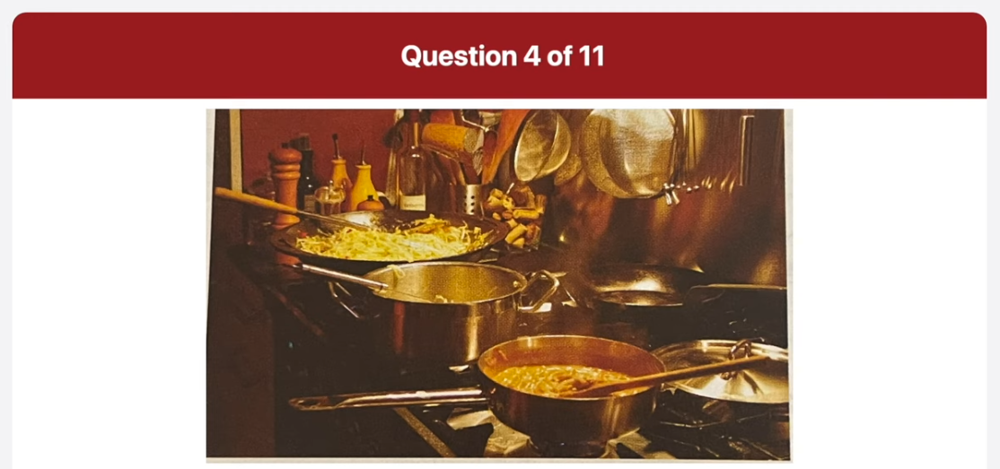
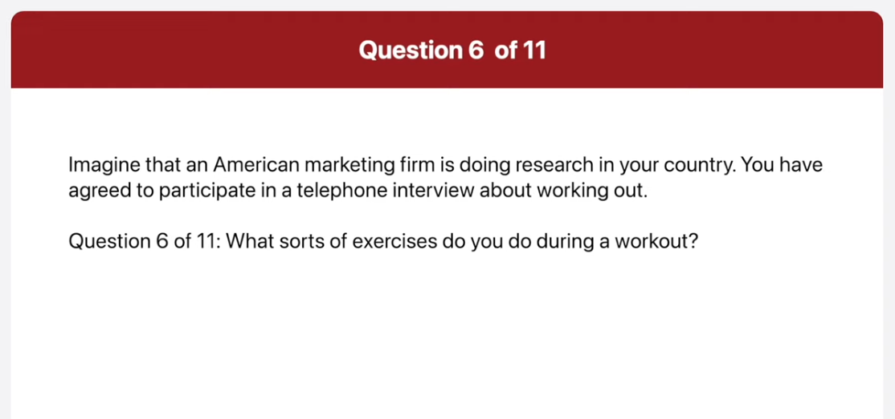

_Link: https://www.youtube.com/watch?v=_ghzcTca-28_

00:01:07.159 if you are looking to buy a car that's
00:01:10.200 also good for the environment come and
00:01:13.140 test drive the media the newest hybrid
00:01:15.900 car in the market the media is an SUV
00:01:19.380 fuel efficient at 32 miles per gallon
00:01:22.979 and reasonably priced starting at 52 and
00:01:27.540 800 dollars the media was selected Mass
00:01:30.960 design at the Chicago Auto Show in 2011
00:01:35.220 with its newly designed interior
00:01:38.220 allowing for two extra cup holders
00:01:41.159 overhead compartment space for two pairs
00:01:44.280 of sunglasses

00:02:37.920 the city of Wilmington will be holding
00:02:40.860 its Annual photos of the city life
00:02:43.319 Exhibition at the City Hall Museum
00:02:45.840 located at 45 Grove Weston Street this
00:02:49.920 division starts on September 1st and
00:02:52.680 will run until December 31st the museum
00:02:56.160 is open from 9am to 5 PM on weekdays the
00:03:01.800 admission fee is ten dollars children
00:03:04.920 under the age of five are free for more
00:03:08.160 information call
00:03:14.420 800-422-4538 or visit definitely
00:03:17.159 definitely definitely Dot willmoss.org

00:04:26.100 this picture was taken in a conference
00:04:28.680 room a man is standing at a flip chart
00:04:31.500 giving a presentation his porting at a
00:04:35.220 pie graph on the fleet chart three
00:04:37.680 people are sitting at a wooden table
00:04:40.080 watching the presentation there are two
00:04:43.139 coffee cups on the table in the
00:04:45.600 background I can see a wood panel word
00:04:48.540 the presentation seems to be going well
00:04:51.419 as the audience seems to be focused on
00:04:54.060 what the presenter is telling them

00:05:48.840 this picture was taken in a kitchen
00:05:51.120 there are four substance of various
00:05:53.820 sites on a gas range three of the
00:05:56.639 saucepan contained foods which is being
00:05:59.039 cooked
00:06:00.060 in the background there are some bottles
00:06:02.340 and salt and pepper shakers there are
00:06:05.220 also some kitchen utensils and a
00:06:07.860 container full of white bottle corks the
00:06:11.220 kitchen looks well equipped and it looks
00:06:13.919 like a very busy kitchen

00:06:40.560 when do you usually work out
00:06:43.139 begin preparing now
00:06:49.199 begin speaking now
00:06:51.419 well I usually try to work out every
00:06:54.539 evening at the school but when I have
00:06:57.000 appointment with my friends or an
00:06:59.340 assignment to finish I often skip it so
00:07:02.699 I think I work out about two or three
00:07:06.000 times a week

00:07:08.880 what sorts of exercises do you do during
00:07:11.220 a workout
00:07:12.419 begin preparing now
00:07:18.479 begin speaking now
00:07:20.720 I normally just use the SSI bike or the
00:07:24.900 treadmill since these two things are the
00:07:27.960 it is for me to work out on also they
00:07:31.560 are good for burning calories and losing
00:07:34.319 weight

00:07:37.979 do you prefer to work out at a gym or at
00:07:40.139 home
00:07:41.280 begin preparing now
00:07:47.280 begin speaking now
00:07:49.919 actually I prefer working out at home
00:07:52.500 the main reason is that it's
00:07:54.479 inconvenient to make them effort to go
00:07:57.240 all the way to the gym for example when
00:08:00.000 I signed up for a gym membership last
00:08:02.340 month I rarely went there the other
00:08:05.220 reason is that I can exercise whenever I
00:08:08.340 want regardless of the business hours at
00:08:11.099 the gym that's why I like to work out at
00:08:13.919 home

00:09:26.779 and what time does it begin
00:09:30.620 preparing now
00:09:36.600 again speaking now
00:09:38.940 the conference is on Tuesday August 23rd
00:09:42.839 and it starts at 1pm

00:09:46.500 will there be any breaks between the
00:09:48.360 presentation
00:09:49.860 begin preparing now
00:09:55.920 begin speaking now
00:09:58.740 yes there will be a 10 minute break
00:10:01.500 after each presentation

00:10:06.060 how many presentations will there be and
00:10:08.399 when do I present
00:10:11.160 begin preparing now
00:10:16.760 begin speaking now
00:10:20.459 will be four presentations during the
00:10:23.279 day and you will be the last presenter
00:10:25.740 you will present after Andrea Sundance

00:10:28.860 talk on reducing pollution

00:11:38.480 well I agree with that statement I think
00:11:41.880 schools are the most important fighter
00:11:44.220 when choosing a place to live there are
00:11:46.800 few reasons why I believe this first of
00:11:50.040 all I have children and I want to ensure
00:11:53.100 that they get the best education
00:11:55.200 possible I'll take a lower paying job to
00:11:58.860 make sure my children have assessed to
00:12:01.320 better schools with better schools my
00:12:04.019 children have a better chance to success
00:12:06.480 when they get older another reason for
00:12:09.660 me is surrounding area of the good
00:12:12.180 school good schools are typically a
00:12:14.940 nicer and safer areas of Uptown I want
00:12:18.899 my family to be safe and live in a nice
00:12:21.660 Community you probably won't find a
00:12:25.140 grass Going Back part of town that could
00:12:27.899 be of course some other factors to
00:12:30.540 consider than finding a good school but
00:12:33.300 for me my family is the most important
00:12:36.120 thing in my life so I strongly agree
00:12:39.000 that a good school is the most important
00:12:41.640 factor when choosing a new place to live
00:12:45.420 yeah to be honest I disagree with this
00:12:48.959 statement in my opinion there are other
00:12:51.540 Fighters that are more important than
00:12:53.579 finding a good school when you choose a
00:12:56.040 place to live one of the most important
00:12:58.500 things I think is good public
00:13:01.139 transportation I'd want to work in a
00:13:04.079 place that has a great best and ideally
00:13:07.079 subway system I prefer taking the best
00:13:10.019 or train driving and sitting in traffic
00:13:13.019 or long previous attempt I can save
00:13:16.139 money and time by living in a city with
00:13:19.680 a great transportation system another
00:13:22.560 figure I consider is the alignment I
00:13:25.980 want to live in a city with a lot of
00:13:28.680 Green Space such as the past the Greek
00:13:31.560 creation areas and Blended plants and
00:13:34.860 trees around the city
00:13:36.959 health is very important things for me
00:13:40.019 and my family we want to have the proper
00:13:43.500 facilities to be able to get outside
00:13:46.019 exercise and enjoy the weather

