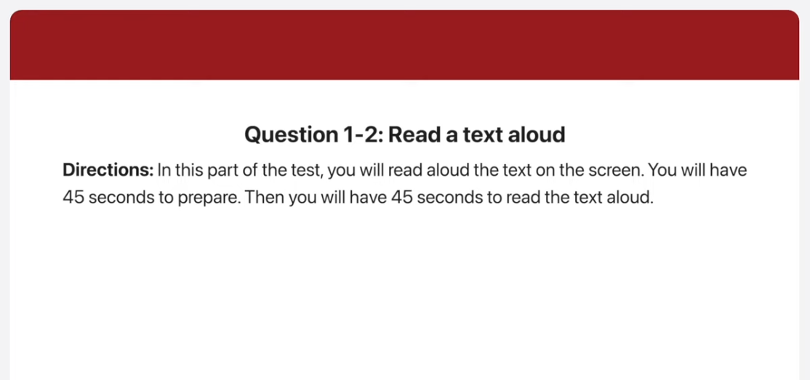
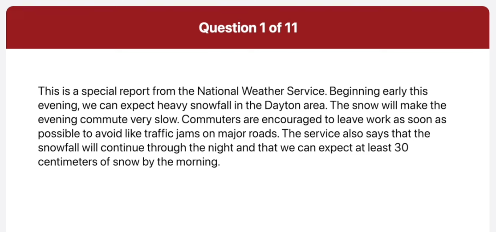
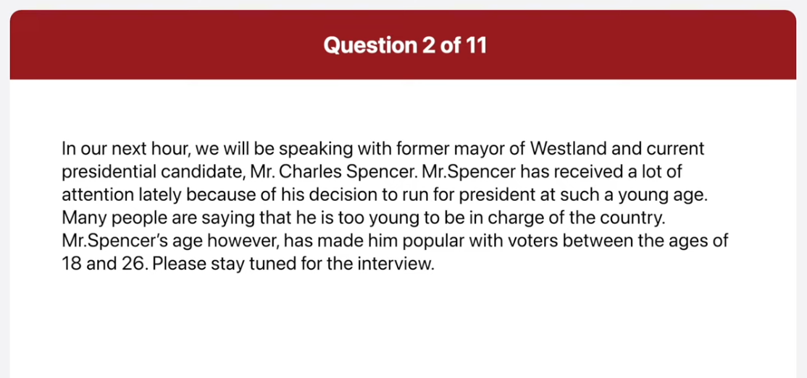
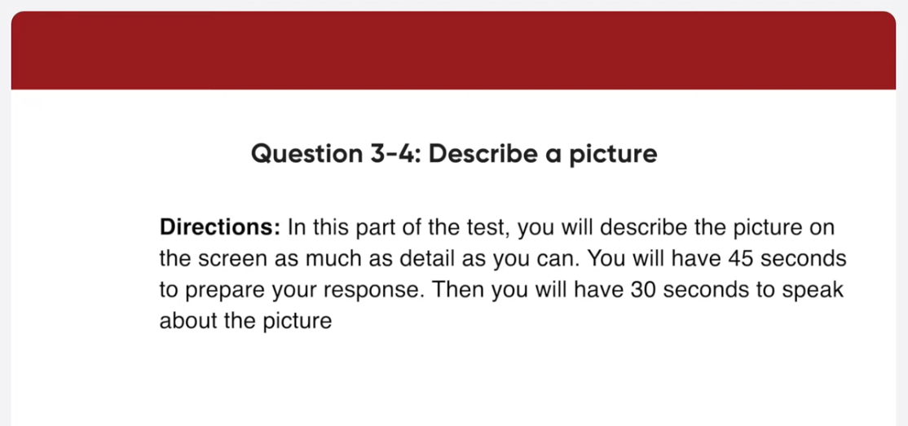
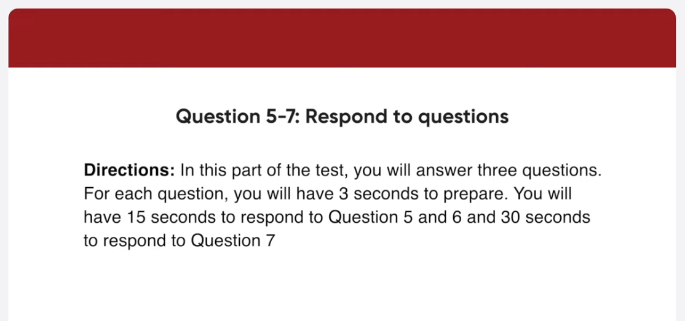
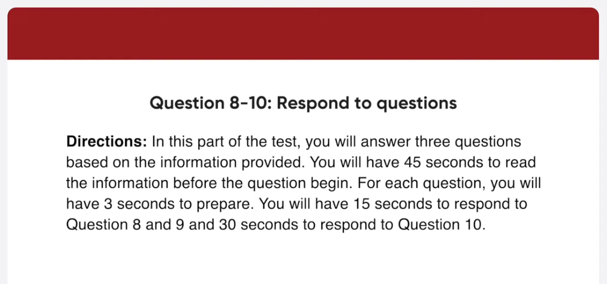
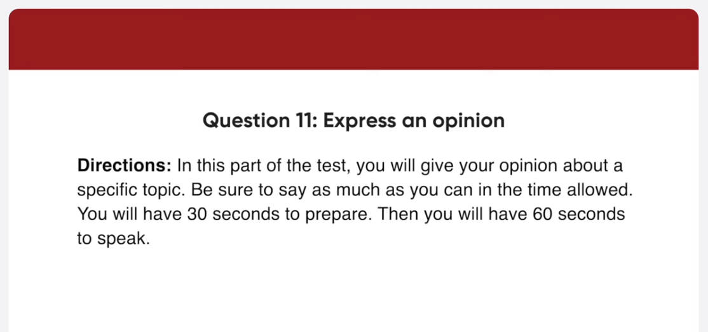
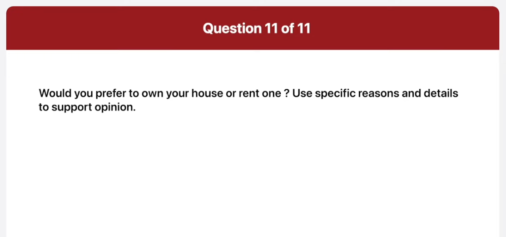

*Link: https://www.youtube.com/watch?v=KcarZoQWL3o*

This is a special report from the National Weather Service. Beginning early this evening, we can expect heavy snowfall in the Dayton area. The snow will make the evening commute very slow. Commuters are encouraged to leave work as soon as possible to avoid light traffic jams on major roads. The service also says that the snowfall will continue through the night and that we can expect at least 30 centimeters of snow by the morning

In the next hour, we will be speaking with a former mayor of Westland and current presidential candidate, Mr. Charles Spencer. Mr. Spencer has received a lot of attention lately because of his decision to run for president at such a young age. Many people are saying that he is too young to be in charge of the country. Mr. Spencer's age however, has made him popular with voters between the ages of 18 and 26. Please stay turned for the interview.

This is a picture of a shopping street in what looks like a pedestrian only area. A woman wearing a black coat and black high heels is looking in a shop window. There are buildings on both sides of the street and small trees in pots. There are also plants growing against some of the walls. On the right hand side of the street there are some shops. One of the shop has a black frontage with gold lettering. It looks like a pleasant day and a nice atmosphere in which to go shopping.

This picture was taken at a fruit and vegetable market. A man and a woman are standing with their backs to the camera. They are both wearing jackets. A woman working at the stand is weighing some vegetables for them. The two customers have a large dog with them. There are some other people in the background and I can see a roadside outside the patio umbrella that covers the stands. The produce looks delicious and is properly really fresh.

I usually play computer games on weekends. I don't have time during the week because I get home from work late.

Typically, I prefer to buy computer games online, particularly from digital platforms like steam or GOG because buying games online provides me a wide range of options to choose from.

I like to play computer game for the following reasons. First, I play computer games to pass the time. Whenever I'm bored, I play computer games. Secondly, some games are like good books or movies. They have storylines, and I keep playing because I want to find out what happens next. These are the reasons I like to play computer games.

All seminars start at 2PM and finish at 4 pm they are taking place at top City Hotel Grand Ballroom who will be leading the seminar on buyer profiles

Samantha Leoni will be leading that seminar. She is the director of Midlink Properties.

Certainly. The first seminar, which is on Monday April 23rd will be about supply and demand situations. The instructor will be Andrea Beety, who is a professor at Windham University. You definitely do not want to meet this seminar as it will lay the foundation for the following topics

Now there is no doubt in my mind that owning a house is better than renting I feel this way for two main reasons most importantly owning a house is a wise Financial investment house prices usually rise considerably over time so the value of your investment increases if you rent a house you have to pay a lot of money every month and that money is gone forever even if you paid rent for 50 years you still would not own the property so it's complete waste of money not only that if you rent the landlord can add ask you to leave at any time that's very inconvenient especially if you work nearby or have children attending a local school therefore my preference is to buy rather than rent if I can afford to do so

