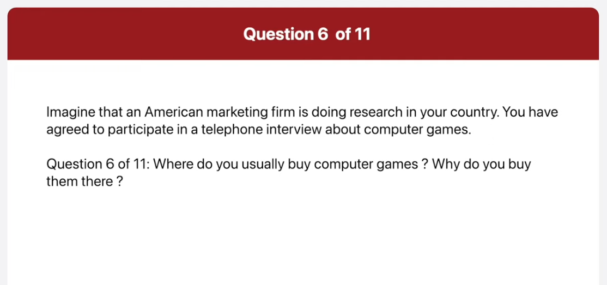
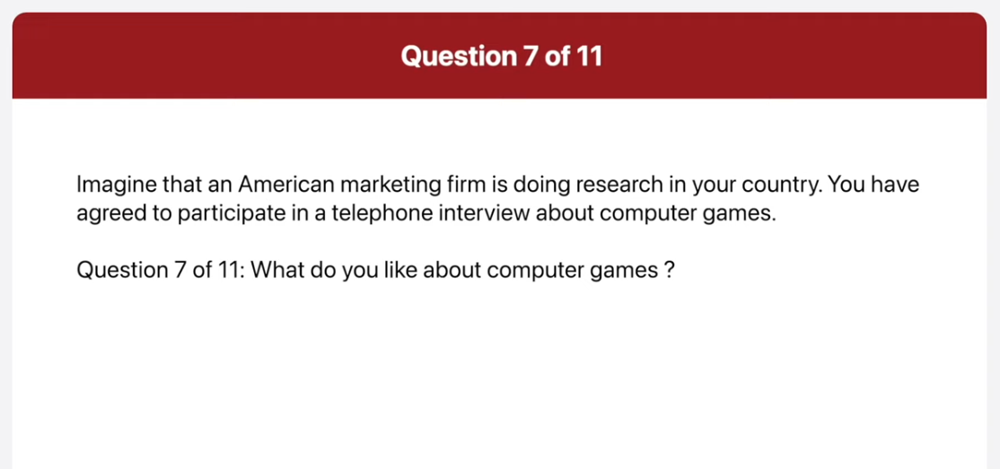

_Link: https://www.youtube.com/watch?v=KcarZoQWL3o _

00:00:00.240 there is no doubt in my mind that owning
00:00:03.120 a house is better than renting I feel
00:00:06.000 this way for two main reasons in this
00:00:08.460 part of the test you will read aloud the
00:00:10.440 text on the screen you will have 45
00:00:12.719 seconds to prepare then you will have 45
00:00:15.360 seconds to read the text aloud

This is a special report from the National Weather Service beginning only this evening we can expect heavy snowfall in the dating area the snow will make the evening commute very slow commuters are encouraged to leave work as soon as possible to avoid light traffic jams on major roads the service also says that the snowfall will continue through the night and that we can expect at least 30 centimeters of snow by the morning

This is a picture of a shopping street in what looks like a pedestrian only area a woman wearing a black coat and black high heels is looking in a sharp window there are buildings on both sides of the street and small trees in pots there are also plants growing against some of the wars otherwise hand side of the street there are some shops one of the shop has a black Francis with gold lettering it looks like a pleasant day and a nice astrophy in which to go shopping

this picture was taken at a fruit and vegetable market a man and a woman are standing with their backs to the camera they are both wearing jackets a woman working at the stand is wearing some vegetables for them the two customers have a large dog with them there are some other people in the background and I can see a roadside outside the patio umbrella that covers the stance the produce looks delicious and is properly really fresh in this part of the test

I usually play computer games on weekends I don't have time during the week because I get home from work late where do you usually buy computer games why do you buy them there

again speaking now typically I prefer to buy computer games online particularly from digital platforms like steam or Gog because buying games online provides me a wide range of options to choose from what do you like about computer games

I like to play computer games for the following reasons first I play computer games to pause the time whenever I'm bored I play computer games secondly some games are like good books or movies they have story lives and I keep playing because I want to find out what happens next these are the reasons I like to play computer games

All seminars start at 2PM and finish at 4 pm they are taking place at top City Hotel Grand Ballroom who will be leading the seminar on buyer profiles

Certainly the first seminar which is on Monday April 23rd will be about supply and demand situations the instructor will be Andrea Beatty who is a professor at Windham University you definitely do not want to meet this seminar as it will lay the foundation for the following topics

Now there is no doubt in my mind that owning a house is better than renting I feel this way for two main reasons most importantly owning a house is a wise Financial investment house prices usually rise considerably over time so the value of your investment increases if you rent a house you have to pay a lot of money every month and that money is gone forever even if you paid rent for 50 years you still would not own the property so it's complete waste of money not only that if you rent the landlord can add ask you to leave at any time that's very inconvenient especially if you work nearby or have children attending a local school therefore my preference is to buy rather than rent if I can afford to do so

