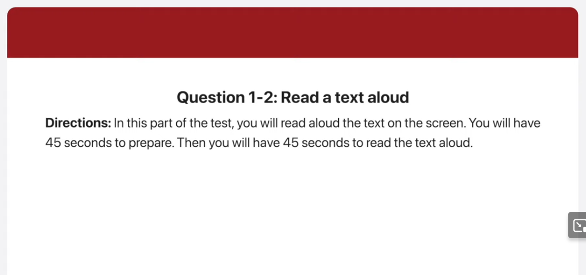
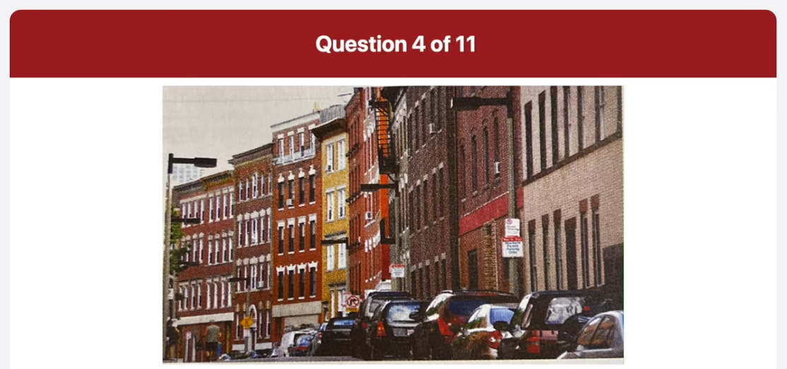
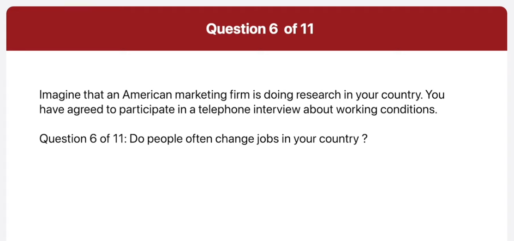
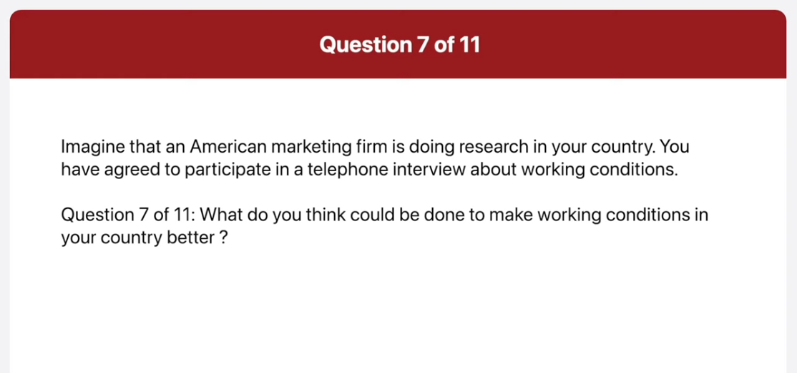

_Link: https://www.youtube.com/watch?v=lgKUIkjDTAk_

## Transcript

00:00:00.480 of these three options I think I would
00:00:03.540 choose to read a book my main reason is
00:00:06.120 that books allow me to experience in
00:00:08.340 this part of the test you will read
00:00:09.900 aloud the text on the screen you will
00:00:12.240 have 45 seconds to prepare then you will
00:00:14.880 have 45 seconds to read the text aloud
00:00:17.880 begin preparing now
00:01:05.640 begin reading now
00:01:07.760 are you hungry for the best pizza in the
00:01:10.799 city then cause a top of the pizza for
00:01:13.740 quick delivery of our fresh hot pizza in
00:01:17.580 addition to a wide selection of pizzas
00:01:20.040 and toppings we also make delicious
00:01:22.560 pasta dishes salads and breadsticks for
00:01:26.759 your convenience you can even place your
00:01:29.159 order online for quick pick up for or
00:01:32.580 delivery so the next time you're
00:01:35.220 thinking about what to do for dinner
00:01:37.439 give us a call and let us take of
00:01:40.140 everything
00:01:43.380 begin preparing now
00:02:31.020 begin reading now
00:02:32.959 as a guess of High Point Hotel all
00:02:36.840 travelers can enjoy free access to our
00:02:39.660 modern fitness center located on the
00:02:43.019 15th floor the center offers you all of
00:02:46.200 the latest exercise equipment to help
00:02:48.959 you stay in shape the Phoenix Center has
00:02:52.379 personal trainers to make sure you get
00:02:55.019 the most of your workouts when your
00:02:57.959 workout is finished you can relax in
00:03:00.720 large outdoor swimming pool that offers
00:03:03.660 great views of the city
00:03:08.220 in this part of the test you will
00:03:10.200 describe the picture on the screen as
00:03:11.879 much as detail as you can
00:03:13.920 you will have 45 seconds to prepare your
00:03:16.500 response
00:03:17.640 then you will have 30 seconds to speak
00:03:19.739 about the picture
00:03:21.840 begin preparing now
00:04:08.640 foreign
00:04:09.860 speaking now
00:04:11.819 this picture was taken in an auditorium
00:04:14.580 people are sitting on red and white Seas
00:04:17.699 facing the stage on the stage this man
00:04:20.880 looks like he's addressing the audience
00:04:23.160 in the background I can see an upper
00:04:26.040 level of sitting in the auditorium where
00:04:29.100 more people are sitting there are
00:04:31.259 various spotlights in the ceiling of the
00:04:33.419 auditorium and there seems to be a
00:04:36.240 screen of the wall of the stage the
00:04:38.759 auditorium looks comfortable and well
00:04:40.740 equipped
00:04:42.900 begin preparing now
00:05:30.780 begin speaking now
00:05:33.120 the picture was taken in a quiet street
00:05:35.400 there are two people walking away in the
00:05:38.100 distance only one of whom is really
00:05:40.680 invisible the man is wearing blue shawls
00:05:43.740 and gray sleeveless shirt he seems to be
00:05:46.680 carrying a bag their cars parked on the
00:05:49.800 right hand side of the road both sides
00:05:52.320 of the road are light with tall street
00:05:54.660 lights the street looks calm and
00:05:56.820 peaceful as there's no traffic and the
00:05:58.979 man is working in the road
00:06:02.780 in this part of the test you will answer
00:06:05.400 three questions
00:06:07.199 for each question you will have three
00:06:09.240 seconds to prepare
00:06:10.979 you will have 15 seconds to respond to
00:06:13.500 question 5 and 6 and 30 seconds to
00:06:15.960 respond to question seven imagine that
00:06:18.479 an American marketing firm is doing
00:06:20.100 research in your country
00:06:22.080 you have agreed to participate in a
00:06:24.180 telephone interview about working
00:06:25.380 conditions
00:06:27.120 what are the standard working hours in
00:06:29.220 your country
00:06:30.180 begin preparing now
00:06:36.240 begin speaking now
00:06:38.819 in my country the working hours are
00:06:41.699 usually nine to six some people work
00:06:44.819 longer though
00:06:47.580 do people often change jobs in your
00:06:49.740 country
00:06:50.580 begin preparing now
00:06:56.120 begin speaking now
00:07:00.240 it is quite common for people to change
00:07:02.940 jobs in my country it's okay to have had
00:07:06.780 different jobs
00:07:11.400 what do you think could be done to make
00:07:13.319 working conditions in your country
00:07:14.759 better
00:07:15.780 begin preparing now
00:07:21.780 begin speaking now
00:07:25.319 working conditions would be better if
00:07:28.259 people felt able to live work on time in
00:07:31.560 some companies people think that they
00:07:34.319 shouldn't live work until their boss
00:07:36.180 leaves this can mean that people are
00:07:38.699 just waiting in the office even though
00:07:41.580 they have finished all their work
00:07:44.819 in this part of the test you will answer
00:07:46.919 three questions based on the information
00:07:48.720 provided
00:07:50.220 you will have 45 seconds to read the
00:07:52.680 information before the question begin
00:07:55.199 for each question you will have three
00:07:57.300 seconds to prepare
00:07:59.039 you will have 15 seconds to respond to
00:08:01.500 question 8 and 9 and 30 seconds to
00:08:03.780 respond to question 10.
00:08:06.240 begin preparing now
00:08:53.300 hello my name is Sam Goldsmith and I've
00:08:56.459 recently been hired by your company
00:08:58.560 I'm calling to ask some questions about
00:09:00.660 the upcoming orientation
00:09:02.820 where is it going to be held what time
00:09:05.040 does it end
00:09:06.300 begin preparing now
00:09:11.779 begin speaking now
00:09:14.640 it will be held at the pr training
00:09:18.240 center and it ends at 4 pm
00:09:22.800 do we get our ID badge on this day
00:09:26.040 begin preparing now
00:09:32.459 speaking now
00:09:34.399 no you don't you'll get your ID badge in
00:09:38.519 your first day of work
00:09:42.420 I may have to leave at lunch because of
00:09:44.279 important family business
00:09:46.380 what will I miss
00:09:48.600 begin preparing now
00:09:54.660 begin speaking now
00:09:57.240 if you leave at noon you'll miss
00:09:59.640 employee responsibility and conduct
00:10:02.459 which is scheduled from 1 to 2 PM you
00:10:07.019 also Miss information security which is
00:10:10.260 scheduled from 2 to 3 pm and computer
00:10:13.459 orientation which is from 3 to 4 pm
00:10:19.740 in this part of the test you will give
00:10:21.899 your opinion about a specific topic
00:10:24.360 be sure to say as much as you can in the
00:10:26.459 time allowed
00:10:27.779 you will have 30 seconds to prepare
00:10:30.600 then you will have 60 seconds to speak
00:10:32.820 which of the following three things
00:10:34.800 would you do if you had some free time
00:10:37.500 choose one of the options and use
00:10:39.540 specific reasons and details to support
00:10:41.580 your opinion
00:10:43.980 begin preparing now
00:11:17.399 begin speaking now
00:11:21.120 if I have some free time I would choose
00:11:23.760 hiking from these three options I like
00:11:26.519 hiking for two simple reasons firstly
00:11:29.579 hiking gives me a really good
00:11:31.980 opportunity to think through things
00:11:34.920 I can breathe fresh air in the forest
00:11:37.620 and this helps me to relax and think
00:11:40.560 more clearly once I begin hiking with a
00:11:44.519 lot of stress worrying about a family
00:11:47.220 problem but by the time I was finished I
00:11:50.339 had a brilliant solution in mind and I
00:11:52.680 was completely stress free not only that
00:11:55.500 but hiking is also excellent exercise
00:11:58.220 hiking up on actual mountains is very
00:12:01.620 physically demanding so it is effective
00:12:04.680 for strengthening my muscles and
00:12:07.140 increasing my stamina
00:12:09.000 I find that hiking for a few hours is
00:12:12.000 much more effective than doing muscle
00:12:14.459 training at the gym therefore I would go
00:12:17.579 hiking during my spare time
00:12:20.959 of these three options I think I would
00:12:24.180 choose to read a book my main reason is
00:12:26.880 that books allow me to experience things
00:12:29.339 that I might never have a opportunity to
00:12:32.760 experience firsthand
00:12:34.860 this includes things that are not
00:12:37.320 currently possible like traveling to
00:12:40.019 other worlds or Through Time Of course
00:12:43.019 movies do the same thing but with a book
00:12:45.600 I use my own imagination while with a
00:12:48.899 movie I watch someone else do it my
00:12:52.200 second reason for choosing a book is
00:12:54.779 that it is very convenient
00:12:56.880 since books are light and durable they
00:13:00.300 are easy to carry I can read books
00:13:02.880 anywhere so when I have free time I
00:13:05.760 prefer to read a book
