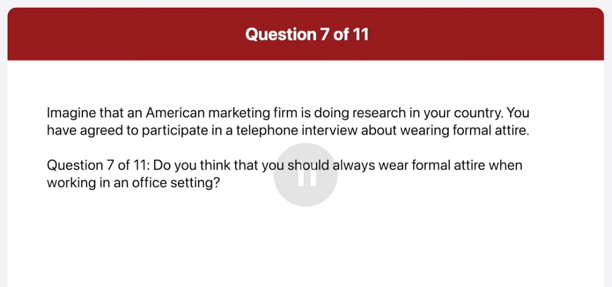
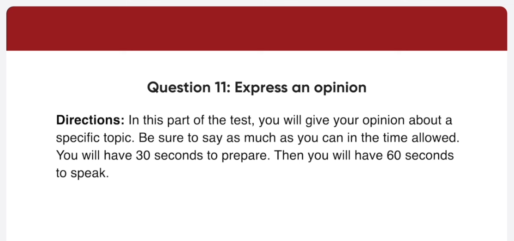

*Link: https://www.youtube.com/watch?v=jpTcezHC4z4

## Transcript

00:00:00.060 this picture was taken in a street
00:00:02.340 outside a cafe in the foreground six
00:00:05.640 people are seated around the table in
00:00:08.340 this part of the test you will read
00:00:09.960 aloud the text on the screen you will
00:00:12.300 have 45 seconds to prepare then you will
00:00:14.940 have 45 seconds to read the text aloud
00:00:18.060 begin preparing now
00:01:05.760 begin reading now
00:01:07.760 hello listeners thanks for tuning in to
00:01:11.460 Frankly Speaking I'm Corner Davis today
00:01:14.939 we're lucky with us as our first guest a
00:01:18.180 man who worked with the United Nations
00:01:20.400 for over five years Mr Michael Dumont
00:01:24.500 originally from France Mr Michael Dumont
00:01:28.020 has given many speeches about the
00:01:30.840 positive benefits of nuclear energy his
00:01:34.439 beliefs in this benefits have shocked
00:01:37.020 many people around the world when we
00:01:40.140 turn from commercial break we will speak
00:01:42.479 to him about his views don't go away
00:01:49.140 preparing now
00:02:36.599 begin reading now
00:02:38.660 on tonight's show we'll hear comments
00:02:41.879 from three people who are trying to get
00:02:44.280 the government to pay more attention to
00:02:47.220 solar energy as we all know solar power
00:02:50.760 is a good source of energy because it is
00:02:53.940 clean and cheap our guests will talk
00:02:56.700 about the other benefits of solar energy
00:02:59.400 and why businesses and average family
00:03:02.840 need to start using this natural source
00:03:06.180 of power when you come by from this
00:03:08.700 commercial break I will introduce our
00:03:10.980 guests please stay tuned
00:03:15.120 in this part of the test you will
00:03:17.040 describe the picture on the screen as
00:03:18.780 much as detail as you can
00:03:20.760 you will have 45 seconds to prepare your
00:03:23.280 response
00:03:24.540 then you will have 30 seconds to speak
00:03:26.640 about the picture
00:03:28.620 begin preparing now
00:04:15.599 foreign
00:04:16.620 begin speaking now
00:04:18.600 this picture was taken in a street
00:04:20.820 outside a cafe in the foreground six
00:04:24.180 people are seated a rally table the
00:04:26.820 people are all wearing jackets or cause
00:04:29.220 the table is covered by a yellow
00:04:32.120 tablecloth there are two coffee cups and
00:04:35.340 saucers on the table and some sugar in
00:04:38.639 the background and see the cafe and some
00:04:41.220 other stores there are some trees lining
00:04:43.919 the road on the sidewalker people are
00:04:46.259 passing by it looks like a nice place to
00:04:49.259 have a coffee with friends
00:04:51.780 begin preparing now
00:05:39.780 begin speaking now
00:05:42.060 this is the picture of a subway station
00:05:44.400 there are two train tracks and a
00:05:47.160 platform on either side of the tracks
00:05:49.500 the station is covered by a dome-shaped
00:05:52.320 roof people are waiting on both
00:05:54.600 platforms for trains about one of the
00:05:57.360 platforms I can see a map of the train
00:05:59.639 line in the distance I can see the
00:06:02.580 opening of the station they're a bright
00:06:05.220 light outside the station looks clean
00:06:08.100 and well organized
00:06:10.259 in this part of the test you will answer
00:06:12.539 three questions
00:06:14.280 for each question you will have three
00:06:16.380 seconds to prepare
00:06:18.120 you will have 15 seconds to respond to
00:06:20.580 question 5 and 6 and 30 seconds to
00:06:23.100 respond to question 7. imagine that an
00:06:25.800 American marketing firm is doing
00:06:27.240 research in your country
00:06:29.220 you have agreed to participate in a
00:06:31.259 telephone interview about wearing formal
00:06:32.880 attire
00:06:34.440 how often do you wear a formal suit
00:06:37.319 begin preparing now
00:06:43.380 begin speaking now
00:06:45.720 I wear a former suit four times a week
00:06:48.720 Monday through Thursday to go to work on
00:06:52.199 Fridays we can dress more casually
00:06:56.580 where do you normally buy formal attire
00:06:59.400 begin preparing now
00:07:05.000 begin speaking now
00:07:07.500 well I usually buy a tile from a variety
00:07:11.160 of places enjoy shopping at both
00:07:14.039 physical retail stores and online
00:07:16.319 platforms some of my go-to stores
00:07:19.199 include department stores boating stores
00:07:21.960 and popular clothing brands
00:07:25.919 do you think that you should always wear
00:07:27.720 formal attire when working in an office
00:07:29.880 setting begin preparing now
00:07:36.539 begin speaking now
00:07:38.639 yes I think you should always wear a
00:07:41.580 formal tile when working in an office if
00:07:44.880 everyone wears former tile it creates a
00:07:48.000 more professional atmosphere in the
00:07:50.340 workplace also for me personally I think
00:07:54.060 wearing formal clothing makes me focus
00:07:56.819 more on work
00:07:58.620 in this part of the test you will answer
00:08:00.780 three questions based on the information
00:08:02.580 provided
00:08:03.960 you will have 45 seconds to read the
00:08:06.419 information before the question begin
00:08:09.000 for each question you will have three
00:08:11.039 seconds to prepare
00:08:12.840 you will have 15 seconds to respond to
00:08:15.300 question 8 and 9 and 30 seconds to
00:08:17.639 respond to question 10.
00:08:19.979 begin preparing now
00:09:07.279 hi I heard that some kind of food
00:09:09.660 festival is going to be held next week
00:09:12.360 I'd like to find out more about it
00:09:14.940 could you answer some questions for me
00:09:16.980 what is the theme of the festival and
00:09:19.440 where is it going to be held
00:09:22.080 begin preparing now
00:09:27.680 begin speaking now
00:09:30.480 is Caribbean disheve festival and it's
00:09:33.839 going to be held at Ridgefield Park
00:09:36.899 can you tell me the schedule for the
00:09:38.760 afternoon
00:09:40.200 begin preparing now
00:09:46.680 speaking now
00:09:49.019 sure there will be musical performances
00:09:52.080 from 1 to 3 pm and from 3 P.M to 4 pm
00:09:56.459 there will be cooking classes
00:10:00.060 I'd like to find more information about
00:10:01.980 the musical performances
00:10:05.700 begin preparing now
00:10:11.760 begin speaking now
00:10:13.980 sorry but I don't have bad information
00:10:16.320 with me if you'd like to find more about
00:10:19.800 the musical performances called the
00:10:22.560 Monte cultural Community Center at
00:10:27.740 555-4321 and speak to Simba Ebola
00:10:33.480 in this part of the test you will give
00:10:35.580 your opinion about a specific topic
00:10:38.100 be sure to say as much as you can in the
00:10:40.320 time allowed
00:10:41.519 you will have 30 seconds to prepare
00:10:44.339 then you will have 60 seconds to speak
00:10:46.620 do you agree or disagree with the
00:10:48.959 following statement
00:10:50.459 internet has brought people closer
00:10:52.380 together
00:10:53.459 use specific reasons and details to
00:10:55.920 support your opinion
00:10:57.720 begin preparing now
00:11:31.200 begin speaking now
00:11:33.240 I definitely agree with the statement
00:11:35.880 that internet has brought people closer
00:11:38.880 together firstly the internet makes it
00:11:42.120 much easier to stay in touch with people
00:11:44.899 in the past if you had to move along
00:11:48.060 this little way it was difficult to keep
00:11:51.060 in touch with family and friends you
00:11:53.760 have to send letters or make expensive
00:11:56.459 long distance phone calls now you can
00:11:59.459 easily contact everyone by email and
00:12:02.339 instant messaging
00:12:04.140 secondly the internet has made it much
00:12:06.959 easier to make new friends a even if you
00:12:09.959 don't know a person very well you can
00:12:12.180 add them as friend on the social
00:12:14.100 networking site and get to know them
00:12:16.680 better that way the internet has done a
00:12:19.620 lot to bring people closer together
