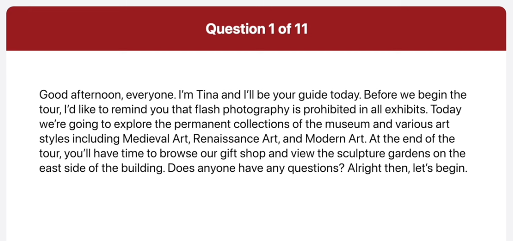
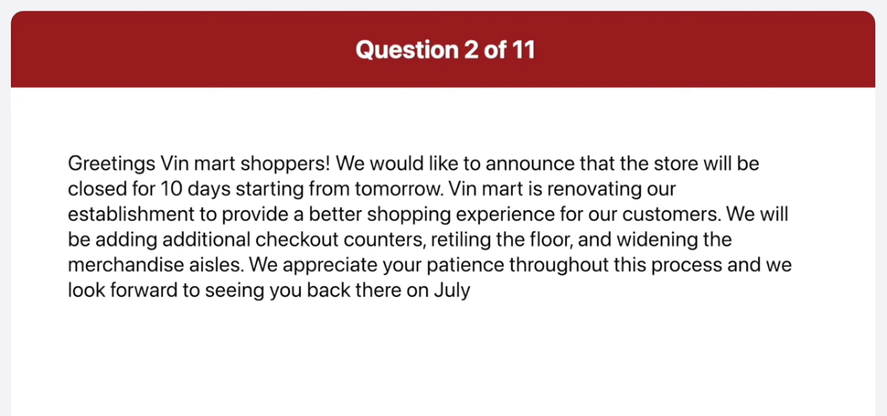
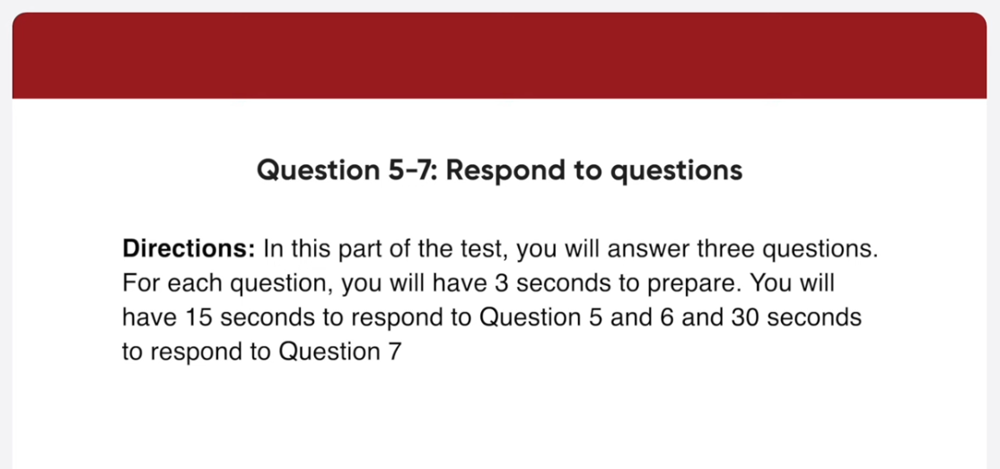
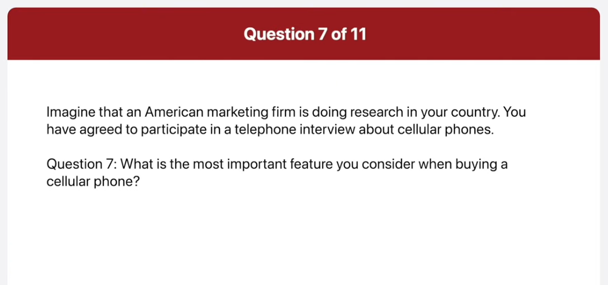
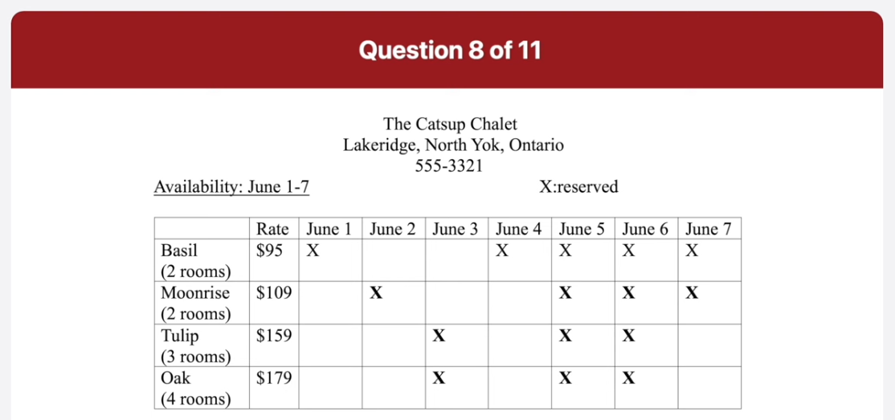
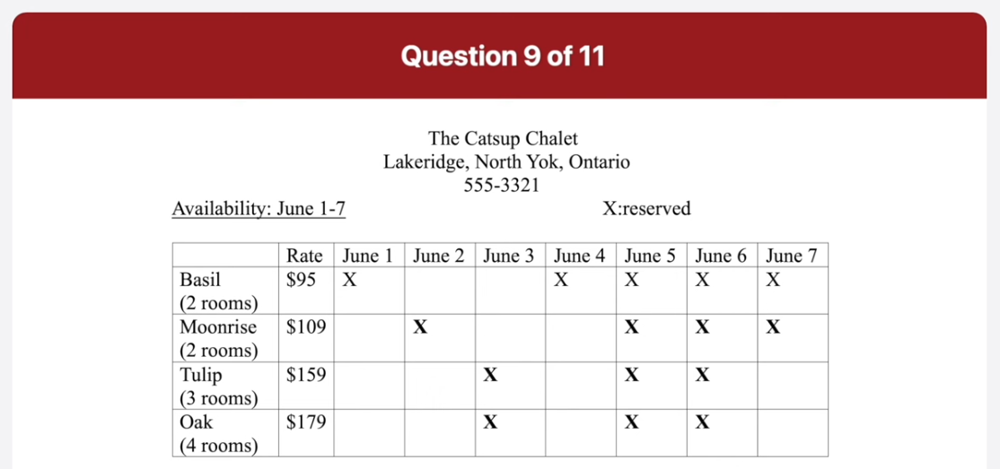
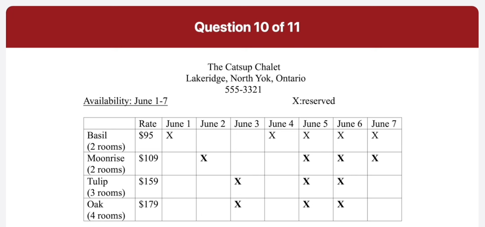
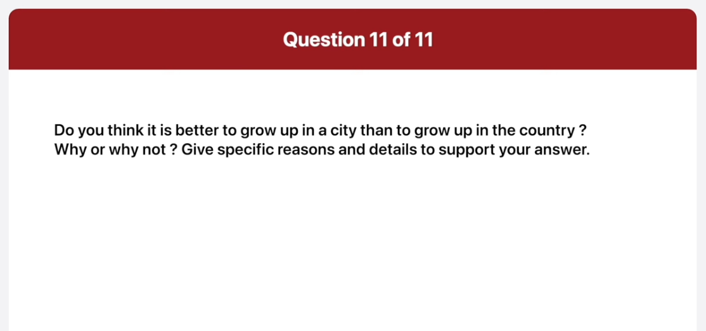

*Link: https://www.youtube.com/watch?v=oRiouKPQYiQ

## Transcript

00:00:00.240 there are few reasons why I believe it
00:00:03.000 is better to grow up in the country than
00:00:04.860 in a city in this part of the test you
00:00:07.440 will read aloud the text on the screen
00:00:09.120 you will have 45 seconds to prepare then
00:00:12.480 you will have 45 seconds to read the
00:00:14.460 text aloud
00:00:15.839 begin preparing now
00:01:03.019 begin reading now
00:01:05.339 foreign
00:01:06.180 good afternoon everyone I'm Tina and
00:01:10.080 I'll be your guide today before we begin
00:01:12.840 the tour I'd like to remind you that
00:01:15.780 flash photography is prohibited in all
00:01:19.080 exhibits today we're going to explore
00:01:22.200 the permanent collection of the museum
00:01:24.540 and various art styles including
00:01:27.439 medieval Arts Renaissance Art and modern
00:01:31.020 art at the end of the tour you have time
00:01:34.740 to browse our gift shop and view the
00:01:37.439 sculptural Gardens on the east side of
00:01:39.900 the building does anyone have any
00:01:42.600 questions
00:01:43.799 arrive then let's begin
00:01:50.700 again preparing now foreign
00:02:40.400 greetings we Mark Shoppers we obliged to
00:02:44.099 announce that the store will be closed
00:02:46.620 for 10 days starting from tomorrow
00:02:50.099 Finn mod is renovating our establishment
00:02:53.160 to provide a better shopping experience
00:02:56.220 for our customers
00:02:58.560 we will be adding addition checkout
00:03:01.319 counters retiring the floor and widening
00:03:04.920 the merchandise else we appreciate our
00:03:08.099 passion throughout this process and we
00:03:10.980 look forward to seeing you back there on
00:03:13.440 July 15th for our grand reopening sale
00:03:17.700 foreign
00:03:19.500 in this part of the test you will
00:03:21.480 describe the picture on the screen as
00:03:23.159 much as detail as you can
00:03:25.140 you will have 45 seconds to prepare your
00:03:27.720 response
00:03:28.920 then you will have 30 seconds to speak
00:03:31.019 about the picture
00:03:33.060 begin preparing now
00:04:20.540 begin speaking now
00:04:23.040 this picture was taken in a classroom
00:04:25.800 some people who seemed to be students
00:04:28.740 are in a group discussing something a
00:04:31.919 woman on the right is holding a red
00:04:34.020 folder and jaspering I think she's
00:04:36.419 giving a lecture or an explanation to
00:04:39.000 the class next to her a man in Blue's
00:04:41.820 weather is folding his arms and looking
00:04:43.620 at the lecturer judging by their facial
00:04:46.440 expressions the students seem to be
00:04:48.960 paying close attention to what's being
00:04:51.419 said
00:04:54.000 begin preparing now
00:05:41.699 begin speaking now this is a picture of
00:05:45.539 a beach in the main focus of the picture
00:05:48.000 there is a woman and an older man
00:05:50.220 looking at something the man is wearing
00:05:52.620 a hat and a shakered shirt he's carrying
00:05:55.139 a camera around his neck and putting
00:05:57.780 somewhere he might be explaining
00:05:59.820 something to the woman she seems to be
00:06:02.460 listening to him and putting her hands
00:06:04.860 in her jacket pocket behind some people
00:06:08.039 are strolling along to the beach and
00:06:10.259 sitting on the Rocks relaxing the sun is
00:06:12.960 shining and people seem to be enjoying
00:06:14.880 some time off in this part of the test
00:06:17.340 you will answer three questions
00:06:19.919 for each question you will have three
00:06:22.139 seconds to prepare
00:06:23.819 you will have 15 seconds to respond to
00:06:26.280 question 5 and 6 and 30 seconds to
00:06:28.800 respond to question seven imagine that
00:06:31.259 an American marketing firm is doing
00:06:32.880 research in your country you have agreed
00:06:35.340 to participate in a telephone interview
00:06:36.960 about cellular phones
00:06:39.419 what kind of cellular phone do you use
00:06:41.460 and where did you get it begin preparing
00:06:44.280 now
00:06:48.740 begin speaking now
00:06:51.300 my cell phone is a new smartphone from
00:06:54.060 Samsung I bought it at an Electronics
00:06:57.060 shop in this in the mall near my
00:06:59.400 apartment
00:07:00.240 foreign
00:07:01.259 what do you normally use your cellular
00:07:03.180 phone for and what did you do with your
00:07:05.220 cellular phone most recently
00:07:07.199 begin preparing now
00:07:12.800 begin speaking now
00:07:15.539 in addition to calling and texting
00:07:17.940 people I normally use my smartphone to
00:07:21.479 play games and stuff the internet the
00:07:24.539 last thing I did with my phone was
00:07:26.400 sending an email to my mother
00:07:31.199 what is the most important feature you
00:07:33.120 consider when buying a cellular phone
00:07:34.880 begin preparing now
00:07:40.819 begin speaking now
00:07:43.680 the most important feature I consider
00:07:46.319 when buying a cell phone is its memory
00:07:49.740 capacity I download a lot of things such
00:07:53.220 as music TV shows movies and
00:07:56.520 appreciations my cell phone is very
00:07:59.460 versatile so I need a lot of space so I
00:08:02.580 can do many different things on it so it
00:08:05.160 there's a lot of space I can just keep
00:08:07.259 downloading stuff without worry
00:08:10.740 in this part of the test you will answer
00:08:12.900 three questions based on the information
00:08:14.699 provided
00:08:16.139 you will have 45 seconds to read the
00:08:18.599 information before the question begin
00:08:21.180 for each question you will have three
00:08:23.280 seconds to prepare
00:08:24.960 you will have 15 seconds to respond to
00:08:27.419 question 8 and 9 and 30 seconds to
00:08:29.699 respond to question 10.
00:08:32.159 begin preparing now
00:09:20.580 hi
00:09:21.959 this is Jim norlen
00:09:24.000 I am going on a vacation with my family
00:09:26.040 the first week of June
00:09:28.019 so I'd like to get some information
00:09:30.959 where are you located
00:09:34.200 begin preparing now
00:09:40.200 begin speaking now
00:09:42.480 the cuts up Charlotte is located in
00:09:45.000 Lakewood Ridge North York Ontario
00:09:50.100 I want to rent a room
00:09:52.200 can I rent your cottage by the week
00:09:54.959 begin preparing now
00:10:01.200 again speaking now
00:10:03.180 yes our cartilages are available to be
00:10:06.420 rented by the week unfortunately none of
00:10:09.660 our Cottages are currently available for
00:10:12.300 a full week rental because some are
00:10:14.820 already reserved on certain days
00:10:17.880 I have a final question
00:10:20.220 could you tell me about renting on the
00:10:22.019 6th
00:10:23.880 begin preparing now
00:10:29.540 begin speaking now
00:10:32.000 I am afraid to inform you that the rooms
00:10:35.519 on the 6th are all reserved so it's not
00:10:38.580 possible to rent any room on that day
00:10:42.180 foreign
00:10:44.360 test you will give your opinion about a
00:10:47.040 specific topic
00:10:48.540 be sure to say as much as you can in the
00:10:50.760 time allowed
00:10:51.959 you will have 30 seconds to prepare
00:10:54.720 then you will have 60 seconds to speak
00:10:57.000 do you think it is better to grow up in
00:10:59.279 a city than to grow up in the country
00:11:01.860 why or why not
00:11:03.839 give specific reasons and details to
00:11:06.240 support your answer
00:11:08.100 begin preparing now
00:11:40.380 thank you begin speaking now
00:11:43.800 there are few reasons why I believe it
00:11:46.440 is better to grow up in the country than
00:11:48.240 in a city most importantly growing up in
00:11:51.600 the country allows me to develop in an
00:11:54.000 environment that is not very polluted
00:11:56.220 for instance because there are fewer
00:11:58.980 autonomobies the air quality is better
00:12:01.980 in addition there will be less maybe
00:12:04.980 even no noise pollution since they are
00:12:07.500 not that many people or things creating
00:12:10.440 unwanted noise
00:12:12.000 these types of pollution can cause
00:12:14.459 stress to an individual that can
00:12:17.100 adversely affect his or her health
00:12:20.279 another reason is that with today's
00:12:22.740 technology living in the country is more
00:12:25.920 comfortable than it was in the past for
00:12:28.920 example entertainment and educational
00:12:31.200 information can be easily assessed
00:12:34.019 through the internet I do not have to
00:12:36.360 travel all the way to the city of evil
00:12:39.300 lived there when I can assess this of
00:12:41.940 information on the internet in the
00:12:44.579 comfort of my home hence I feel that
00:12:47.459 it's better to grow up in the country
00:12:49.260 than in a city
