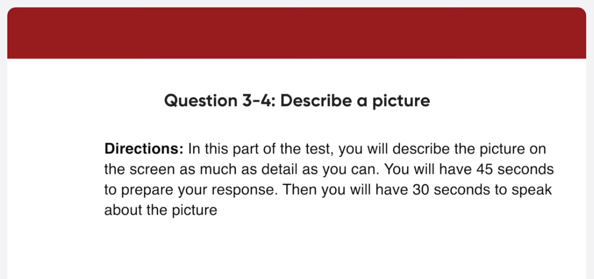
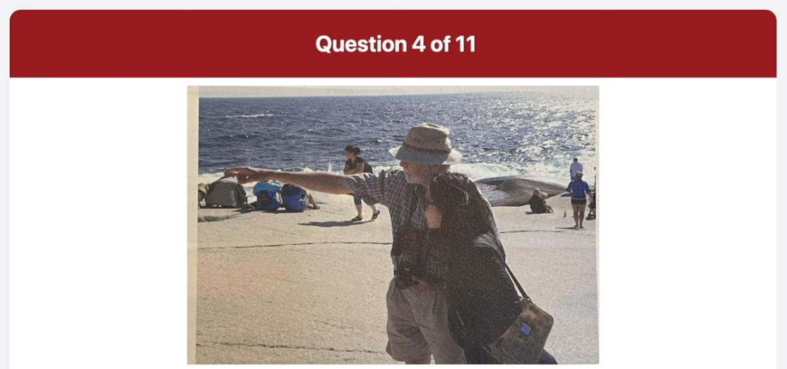

_Link: https://www.youtube.com/watch?v=oRiouKPQYiQ_

Good afternoon everyone I'm Tina and I'll be your guide today before we begin the tour I'd like to remind you that flash photography is prohibited in all exhibits today we're going to explore the permanent collection of the museum and various art styles including medieval Arts Renaissance Art and modern art at the end of the tour you have time to browse our gift shop and view the sculptural Gardens on the east side of the building does anyone have any questions arrive then let's begin

greetings we Mark Shoppers we obliged to announce that the store will be closed for 10 days starting from tomorrow Finn mod is renovating our establishment to provide a better shopping experience for our customers we will be adding addition checkout counters retiring the floor and widening the merchandise else we appreciate our passion throughout this process and we look forward to seeing you back there on July 15th for our grand reopening sale foreign

This picture was taken in a classroom some people who seemed to be students are in a group discussing something a woman on the right is holding a red folder and jaspering I think she's giving a lecture or an explanation to the class next to her a man in Blue's weather is folding his arms and looking at the lecturer judging by their facial expressions the students seem to be paying close attention to what's being said

Now this is a picture of a beach in the main focus of the picture there is a woman and an older man looking at something the man is wearing a hat and a shakered shirt he's carrying a camera around his neck and putting somewhere he might be explaining something to the woman she seems to be listening to him and putting her hands in her jacket pocket behind some people are strolling along to the beach and sitting on the Rocks relaxing the sun is shining and people seem to be enjoying some time off in this part of the test

respond to question seven imagine that an American marketing firm is doing research in your country you have agreed to participate in a telephone interview about cellular phones what kind of cellular phone do you use and where did you get it begin preparing

My cell phone is a new smartphone from Samsung I bought it at an Electronics shop in this in the mall near my apartment

what do you normally use your cellular phone for and what did you do with your cellular phone most recently?

In addition to calling and texting people I normally use my smartphone to play games and stuff the internet the last thing I did with my phone was sending an email to my mother 

what is the most important feature you consider when buying a cellular phone

The most important feature I consider when buying a cell phone is its memory capacity I download a lot of things such as music TV shows movies and appreciations my cell phone is very versatile so I need a lot of space so I can do many different things on it so it there's a lot of space I can just keep downloading stuff without worry

hi this is Jim norlen I am going on a vacation with my family the first week of June so I'd like to get some information

the cuts up Charlotte is located in Lakewood Ridge North York Ontario

I want to rent a room can I rent your cottage by the week

yes our cartilages are available to be rented by the week unfortunately none of our Cottages are currently available for a full week rental because some are already reserved on certain days

I have a final question could you tell me about renting on the 6th

I am afraid to inform you that the rooms on the 6th are all reserved so it's not possible to rent any room on that day

there are few reasons why I believe it is better to grow up in the country than in a city most importantly growing up in the country allows me to develop in an environment that is not very polluted for instance because there are fewer autonomobies the air quality is better in addition there will be less maybe even no noise pollution since they are not that many people or things creating unwanted noise these types of pollution can cause stress to an individual that can adversely affect his or her health another reason is that with today's technology living in the country is more comfortable than it was in the past for example entertainment and educational information can be easily assessed through the internet I do not have to travel all the way to the city of evil lived there when I can assess this of information on the internet in the comfort of my home hence I feel that it's better to grow up in the country than in a city

