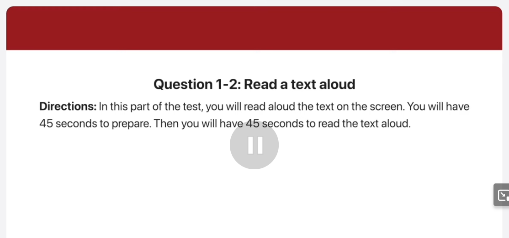
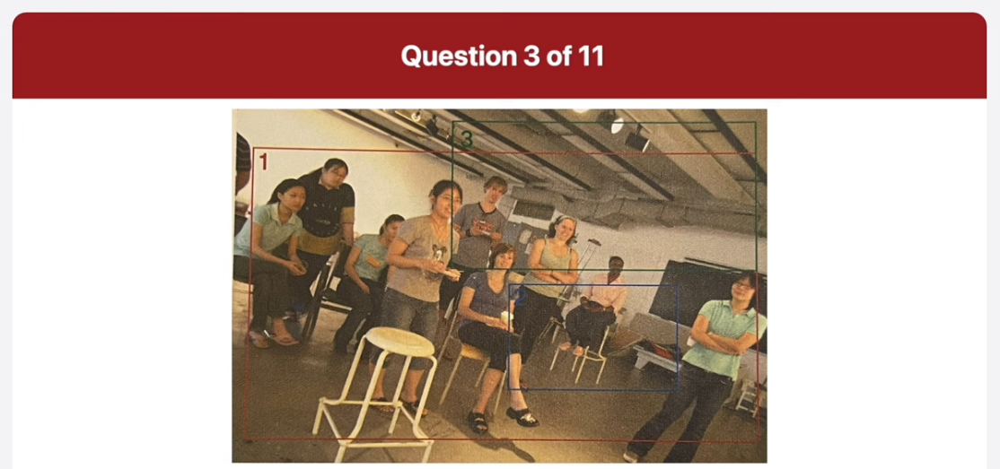
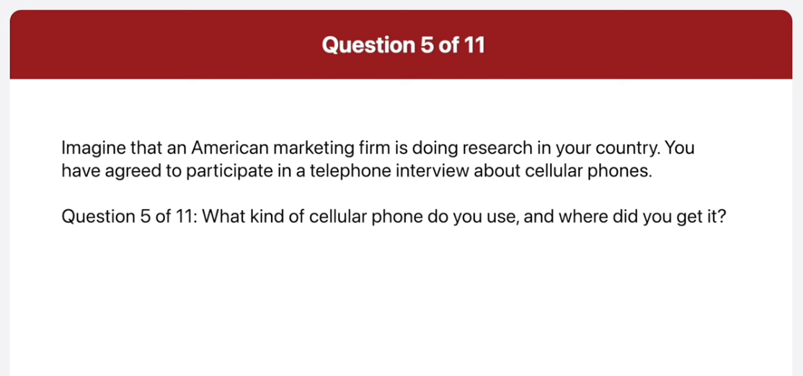
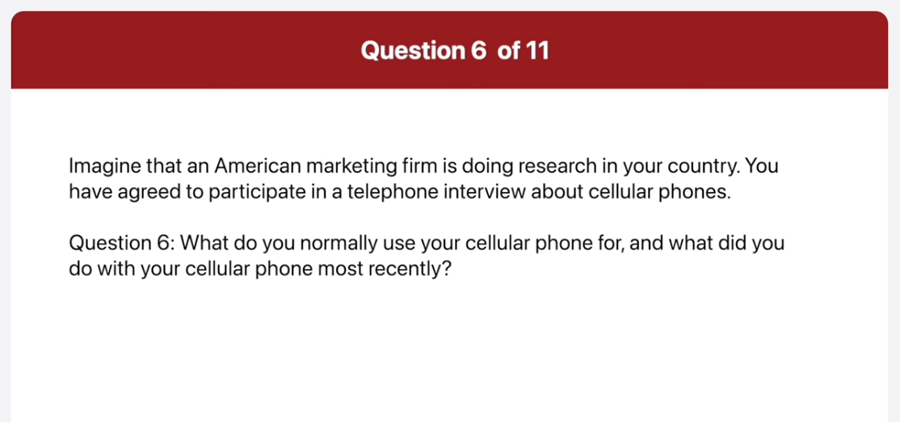
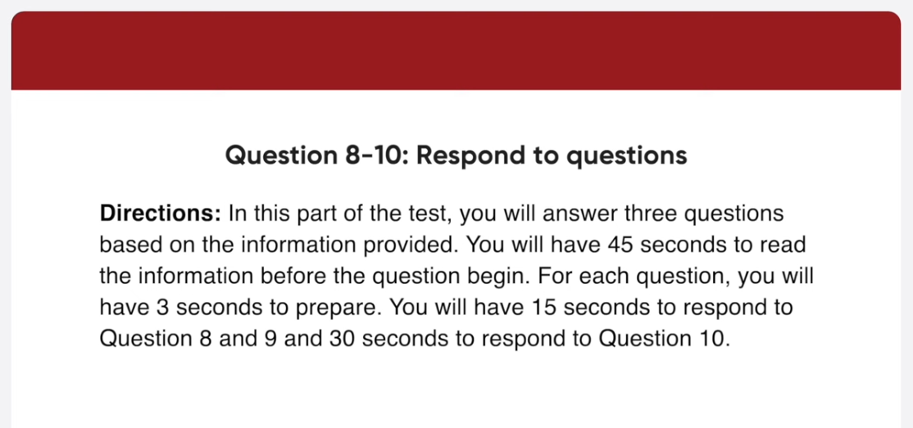
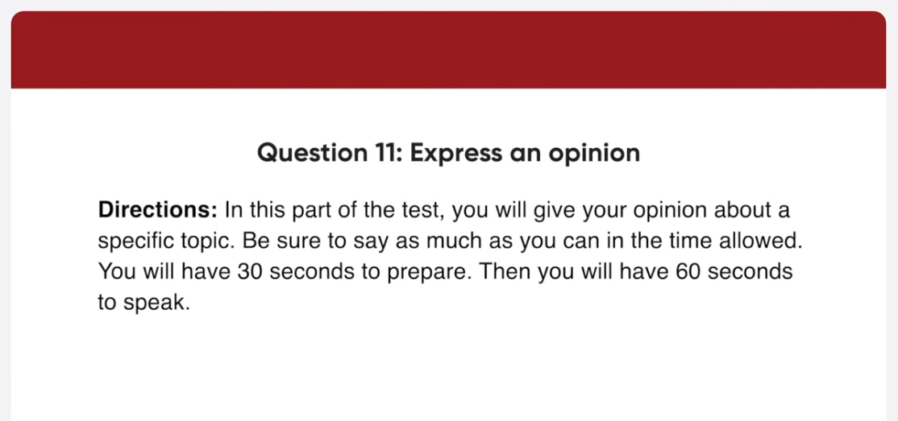

_Link: https://www.youtube.com/watch?v=oRiouKPQYiQ_

Good afternoon, everyone. I'm Tina and I'll be your guide today. Before we begin the tour, I'd like to remind you that flash photography is prohibited in all exhibits. Today we're going to explore the permanent collections of the museum and various art styles including Medieval Arts, Renaissance Art, and Modern Art. At the end of the tour, you'll have time to browse our gift shop and view the sculpture gardens on the east side of the building. Does anyone have any questions? Alright then, let's begin.

Greetings Vin mart shoppers! We would like to announce that the store will be closed for 10 days starting from tomorrow. Vin mart is renovating our establishment to provide a better shopping experience for our customers. We will be adding additional checkout counters, retiling the floor, and widening the merchandise aisles. We appreciate your patience throughout this process and we look forward to seeing you back there on July.

This picture was taken in a classroom. Some people who seemed to be students are in a group discussing something. A woman on the right is holding a red folder and gesturing. I think she's giving a lecture or an explanation to the class. Next to her, a man in blue sweater is folding his arms and looking at the lecturer. Judging by their facial expressions, the students seem to be paying close attention to what's being said.

Now this is a picture of a beach. In the main focus of the picture, there is a woman and an older man looking at something. The man is wearing a hat and a checkered shirt. He's carrying a camera around his neck and putting somewhere. He might be explaining something to the woman. She seems to be listening to him and putting her hands in her jacket pocket. Behind them, some people are strolling along to the beach and sitting on the rocks relaxing. The sun is shining and people seem to be enjoying some time off.

My cell phone is a new smartphone from Samsung. I bought it at an Electronics shop in the mall near my apartment.

In addition to calling and texting people, I normally use my smartphone to play games and surf the internet. The last thing I did with my phone was sending an email to my mother 

The most important feature, I consider when buying a cell phone is its memory capacity. I download a lot of things such as music, TV shows, movies and appreciations. my cell phone is very versatile so I need a lot of space so I can do many different things on it. If there's a lot of space I can just keep downloading stuff without worry.

Hi. This is Jim Norlen. I am going on a vacation with my family the first week of June so I'd like to get some information. Where are you located?

The Catsup Chalet is located in Lakeridge, North York, Ontario.

I want to rent a room can I rent your cottage by the week.

Yes, our cottages are available to be rented by the week. Unfortunately, none of our Cottages are currently available for a full week rental because some are already reserved on certain days.

I have a final question. Could you tell me about renting on the 6th?

I am afraid to inform you that the rooms on the 6th are all reserved so it's not possible to rent any room on that day.

There are few reasons why I believe it is better to grow up in the country than in a city. Most importantly growing up in the country allows me to develop in an environment that is not very polluted. For instance, because there are fewer autonomobies the air quality is better. In addition, there will be less maybe even no noise pollution since they are not that many people or things creating unwanted noise. These types of pollution can cause stress to an individual that can adversely affect his or her health. Another reason is that with today's technology living in the country is more comfortable than it was in the past. For example, entertainment and educational information can be easily assessed through the internet. I do not have to travel all the way to the city of even live there when I can assess this of information on the internet in the comfort of my home. Hence, I feel that it's better to grow up in the country than in a city.

