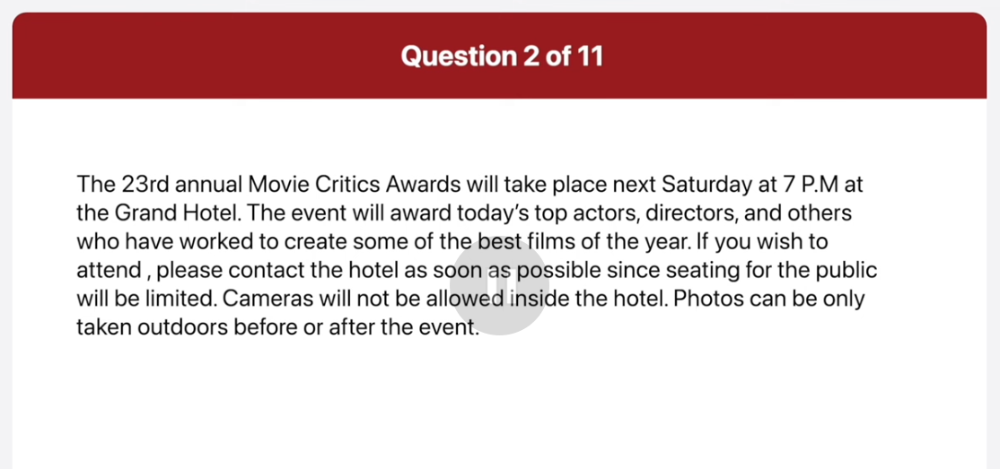
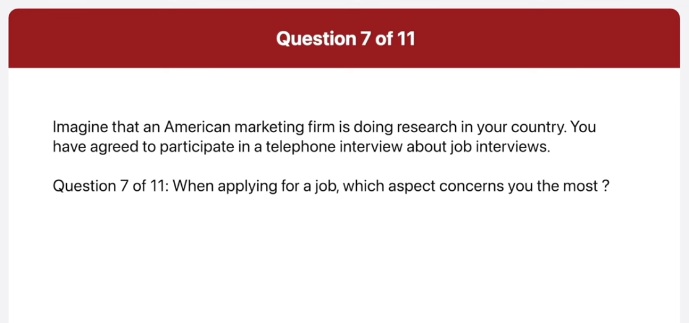

_Link: https://www.youtube.com/watch?v=lScVsWNRPA4_

## Transcript

00:00:00.520 well I agree that true and should not be
00:00:03.120 allowed to use cell phones at school for
00:00:05.960 the following reasons in this part of
00:00:08.599 the test you will read aloud the text on
00:00:10.759 the screen you will have 45 seconds to
00:00:13.519 prepare then you will have 45 seconds to
00:00:16.160 read the text aloud begin preparing
00:00:28.960 now
00:01:05.799 begin reading
00:01:07.400 now fairies man store has been providing
00:01:11.360 the area with some of the funest man's
00:01:14.080 fashions for the last 50 years this
00:01:17.159 weekend fairies will have a winter
00:01:19.759 clearance sale to make room for their
00:01:22.200 entire spring collection during the sale
00:01:25.720 Shoppers will enjoy the scouts up to 50%
00:01:29.400 on all winter items to make sure that
00:01:32.680 the stores valued customers can enjoy
00:01:35.479 the weekend sale fairies will be open
00:01:38.439 from 10:00 a.m. to 10
00:01:42.399 p.m. begin preparing
00:01:58.840 now
00:02:31.239 begin reading
00:02:32.959 now the 23rd annual movie critics Awards
00:02:37.519 will take place next Saturday at 700
00:02:40.080 p.m. at the Grand Hotel the event will
00:02:43.800 award today's top actors directors and
00:02:47.560 others who have worked to create some of
00:02:50.599 the best files of the year if you wish
00:02:53.239 to attend please contact the hotel as
00:02:55.879 soon as possible since seting for the
00:02:58.560 public will be limited cameras will not
00:03:01.239 be allowed Inside the Hotel photos can
00:03:04.280 be only taken Outdoors before or after
00:03:07.159 the
00:03:09.319 event in this part of the test you will
00:03:12.000 describe the picture on the screen as
00:03:13.599 much as detail as you can you will have
00:03:16.480 45 seconds to prepare your
00:03:18.760 response then you will have 30 seconds
00:03:21.200 to speak about the
00:03:22.959 picture begin preparing
00:03:28.680 now
00:04:11.799 begin speaking now this is a picture of
00:04:15.319 a street there are two trm racks on the
00:04:18.079 road and there is a trm on one of the
00:04:20.639 tracks the trm is white with a red drive
00:04:24.240 along the side of each carriage in the
00:04:27.479 background there are four large
00:04:29.199 buildings
00:04:30.240 on the left hand side of the road I can
00:04:32.560 see a man walking on the sidewalk there
00:04:35.520 are also some other buildings in the
00:04:37.720 background the trim looks like a good
00:04:40.199 way to get around the
00:04:42.600 city begin preparing
00:04:58.560 now
00:05:31.440 begin speaking
00:05:32.919 now this picture was taken in a cboard
00:05:36.560 area outside a restaurant some tables
00:05:40.000 have been set up outside the restaurant
00:05:42.720 each table has four wooden chairs
00:05:45.360 arounded brightly colored table clothes
00:05:49.199 has been placed on the tables and cuty
00:05:52.639 and glasses with napkins inside have
00:05:55.800 been laid down in the background there
00:05:58.080 is an old brick War there is an
00:06:00.680 rectangular ho in the war it seems like
00:06:03.600 a nice place to have a meal
00:06:06.360 outdoors in this part of the test you
00:06:08.800 will answer three
00:06:10.240 questions for each question you will
00:06:12.680 have 3 seconds to prepare you will have
00:06:15.680 15 seconds to respond to question five
00:06:18.160 and six and 30 seconds to respond to
00:06:20.400 question 7 imagine that an American
00:06:22.960 marketing firm is doing research in your
00:06:25.240 country you have agreed to participate
00:06:27.720 in a telephone interview about job
00:06:30.360 interviews where do you normally search
00:06:32.639 preparing for a job begin preparing
00:06:39.400 now begin speaking now well I normally
00:06:43.919 visit the carrier sessions of specific
00:06:46.759 companies that interest me many
00:06:49.680 organizations post job openings directly
00:06:52.560 on their websites providing detailed
00:06:55.199 information about the posision
00:06:57.319 requirements company cultures and and
00:06:59.759 application
00:07:02.199 process how much time do you usually
00:07:04.479 spend preparing for a job interview
00:07:07.199 begin preparing
00:07:12.199 now begin speaking
00:07:14.720 now well the amount time I spend
00:07:17.680 preparing for a job interview can vary
00:07:20.639 depending on various factors such as the
00:07:23.520 level of job the industry and some cuman
00:07:27.479 but normally I spend about two or three
00:07:29.639 days preparing for a job
00:07:33.360 interview when applying for a job which
00:07:36.120 aspect concerns you the most begin
00:07:38.759 preparing
00:07:43.319 now begin speaking
00:07:45.840 now well the aspect that I'm concerned
00:07:49.400 with is the scenary although the other
00:07:52.199 factors are Point important they don't
00:07:54.560 matter if you don't have enough money to
00:07:57.120 have a good life also it will allow me
00:08:00.240 to open my business with the money in
00:08:02.840 the future so I can say that I prefer to
00:08:06.159 have a job with good pay than a job with
00:08:09.080 loss of occas or other nonfinancial
00:08:14.479 benefits in this part of the test you
00:08:16.919 will answer three questions based on the
00:08:18.919 information provided you will have 45
00:08:22.080 seconds to read the information before
00:08:23.960 the question begin for each question you
00:08:27.039 will have 3 seconds to prepare you will
00:08:29.960 have 15 seconds to respond to question 8
00:08:32.519 and 9 and 30 seconds to respond to
00:08:34.719 question
00:08:35.839 10 begin preparing
00:08:58.200 now
00:09:24.800 hi I'm a huge fan of Michael Osman and I
00:09:27.360 heard he's going to be at your bookstore
00:09:28.880 for a book signing event can I ask a few
00:09:32.120 questions about it when do I have to be
00:09:35.240 there to get an autograph from Mr
00:09:37.880 Osman begin preparing
00:09:43.880 now begin speaking
00:09:46.920 now you should be there on Monday April
00:09:50.440 10th between 7 and 800 p.m. will there
00:09:54.399 be a chance to ask questions to be
00:09:56.680 author begin preparing now
00:10:03.680 begin speaking
00:10:05.480 now yes there will be a 15minute Q&A
00:10:09.240 session after the book
00:10:13.440 Sign can you tell me about the rest of
00:10:15.800 the authors that will be at the
00:10:18.399 event begin preparing
00:10:24.399 now begin speaking
00:10:27.160 now certainly pral will be there on
00:10:31.360 Tuesday and Grand yamasaki will be there
00:10:34.560 on Wednesday on Thursday atricia Port
00:10:38.560 will be there and on Friday Molen
00:10:41.360 Johnson will be there but keep in mind
00:10:43.880 that they all be there at different
00:10:48.240 times in this part of the test you will
00:10:50.880 give your opinion about a specific topic
00:10:53.839 be sure to say as much as you can in the
00:10:55.720 time allowed you will have 30 seconds to
00:10:58.680 prepare
00:11:00.120 then you will have 60 seconds to speak
00:11:02.680 do you agree or disagree with the
00:11:04.440 following
00:11:05.399 statement children should not be allowed
00:11:07.600 to use cell phones at school give
00:11:10.480 specific reasons and examples to support
00:11:12.720 your
00:11:14.399 opinion begin preparing
00:11:27.959 now
00:11:48.880 begin speaking
00:11:51.160 now well I agree that children should
00:11:54.320 not be allowed to use cell phones at
00:11:56.800 school for the following reasons first
00:11:59.680 of all it can be a major distraction in
00:12:02.519 school for example when students send
00:12:05.959 text messages to one another in class
00:12:08.880 the sounds of phones be being all
00:12:11.279 vibrating make it difficult for students
00:12:14.079 and teachers to concentrate another
00:12:17.279 reason is that cell phones discourage
00:12:19.760 children from being social for instance
00:12:23.120 with the Advent of the smartphones many
00:12:25.880 children spend more time playing with
00:12:28.199 their phones than spending time with
00:12:30.440 friends for this reason I believe
00:12:33.120 children should not be allowed to use
00:12:35.199 selfness School
