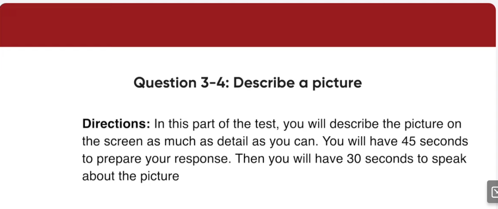
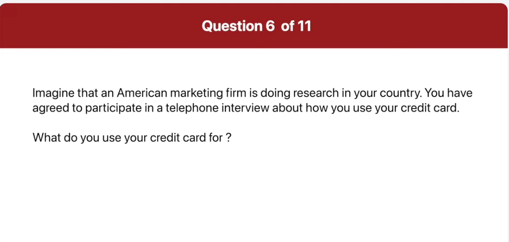
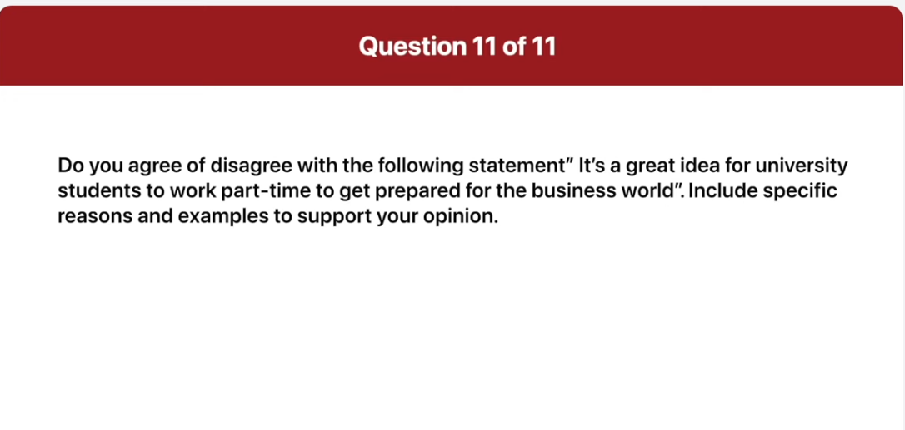

_Link: https://www.youtube.com/watch?v=zlvSKxX02Ac_

welcome to this historic ceremony for
the new Shamrock shopping center this
new mall is the biggest on the eastern
seabort and will have more than
120 stores and shops to choose from
furthermore the Shamrock shopping center
will feature a spacious food court a
fully equipped Health Center and a movie
theater Megaplex For Your Entertainment

all passengers please listen to the
following two announcements first
departures to Orlando New Orleans and
Nashville will now begin boarding at
gate 78. please proceed to gate 78 for
boarding if you already have checked in
with security and have your boarding
pass
second flight 411 to San Diego is now
departing from gate 19. thank you

00:03:57.599 this picture was taken at a large
00:04:00.000 clothing store on the right side of the
00:04:02.340 picture there is a long clothing rack
00:04:04.860 with men's attire there's a woman in the
00:04:07.980 middle of the picture who is looking at
00:04:10.439 some of the items on the rack she's
00:04:13.200 wearing a long black coat and dark pants
00:04:16.380 Behind The woman there is a small table
00:04:19.139 with two horizontal handles which may be
00:04:22.380 for draws on the sailing there are a lot
00:04:25.199 bright lights and in the background you
00:04:27.660 can see a small red colored seat begin

00:05:19.320 this picture was taken at a grocery
00:05:21.660 store you can see a row of fruit on
00:05:25.020 display for customers such as oranges
00:05:27.780 and plumens there are two people in this
00:05:30.120 picture one female customer is on the
00:05:32.820 left and a tall man is on the right he
00:05:35.699 appears to be an employee of the grocery
00:05:38.280 store the woman looks like she just
00:05:41.460 bought some produce and is receiving her
00:05:44.400 change in the background there's a
00:05:47.100 display of jars or Gems or jellies

00:06:15.840 how many credit cards do you have and
00:06:17.820 how often do you use them begin

00:06:28.259 I only have one card and I think I use
00:06:31.020 it nearly every day I use it quite often
00:06:34.440 because I don't like to carry lots of
00:06:36.720 cash also it's very useful when I'm
00:06:39.600 running out of cash

00:06:44.340 what do you use your credit card for

00:06:56.160 well of course I use it to pay for items
00:06:59.280 I buy at stores or on the internet I
00:07:02.819 also use it to buy food every day so my
00:07:06.240 credit card is absolutely necessary in
00:07:09.000 my daily life

00:07:13.639 how could your credit card service be
00:07:15.960 improved

00:07:25.199 well I think the security of credit
00:07:27.479 cards should be improved the reason is
00:07:30.479 that if it's stolen it can be used by
00:07:33.720 strangers and cause a big problem for
00:07:36.539 the owner for example I have a friend
00:07:39.780 who's
00:07:41.060 was host credit card was stolen recently
00:07:44.460 and it was used to buy thousands of
00:07:48.180 dollars worth of stuff therefore I
00:07:51.360 definitely wish that credit cards were
00:07:55.020 safer

00:09:05.959 Can employees access the current email
00:09:08.580 system

00:09:19.800 the current in-house email network will
00:09:22.680 be taken offline on Monday evening so
00:09:26.040 employees will be able to use the old
00:09:28.440 system until then
00:09:35.760 often there are problems when new
00:09:37.740 computer systems are implemented
00:09:40.260 something is going to be done about this
00:09:42.120 isn't it

00:09:51.959 sure the IT team will review the
00:09:54.899 performance of the system and handle all
00:09:57.959 problems from Wednesday afternoon to
00:10:00.660 Friday employees are welcome to express
00:10:03.720 their opinion about changes then
00:10:08.519 I'm supposed to go on a business trip on
00:10:10.680 Tuesday and planning to be back on
00:10:12.300 Wednesday afternoon

00:10:13.920 I'm worried about missing important
00:10:15.720 system upgrades
00:10:17.399 could you tell me the details of what's
00:10:19.080 going to happen begin preparing now

00:10:28.980 there will be three system upgrade
00:10:31.500 schedules first of all on Tuesday
00:10:34.200 Morning the IT department will upgrade
00:10:37.560 the system so employees will have to use
00:10:40.580 alternative means of transportation
00:10:44.220 following that in the evening live tests
00:10:47.579 of the new in-house email system will be
00:10:50.700 conducted
00:10:51.839 finally all employees will attend a
00:10:55.260 tutorial on the new system on Wednesday
00:10:57.779 morning

00:12:01.980 well I agree with the idea that
00:12:05.220 University students out to work
00:12:07.260 part-time to get prepared for the
00:12:09.600 business world the main reason is that
00:12:12.120 working part-time teaches students
00:12:14.760 important skills they will need in the
00:12:17.279 future
00:12:18.180 for example they can discover how to
00:12:21.540 cooperate with their co-workers finish
00:12:25.079 tasks on time deal with customers and so
00:12:29.399 on
00:12:30.300 the other reason is that working
00:12:32.519 part-time jobs help students plan their
00:12:36.240 future career
00:12:37.920 what I mean is through work experience
00:12:40.620 they can discover what sorts of work
00:12:43.620 they like or dislike as well as what
00:12:47.339 they're good at
00:12:48.779 therefore I think it's a great idea for
00:12:51.720 students to have various change chances
00:12:55.139 to work part-time

