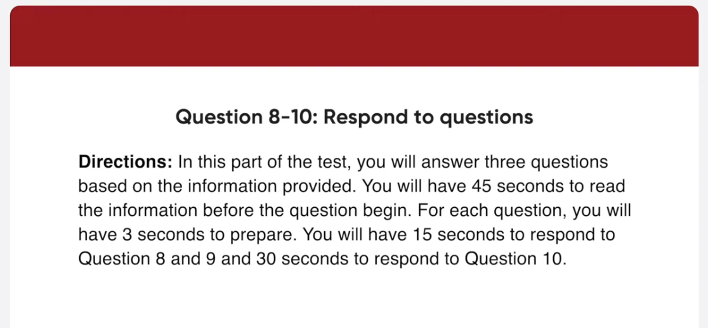

_Link: https://www.youtube.com/watch?v=1qC1H1QsccU_

00:01:02.780 Museum of cultural arts our collection
00:01:06.540 features more than 700 artifacts
00:01:10.020 including Native American Relic totem
00:01:13.740 posts and prince in addition our musical
00:01:17.460 Studio highlights independent music from
00:01:20.640 local musicians after we finish the tour
00:01:24.000 today you are encouraged to visit our
00:01:27.240 gift shop beside the front entrance

00:02:23.160 hello and thank you for calling the
00:02:25.920 Buffalo vet and breakfast
00:02:27.980 regretably we are commonly closed for
00:02:31.140 repairs this means that our roofs gift
00:02:34.739 shops and tourist service centers will
00:02:37.680 be closed until next Thursday if you
00:02:41.160 have any questions stay on the line and
00:02:44.220 an oval Raider where we would do shortly
00:02:46.700 thank you and have a wonderful day

00:03:56.940 there are two men in a blue collar room
00:04:00.180 looking at one another in this picture
00:04:02.900 they are both wearing light colored
00:04:05.940 khakis and standing in front of a
00:04:08.640 photocopier
00:04:10.140 the man on the left a ball and is
00:04:12.959 wearing a short sleeve collar shirt the
00:04:16.260 man on the right is wearing a t-shirt
00:04:18.540 and is holding a cup in his left hand
00:04:22.040 both men are smiling at each other

00:05:17.880 there are two women in this picture the
00:05:21.360 woman on the left has long blonde hair
00:05:23.940 and the woman on the right has long
00:05:26.580 brown hair
00:05:27.900 they appear to be in a woman clothing
00:05:30.060 shop the blonde woman is wearing a shiny
00:05:33.840 silver Overcoat that is tied around her
00:05:37.259 waist she appears to be having The Other
00:05:40.320 Woman shop
00:05:41.759 the brunette is holding up a light blue
00:05:44.759 blouse to her chest to check how it
00:05:47.400 would look on her

00:06:14.699 how often do you take a vacation and who
00:06:16.860 do you usually go with begin preparing
00:06:19.440 now
00:06:23.780 begin speaking now
00:06:26.580 well I take a vacation about once a year
00:06:30.060 with my close friends I usually go
00:06:32.639 during my summer break because that's
00:06:35.460 the only time I can have a long vacation

00:06:42.479 do you prefer to go on vacation in your
00:06:44.699 own country or abroad
00:06:46.500 begin preparing now
00:06:52.500 begin speaking now
00:06:54.360 foreign
00:06:55.280 I generally prefer to go on vacation
00:06:58.380 abroad because that way I can get to
00:07:01.259 experience an exciting and different
00:07:03.660 culture last year I spent my vacation in
00:07:07.020 Thailand and I had a great time there
00:07:11.100 some people like to go on vacation to
00:07:13.259 relax While others prefer excitement and
00:07:15.539 adventure

00:07:16.800 what do you look for in a vacation?

00:07:27.360 well for me I prefer to experience
00:07:30.479 excitement and Adventure on my vacation
00:07:33.800 that's because I like to do challenging
00:07:37.020 and exciting things to relieve stress
00:07:39.840 and make my vacation Unforgettable
00:07:42.900 for example when I went to Thailand I
00:07:45.660 tried various water sport and local food
00:07:48.960 it was so much fun to have new
00:07:51.660 experiences therefore I think it's
00:07:54.419 better for me to go somewhere through
00:07:56.940 fun and interesting activities in this

00:09:07.940 how long will the seminar last
00:09:11.459 begin preparing now
00:09:17.700 begin speaking now foreign
00:09:20.959 will begin at nine o'clock and end at 4
00:09:24.720 30 so it should last around seven and a
00:09:27.779 half hours in total
00:09:36.540 I'm thinking of bringing a packed lunch
00:09:38.220 tomorrow because you know the cafeteria
00:09:40.740 will be packed during lunch time
00:09:42.899 will there be a spot where I can eat my
00:09:44.940 lunch

00:09:55.019 actually it won't be necessary for you
00:09:57.899 to bring a long lunch will be available
00:10:01.019 at no extra cost and will be soaked in
00:10:04.200 the banquet room on the third floor at
00:10:07.080 12 30.
00:10:11.459 unfortunately I have to leave it two in
00:10:13.980 the afternoon because I'm scheduled to
00:10:15.540 take part in an important telephone
00:10:16.860 conference with some clients from Hong
00:10:19.380 Kong

00:10:20.339 can you tell me what part of the program
00:10:21.899 I'll miss out on begin preparing now
00:10:29.220 begin speaking now
00:10:31.820 well you will be missing three sections
00:10:35.580 headphone 2 pm to 4 30 PM first you will
00:10:40.440 be missing part of Kim jong's talk about
00:10:43.200 marketing through social networks next
00:10:46.440 you won't hear the case study about Fido
00:10:49.740 Telecom online marketing strategy given
00:10:53.220 by Mike Owen finally you were missed out
00:10:56.940 on an open discussion starting at 3 30
00:11:00.660 pm

00:12:05.760 personally I would rather get news
00:12:09.120 online than read it in a newspaper for
00:12:13.079 starters it's more convenient in many
00:12:15.839 ways for example I can read all the word
00:12:19.200 next new papers from anywhere via my
00:12:23.519 laptop or mobile phone so I don't even
00:12:27.000 have to go out to the store to buy them
00:12:29.820 moreover mostly is free to read online
00:12:33.720 the other thing is that news websites
00:12:36.839 are more current than papers
00:12:39.560 newspaper only give an update on a
00:12:42.600 situation at the time of printing
00:12:44.899 whereas online news is totally up to the
00:12:49.079 minute therefore you can get the latest
00:12:52.019 news without waiting that is why I think
00:12:55.740 it's better to catch up with current
00:12:57.899 events to online news instead of a
00:13:01.200 newspaper
00:13:03.839 foreign

