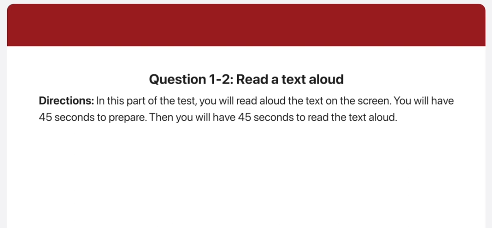
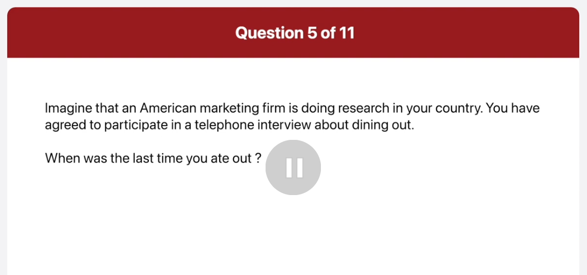
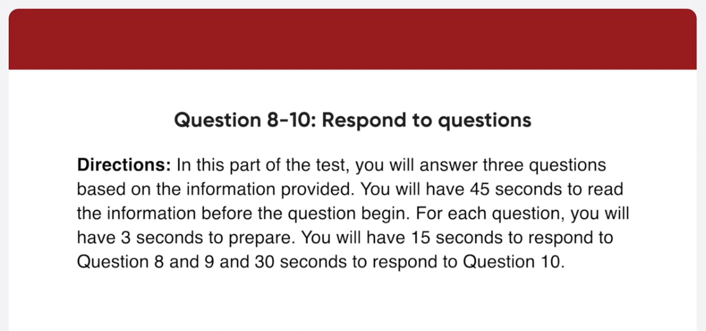
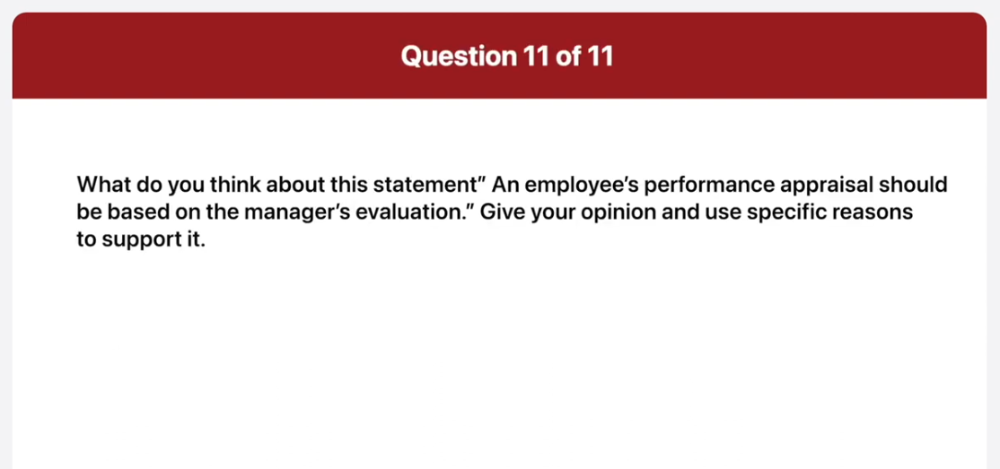

_Link: https://www.youtube.com/watch?v=FABqSYiZQkY_

00:01:00.180 as to all know a president has revealed
00:01:03.960 he will be resigning from his position
00:01:06.119 at the end of this month to have a
00:01:09.060 memorable farewell party for him I would
00:01:11.700 like all of you to heal your brains to
00:01:14.220 comes up with some fresh exciting ideas
00:01:16.580 we're going to have an online vote to
00:01:19.560 select the best idea this Friday and the
00:01:22.740 employee who thinks up the best plan
00:01:25.200 will receive a three-day vacation and a
00:01:28.439 thousand dollar bonus

00:02:22.819 we are fortunate to have a very special
00:02:25.860 guest today Jonathan Ferguson he's one
00:02:29.940 of the UK's bad known Travelers has been
00:02:33.300 adding what travel for 12 years and
00:02:36.480 hosted the show adventures in Africa he
00:02:40.140 just came back from a tour of Asia
00:02:42.260 including Japan Taiwan and Hong Kong
00:02:45.540 last week and is going to share some of
00:02:48.720 his amazing traveling stories with us
00:02:51.480 today
00:02:52.440 please join me in welcoming Jonathan
00:02:55.260 Ferguson

00:04:02.099 this picture was taken in a classroom
00:04:04.799 some people who seem to be students are
00:04:07.920 in a group discussing something a woman
00:04:10.439 on the right is holding a red photo and
00:04:13.319 gesturing I think she's giving a lecture
00:04:16.560 or an explanation to the class next to
00:04:19.978 her a man in a blue sweater is folding
00:04:23.280 his arms and looking at the lecture the
00:04:27.000 rest of the students are also looking at
00:04:29.340 her and listening carefully

00:05:23.699 this is a picture of a food vendor
00:05:26.580 preparing a meal on the left a man in a
00:05:29.759 red jacket seems to be buying some bread
00:05:32.220 there are two people on the right side
00:05:34.919 of the picture one is pointing at the
00:05:37.860 bender and the other is carrying
00:05:40.199 something on his shoulder two motorbikes
00:05:43.080 are parked in front of the shop I can
00:05:46.199 see a few men passing by in the back the
00:05:49.199 people look busy so I guess this picture
00:05:51.479 was taken in the morning

00:06:45.720 what's your favorite restaurant and why

00:06:28.560 well I ate out at a Chinese restaurant
00:06:31.919 with my parents last Sunday we had
00:06:35.100 noodles with black bean salt and sweet
00:06:37.740 and sour pork which is the most popular
00:06:40.380 Chinese food in Vietnam

00:06:57.180 actually the Western I like the best is
00:07:00.180 a little Japanese place downtown that
00:07:03.060 specialize in raw fish and Sushi I like
00:07:07.259 that place because it is fresh
00:07:10.020 ingredients and its prices are
00:07:12.660 reasonable

00:07:14.400 what factors influence decision when you
00:07:16.860 choose a restaurant

00:07:26.539 while the two main factors I consider
00:07:29.940 when choosing a restaurant are
00:07:32.099 healthiness and cost First I don't eat a
00:07:36.120 restaurant that is a lot of artificial
00:07:38.940 seasonings or too much salt as is very
00:07:42.599 unhealthy furthermore I hate spending
00:07:45.660 too much money when dining out because I
00:07:48.660 have a tight budget therefore I think
00:07:51.539 it's important to check whether the
00:07:54.000 restaurant serves healthy food at a
00:07:56.280 reasonable price

00:09:06.860 can you tell me where and when the
00:09:09.180 conference is being held
00:09:11.040 begin preparing now
00:09:17.100 begin speaking now
00:09:19.620 conference where we add the white hotel
00:09:22.019 in Seattle on March 13th and 14th it
00:09:26.640 runs from 9am to 3 30 pm on both days
00:09:36.360 I understand what world famous academic
00:09:38.580 Robert Curry is giving a talk on Monday
00:09:40.500 afternoon

00:09:41.880 what will his talk be about
00:09:44.040 begin preparing now
00:09:50.160 begin speaking now
00:09:52.560 actually Professor Curry will speak on
00:09:55.500 Tuesday afternoon the second day of the
00:09:57.959 conference his talk will start at 1 30
00:10:01.140 pm and it will focus on what related
00:10:04.500 Strat and its impact on productivity

00:10:09.899 unfortunately I have some urgent
00:10:12.060 business in the morning on Monday and
00:10:13.740 Tuesday so I won't be able to make it
00:10:15.540 until lunchtime
00:10:17.040 what will I be missing out on
00:10:20.880 begin preparing now
00:10:26.940 begin speaking now
00:10:29.160 in that case you won't be able to attend
00:10:32.279 three sections first you will miss out
00:10:35.160 on Sally Chan's presentation on
00:10:37.800 employers legal duties towards Injured
00:10:40.860 Workers beginning at 9 00 am on Monday
00:10:43.760 furthermore you won't be able to make it
00:10:47.100 to crack Pockets talk scheduled at 10 30
00:10:50.820 a.m finally you won't be able to attend
00:10:54.120 the talk about workplace exercise
00:10:56.000 programs presented by Kai rose on
00:10:59.339 Tuesday morning

00:12:03.480 well I agree that an employee's
00:12:06.360 performance appraisal should be based
00:12:09.180 many of the managers evaluation the main
00:12:12.660 reason is that the manager is in the
00:12:15.240 best position to assess a worker
00:12:17.880 performance I mean managers aside and
00:12:21.300 monitor employees work directly
00:12:23.480 therefore they know how quickly and
00:12:26.100 effectively employees perform tasks in
00:12:29.399 addition managers are the best people to
00:12:32.459 give the detailed and constructive
00:12:34.680 feedback to employees performance
00:12:37.560 appraisals should also aim to improve
00:12:40.200 employees skills and considering
00:12:42.839 managers managers of work experience
00:12:45.600 they are able to provide workers with
00:12:48.600 informative feedback for these reasons I
00:12:52.139 think it's a great idea to allow
00:12:54.240 managers to evaluate their employees
00:12:56.880 performance
00:13:00.480 foreign

