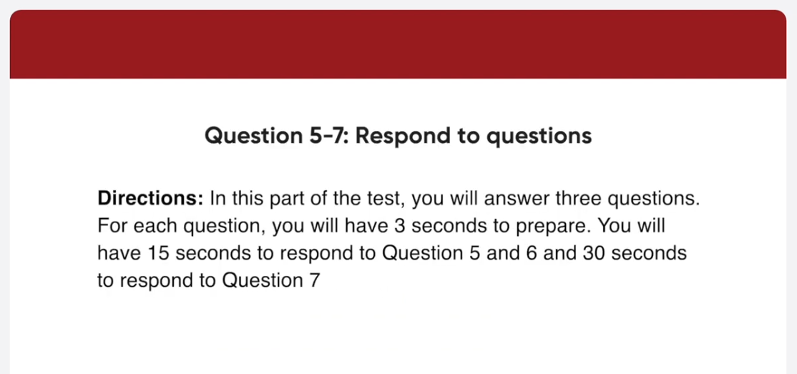
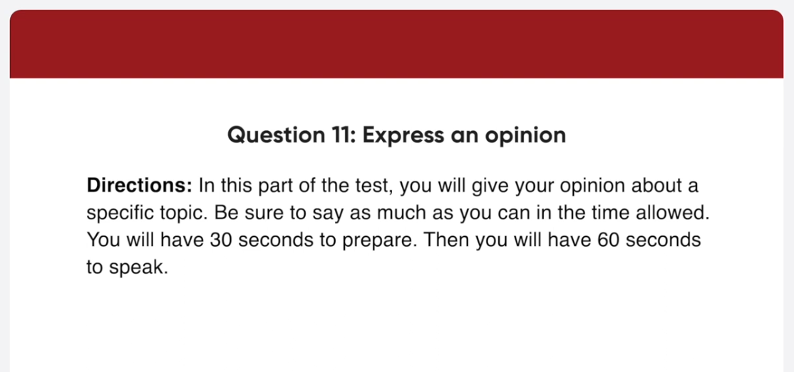

*Link: https://www.youtube.com/watch?v=DychccgHR4A

## Transcript

00:00:00.000 in this part of the test you will read
00:00:02.100 aloud the text on the screen you will
00:00:04.500 have 45 seconds to prepare then you will
00:00:07.140 have 45 seconds to read the text aloud
00:00:10.019 begin preparing now
00:00:57.840 begin reading now
00:01:00.300 this is Ian Galloway with this morning's
00:01:03.239 commuto update so traffic congestion in
00:01:07.380 the Uptown area is causing major delays
00:01:10.740 for motorists trying to enter the city
00:01:13.860 center
00:01:15.060 those heading out now are advised to
00:01:18.360 take an alternative route if possible
00:01:21.720 in addition there has also been a major
00:01:25.259 accident involving a truck and a
00:01:28.619 passenger vehicle on a Western Boulevard
00:01:32.580 traffic in this area is heavy but
00:01:36.119 flowing steadily and should be back to
00:01:38.880 normal soon
00:01:42.420 begin preparing now
00:02:29.780 begin reading now
00:02:32.599 and now it's time to present the
00:02:35.819 employee of the year award
00:02:38.099 this prestigious prize go to the
00:02:41.580 employee who has made the biggest
00:02:43.760 contribution to our company's
00:02:46.200 performance over the last year
00:02:49.260 the recipient is given a one thousand
00:02:52.739 dollars bonus five extra days of
00:02:56.400 vacation leave and a certificate signed
00:02:59.879 by the CEO
00:03:01.680 I'd like you all to applaud Jen
00:03:05.040 Henderson from Administration
00:03:08.220 Jen please come up on stage to collect
00:03:11.760 your award
00:03:15.840 in this part of the test you will
00:03:17.760 describe the picture on the screen as
00:03:19.379 much as detail as you can
00:03:21.540 you will have 45 seconds to prepare your
00:03:24.060 response
00:03:25.260 then you will have 30 seconds to speak
00:03:27.420 about the picture
00:03:29.700 begin preparing now
00:04:16.260 foreign
00:04:17.478 speaking now
00:04:19.500 here is a picture taken at a big lecture
00:04:22.139 hall in the foreground there are
00:04:24.240 students sitting in wooden seats and the
00:04:26.699 class looks very full most of the
00:04:29.040 students are looking down so they're
00:04:30.960 probably taking notes in the middle I
00:04:34.199 can see some long tables with papers and
00:04:36.660 other items on them in the background a
00:04:39.479 teacher is standing with his back to the
00:04:41.580 students he's wearing a brown sweater
00:04:44.100 and blue jeans and is writing something
00:04:46.199 on the Blackboard with chalk overall it
00:04:49.199 looks like a typical classroom scene
00:04:53.160 begin preparing now
00:05:41.100 begin speaking now
00:05:43.199 this is a snapshot taken on a sidewalk
00:05:45.660 in a city what I noticed first in the
00:05:48.300 picture is the father and his young son
00:05:50.400 going somewhere together the father is
00:05:52.919 pushing a stroller and the little child
00:05:55.620 is having his father push the stroller
00:05:58.199 the sidewalk there walking on looks very
00:06:00.720 neat and clean and I can also see a
00:06:03.600 bench on it in the background there are
00:06:06.000 some cars parked on both sides of the
00:06:08.280 street overall it looks like a clean
00:06:10.560 City and the father and son made me
00:06:13.080 smile
00:06:15.600 in this part of the test you will answer
00:06:17.880 three questions
00:06:19.680 for each question you will have three
00:06:21.720 seconds to prepare
00:06:23.400 you will have 15 seconds to respond to
00:06:25.860 question 5 and 6 and 30 seconds to
00:06:28.380 respond to question seven imagine that
00:06:30.840 an American marketing firm is doing
00:06:32.460 research in your country
00:06:34.560 you have agreed to participate in a
00:06:36.600 telephone interview about gardening
00:06:39.180 do you enjoy working in the garden
00:06:41.819 begin preparing now
00:06:47.819 begin speaking now
00:06:50.220 well yes I do very much because I find
00:06:53.340 it relaxing so whenever I have free time
00:06:56.940 on the weekend I plant some flowers and
00:07:00.300 water and trim them
00:07:06.660 how often do you do gardening at home
00:07:09.840 begin preparing now
00:07:16.139 speaking now
00:07:17.759 well I usually do gardening once or
00:07:21.060 twice a week on the weekends I am so
00:07:24.060 busy during the week so the only time I
00:07:26.699 can devote to gardening is on the
00:07:29.160 weekends
00:07:30.599 foreign
00:07:33.120 would you rather spend time in your own
00:07:35.099 garden or visit a large public garden
00:07:38.280 begin preparing now
00:07:43.880 begin speaking now
00:07:46.979 um for me I would prefer to visit a
00:07:49.380 large public garden the reason is that
00:07:51.900 public gardens have a wide variety of
00:07:54.599 beautiful plants and flowers while my
00:07:57.780 own garden has only a limited variety
00:08:00.840 for example when I went to the Botanical
00:08:04.139 Garden near my house I was amazed by all
00:08:07.860 the different kinds of flowers and
00:08:09.840 plants and I had a great time there
00:08:14.400 in this part of the test you will answer
00:08:16.500 three questions based on the information
00:08:18.240 provided
00:08:19.860 you will have 45 seconds to read the
00:08:22.259 information before the question begin
00:08:24.720 for each question you will have three
00:08:26.879 seconds to prepare
00:08:28.620 you will have 15 seconds to respond to
00:08:31.199 question 8 and 9 and 30 seconds to
00:08:33.479 respond to question 10.
00:08:36.000 begin preparing now
00:09:23.060 I have an appointment after work
00:09:26.220 when exactly will we get back from the
00:09:28.140 venue
00:09:30.000 begin preparing now
00:09:36.060 begin speaking now
00:09:39.480 um we are scheduled to get back to the
00:09:41.760 office at 4 40 in the afternoon so you
00:09:44.940 are free to go after that
00:09:47.880 I heard we are expected to organize our
00:09:49.980 own transportation to the Essex
00:09:51.600 Corporate Center
00:09:53.160 is this correct
00:09:55.080 begin preparing now
00:10:01.080 begin speaking now
00:10:03.360 actually it's not you will write in a
00:10:06.480 private coach arranged by the company
00:10:09.140 just wait outside the office at 9 00 am
00:10:12.899 and you'll be picked up and don't be
00:10:15.060 late
00:10:18.060 I've never been to a team building day
00:10:19.860 before
00:10:21.060 what sorts of things does it involve
00:10:25.680 begin preparing now
00:10:31.339 begin speaking now there will be three
00:10:34.860 kinds of sessions you're going to attend
00:10:37.440 first of all you'll be taking part in
00:10:40.200 teamwork exercise and games in the
00:10:42.779 morning next in the afternoon there will
00:10:46.019 be a seminar on communicating at work
00:10:48.839 and finally a brainstorming session on
00:10:52.740 improving cooperation I'm sure you're
00:10:55.920 going to enjoy the programs
00:10:59.640 in this part of the test you will give
00:11:01.800 your opinion about a specific topic
00:11:04.260 be sure to say as much as you can in the
00:11:06.480 time allowed
00:11:07.680 you will have 30 seconds to prepare
00:11:10.440 then you will have 60 seconds to speak
00:11:13.320 if you are offered an opportunity to
00:11:15.360 work abroad for a year or more would you
00:11:17.279 accept it
00:11:18.480 why or why not
00:11:20.640 State your opinion and use specific
00:11:22.440 reasons to support it
00:11:25.140 begin preparing now
00:11:58.560 begin speaking now
00:12:00.480 well in my opinion I think I would
00:12:03.720 definitely accept an offer to work
00:12:05.940 abroad first of all it would be
00:12:08.339 interesting and beneficial to live in
00:12:10.620 another country I could learn about an
00:12:13.380 unfamiliar culture and meet people who
00:12:16.860 are totally different from me it would
00:12:19.920 also help me establish responsibility
00:12:22.860 and make myself a stronger person
00:12:26.180 although it would be a bit tough and
00:12:28.920 challenging at times second it would
00:12:31.680 give me an advantage in the job market
00:12:33.839 for a promotion or career advancement
00:12:37.640 these days employers prefer employees
00:12:40.740 who have work experience abroad because
00:12:43.500 that means they are capable of working
00:12:46.260 in a variety of environments and
00:12:49.200 speaking second languages therefore I
00:12:51.899 think I'd happily accept an opportunity
00:12:54.420 to work abroad
