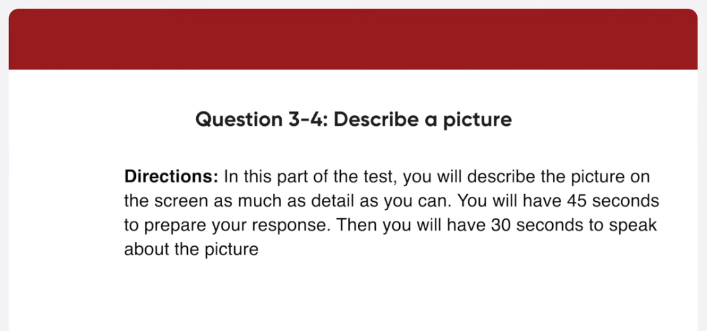
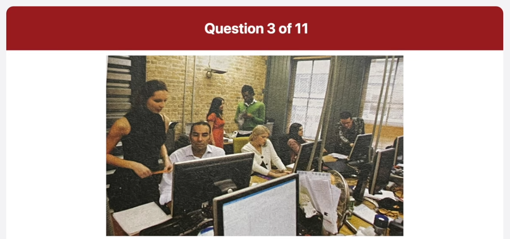
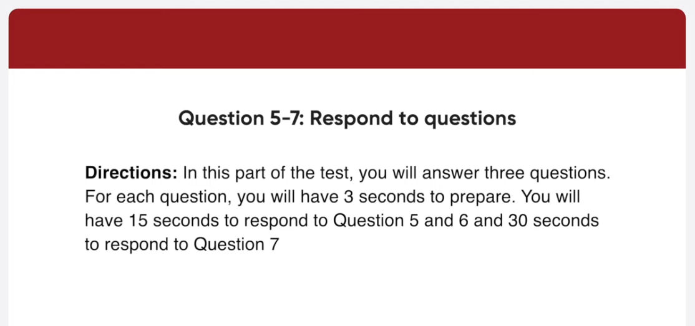
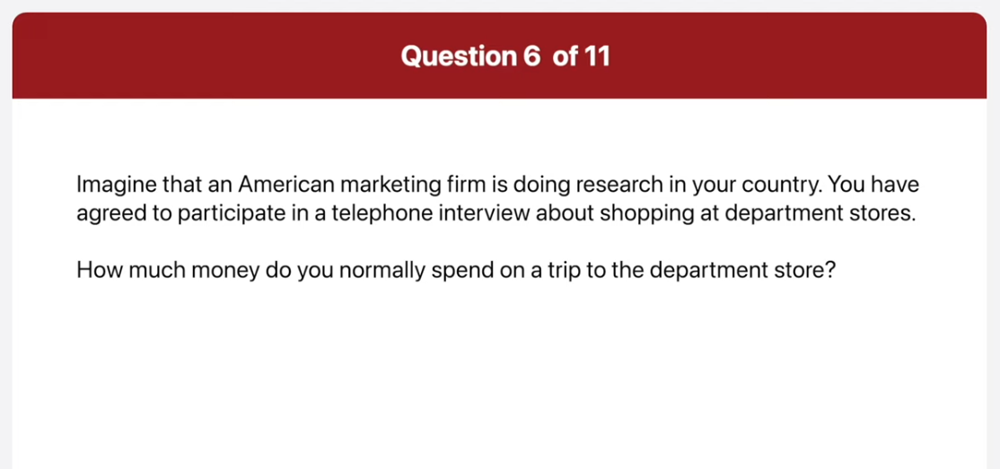

*Link: https://www.youtube.com/watch?v=asa5rJekhqU

## Transcript

00:00:00.000 in this part of the test you will read
00:00:02.100 aloud the text on the screen you will
00:00:04.500 have 45 seconds to prepare then you will
00:00:07.140 have 45 seconds to read the text aloud
00:00:10.019 begin preparing now
00:00:57.840 begin reading now
00:00:59.940 may I have your attention please new con
00:01:03.600 Corporation would like to remind
00:01:05.820 employees of the mandatory safety
00:01:09.119 workshop on July 14th from 9 00 am to 12
00:01:14.040 P.M
00:01:15.119 it is our priority here at neocon to
00:01:19.560 provide a safe and pleasant working
00:01:22.320 environment for everyone
00:01:24.960 this training will cover handling
00:01:27.299 equipment emergency safety procedures
00:01:30.979 and basic first aid
00:01:33.960 thanks and have a great day
00:01:38.520 begin preparing now
00:02:26.160 begin reading now
00:02:28.099 for the best in Comfort while traveling
00:02:31.319 book your next day here at cozy Town
00:02:34.620 Suites you feel at home in our clean
00:02:37.980 spacious rooms as you relax with such
00:02:41.640 amenities as cable TV wireless internet
00:02:45.540 and a private balcony need a place to
00:02:49.260 hold your next business or family event
00:02:52.099 we've recently renovated our conference
00:02:55.319 room area and can accommodate groups of
00:02:58.739 any size
00:02:59.940 call us today at
00:03:04.220 1-88-100 or visit our website at
00:03:07.980 www.cozital.com
00:03:14.459 in this part of the test you will
00:03:16.379 describe the picture on the screen as
00:03:18.060 much as detail as you can
00:03:20.099 you will have 45 seconds to prepare your
00:03:22.680 response
00:03:23.940 then you will have 30 seconds to speak
00:03:25.980 about the picture
00:03:28.019 begin preparing now
00:04:14.879 foreign
00:04:16.100 speaking now
00:04:18.000 this picture was taken at a busy office
00:04:20.459 the main focus of the picture is many
00:04:23.040 employees concentrating on their work
00:04:25.620 the woman on the left is looking over a
00:04:28.380 man's shoulders and he seems to be
00:04:30.900 showing her something on his monitor
00:04:33.080 beside them there is a woman talking on
00:04:35.699 the phone and using the computer at the
00:04:38.160 same time next to her is another woman
00:04:40.500 sitting and talking to the man who's
00:04:42.840 leaning over her desk overall I guess it
00:04:46.199 looks like a typical scene of the office
00:04:50.580 begin preparing now
00:05:38.460 begin speaking now
00:05:40.680 this picture was taken at a barbecue
00:05:43.139 party Outdoors the main focus of the
00:05:45.600 picture is a group of people attending
00:05:47.940 the party the man on the left is serving
00:05:50.580 the barbecue holding a cooking utensil
00:05:53.340 in one hand the others are enjoying the
00:05:56.340 food and gossiping about something
00:05:58.020 together next to him in the background I
00:06:01.380 can also find a deep blue sky without
00:06:04.139 any clouds overall I get it looks like a
00:06:07.500 casual party among close friend close
00:06:09.780 friends
00:06:12.620 in this part of the test you will answer
00:06:15.240 three questions
00:06:17.039 for each question you will have three
00:06:19.080 seconds to prepare
00:06:20.820 you will have 15 seconds to respond to
00:06:23.340 question 5 and 6 and 30 seconds to
00:06:25.800 respond to question seven imagine that
00:06:28.319 an American marketing firm is doing
00:06:29.940 research in your country
00:06:31.919 you have agreed to participate in a
00:06:33.960 telephone interview about shopping at
00:06:35.580 department stores
00:06:37.620 which department store do you usually go
00:06:39.720 to
00:06:40.560 begin preparing now
00:06:46.560 begin speaking now
00:06:49.560 um I usually go to the ABC departments
00:06:52.440 store downtown that's because it has all
00:06:55.500 the best shops and products therefore it
00:06:58.860 is always crowded with lots of customers
00:07:06.360 how much money do you normally spend on
00:07:08.400 a trip to the department store
00:07:10.259 begin preparing now
00:07:16.620 again speaking now
00:07:18.680 I think I usually spend around one
00:07:22.460 million Vietnam dong at the department
00:07:25.380 store but the amount differs depending
00:07:28.259 on the situation sometimes I just go
00:07:31.020 window shopping and buy nothing
00:07:36.240 do you think large chain departments are
00:07:38.220 bad for local businesses
00:07:40.979 begin preparing now
00:07:46.979 begin speaking now
00:07:49.139 well actually I think large chain
00:07:51.840 department stores are good for local
00:07:54.120 businesses that's because they attract
00:07:57.599 lots of customers to the area it is true
00:08:01.020 that customers spend most of their money
00:08:03.780 at the department store however many
00:08:06.780 people still buy things at local shops
00:08:09.780 and eat out at coffee shops and
00:08:11.940 restaurants in the area
00:08:13.740 Source I definitely think
00:08:16.500 having a big department store nearby is
00:08:19.500 good for the surrounding local stores
00:08:23.639 in this part of the test you will answer
00:08:25.740 three questions based on the information
00:08:27.479 provided
00:08:28.979 you will have 45 seconds to read the
00:08:31.319 information before the question begin
00:08:33.899 for each question you will have three
00:08:36.120 seconds to prepare
00:08:37.799 you will have 15 seconds to respond to
00:08:40.320 question 8 and 9 and 30 seconds to
00:08:42.599 respond to question 10.
00:08:45.000 begin preparing now
00:09:34.440 what date exactly is the flight on and
00:09:36.779 what's the flight number
00:09:39.420 begin preparing now
00:09:45.480 again speaking now
00:09:47.240 while your flight will be on September
00:09:50.220 27th and the flight number is kj-56 the
00:09:54.839 flight will be departing at 1 40 pm and
00:09:58.560 will be arriving in Charlotte at 205 pm
00:10:03.839 as far as I remember the baggage weight
00:10:05.940 limit is 60 pounds
00:10:08.220 is that right
00:10:09.899 begin preparing now
00:10:15.560 begin speaking now
00:10:18.180 well I'm afraid not the standard baggage
00:10:21.420 allowance is 50 pounds however if you
00:10:25.560 are a member of the Khal Airways club
00:10:29.220 you will be able to take 60 pounds of
00:10:32.279 baggage at no extra costs
00:10:36.060 I'm arranging to have someone to pick me
00:10:37.980 up and drop me off at the airport in
00:10:39.779 Boston and Charlotte
00:10:41.580 when should I tell them to come
00:10:44.940 begin preparing now
00:10:46.860 foreign
00:10:51.019 speaking now
00:10:53.339 well your flight leaves at Boston at
00:10:56.760 Terminal 1 at 1 40 PM local time but you
00:11:00.959 should arrive at the airport at least
00:11:03.000 one hour prior to the scheduled takeoff
00:11:06.300 time after 1 hour and 25 minute flight
00:11:09.839 you arrive in Charlotte at 205 PM local
00:11:14.220 time there so you need to be picked up
00:11:16.680 soon after that your arrival gate is in
00:11:19.920 terminal 3.
00:11:23.399 in this part of the test you will give
00:11:25.560 your opinion about a specific topic
00:11:28.079 be sure to say as much as you can in the
00:11:30.180 time allowed
00:11:31.440 you will have 30 seconds to prepare
00:11:34.320 then you will have 60 seconds to speak
00:11:37.320 many people believe that most successful
00:11:39.480 people are well organized
00:11:41.760 do you agree or disagree
00:11:44.220 support your opinion using specific
00:11:46.079 reasons and examples
00:11:48.959 begin preparing now
00:12:21.180 foreign
00:12:22.579 speaking now
00:12:24.779 well I totally agree with the idea that
00:12:28.019 most successful people are well
00:12:30.180 organized the main reason is that people
00:12:32.760 who are organized
00:12:35.360 prioritize tasks that helps them to meet
00:12:39.300 their objectives more efficiently for
00:12:42.660 example if you have a specific plan of
00:12:46.019 what to do you'll get right down to the
00:12:48.660 work and save time and energy the other
00:12:51.779 reason is that organized people know how
00:12:54.779 to stay focused on the project until it
00:12:58.800 is finished properly in my experience
00:13:02.540 disorganized people have a lot of
00:13:05.220 difficulty staying disciplined and
00:13:08.279 following through the tasks this makes
00:13:11.519 it much harder for them to meet
00:13:13.500 important deadlines that's why I
00:13:16.019 definitely think that most successful
00:13:18.060 people are well organized
