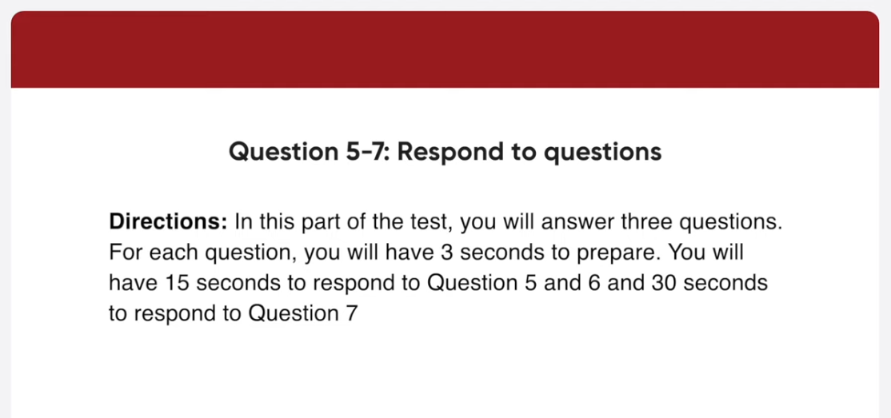
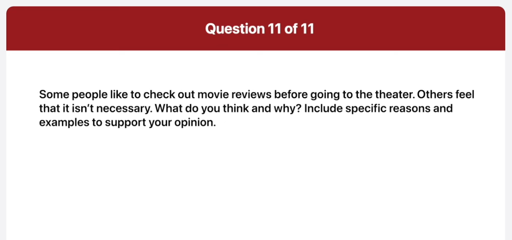

_Link: https://www.youtube.com/watch?v=mXNhZCwsb-U_

Find bargains for the whole family at Penny's outlet. We stock a huge range of clothes, from baby and children's wear to casual clothing for both men and women. Don't forget to get ready for this winter with our new line of coats, hats, scarves and gloves. Customer satisfaction is guaranteed! Visit Penney's Outlet in Western Heights, just off the exit from Highway 4.

This Saturday, world-famous author, James Wright, will be at Bookword's downtown store. He'll be there to promote his fascinating new book, The Time of his Life, a biography of the Great American inventor Thomas Edison. Fans will be able to have their new copies autographed by Mr. Wright. As well as signing books, Mr. Wright will also give a talk to the audience about his new book and about his writing career.

This is a picture taken at an outdoor market. In the foreground, you can see a man selling some small items. It's hard to make out exactly what they are, but I think they might be chess boards and pieces. In the middle of the picture, there are stalls and a lot of people are browsing through them. People are busy examining the goods for sale. And also, some umbrellas have been put up because it's a hot and sunny day.

This picture shows some customers sitting in a cafe. The first thing, I can see in this picture is a young couple sitting by the window. The couple is engaged in conversation, wearing casual clothes. On the right, another couple is sitting by the wall and talking. On the left, there is a guy sitting by himself and using his laptop computer. Overall, it looks like a trendy and stylish coffee shop.

You have agreed to participate in a telephone interview about perfume. When do you usually put on perfume?
I usually put perfume on before I go out on a date or go clubbing. I do it because I want to make a good impressions on others.

Do you like to receive perfume as a gift?

Well personally, I don't because I'm quite picky. They are only a limited number of perfume brands that I like, so I prefer buying it by by myself rather than getting it as a gift.

What are the things you consider when buying perfume?

Well the main thing I consider is that I want to to make sure the scent is mild. The reason is that there's nothing worse than standing next to someone wearing um overpowering perfume. Especially, I hate being with someone wearing strong perfume in a small space like an elevator. Therefore, whenever I buy perfume, I always choose one with a mild scent.

What the first thing on tomorrow's schedule?

You're going to visit the Brook's printing house at nine in the morning and there you will discuss the brochure layout with the head designer. 

As far as I know the monthly lunch meeting is scheduled tomorrow it will be in the conference won't it

I'm afraid that's incorrect. The executive lunch meeting is taking place at La Vitala Italian Cuisine. However, it's subject to change and will be confirmed by 11 AM tomorrow. 

I think I need to stop by the bank sometime after lunch tomorrow so could you tell me the details of the afternoon schedule so that I can find some time for that

Certainly, there are three tasks you for you to do. The first thing you will do is have a video conference with the regional director at 1 30 pm. After that, you're scheduled to attend a seminar on time management hosted by HR Manager. Last, you have to go to the Forman Events Center to attend to a corporate drinks and dinner function.

Well in my case, I tried to avoid reviews before going to see a movie. That's because reviews give away important information about the plot. Which we call movie spoilers. For example, before watching impossible mission, I read a review which gave away the surprising ending. It totally ruined the movie for me. Another thing is that reviews influence your opinion of a movie before you've even seen it. By reading movie reviews beforehand, you already get a negative or positive impression of it. Even worse, a lot of movie productions are posting favorable reviews as part of their marketing strategy. That's why I normally do not check movie reviews before I actually watch it.

