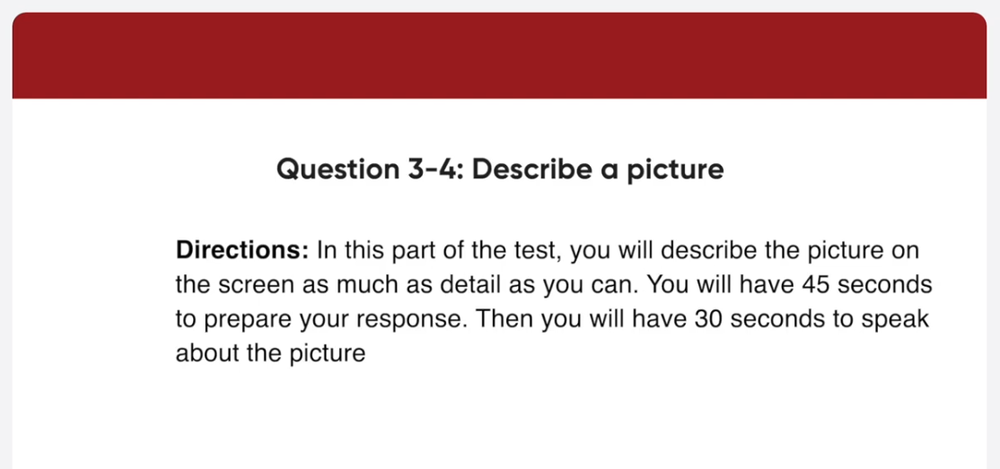
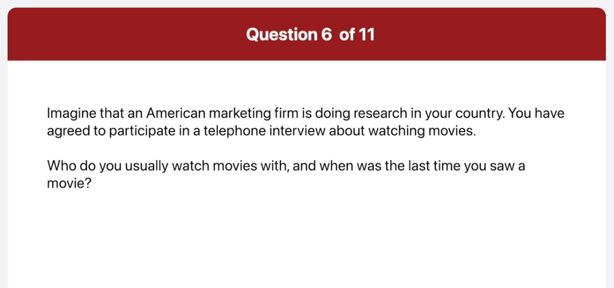
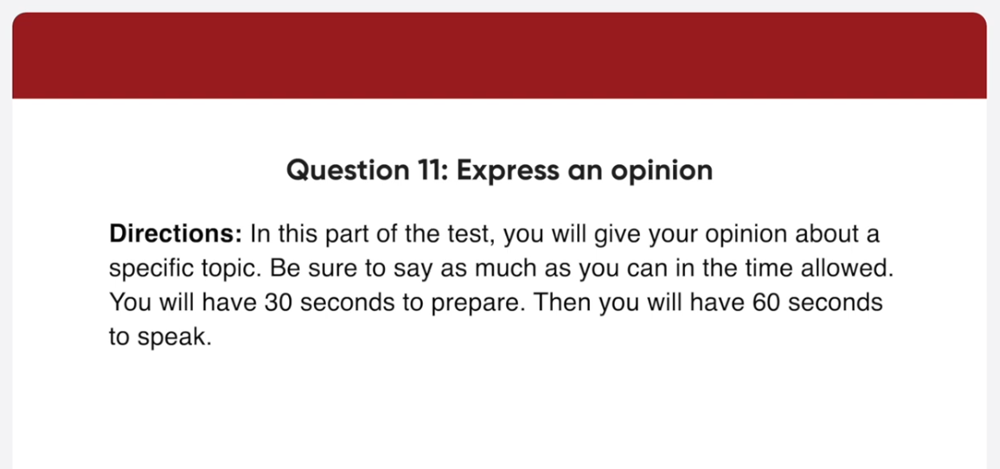
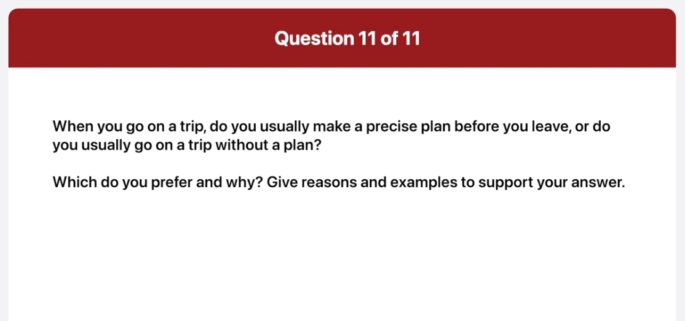

_Link: https://www.youtube.com/watch?v=yGwAgufQxyY_

Hello, thank you for calling Mountain Drive Movie Theater. Today our Cinema is showing two classic movies. In the Blue Cinema, one of the all-time great comedies Back to Barcelona, starring Michael Miller, will be shown, while in the Red Cinema we have Everlasting, starring Leonardo Hall and Kate Bennett. Show times are 6, 8 and 9 30 in the evening. Please press 1 to reserve a ticket. Thank you.

Want to develop health and flexibility while cultivating the inner arts of meditation? Ashina Yoga Center is the answer! We specialize in all kinds of yoga, including Mantra Yoga, Hatha Yoga and Karma Yoga. Our yoga instructors are all extensively trained in India, ensuring superior yoga lessons, and a superior yoga experience. Our Center is located right downtown, so just stop by afterwork to relax both body and mind!

This is a picture of people relaxing on a beach. Some people are getting a tan while others are enjoying the water. I can see one woman on the right is lying on her side. There is an empty chair and a flag in the middle of the photo. In the background, there are palm trees and large houses on the side of the hill. It looks like a hot summer day, and so it is important to remember to apply suntan lotion.

This is a picture of a man giving a speech to an audience. The man is standing on a stage with a big screen behind him. I can see a woman sitting at a table that has microphones set up for others to have a panel discussion. The entire audience is focused on his speech. I can tell people in the audience are probably taking notes. I think the man is giving a speech at a university.

What is your favorite kind of movie?

Well I like watching romantic comedies. One of my favorites is your place or mine on Netflix.

Who do you usually watch movies with and when was the last time you saw a movie?

Well I usually watch movies with my friends and the last time, I saw a movie was two weeks ago, it was a touching story about the friendship between a girl and a dog.

Do you prefer to watch movies on the computer or go to a movie theater why?

I prefer to watch movies on the computer. The biggest reason is that I am too busy and it's hard to find time to go to the movie theater. So I download some of some of the films, I don't want to miss on my computer and watch them on my way home on the bus.

Where can I find an application and when do I need to send it there?

You can find an appication on the Convention Center's homepage. In addition, you can visit the Convention Center and pick up an application form. Please send the application in by January 11th.

Do I need to include my payment with the display Booth application?

Actually it is not necessary to include your payments with the application. However, the payment closing date is April 1st.

I want to make sure that there's a lot of information about my Cafe in the program brochure what can I do?

Well to ensure that there's enough information about your cafe in the program brochure, please supply an outlog of your business by March 3rd. In addition, you can have advertisement printed for the program brochure, which needs to be done by the end of the March. Finally, the program brochure can be accompanied by leaflet inserts about your cafe as long as they are ready by April 19th. Please note that the leaflets are non-compulsory like the advertisements.

Well when I go on a trip, I usually do not make any plans. I am a spontaneous kind of person, and I find that like to be surprised about the interesting places and activities available on my vacation. I went to Ho Chi Minh City last spring with a friend of mine. Neither of us made any plans, but we had the best time of our lives. We met up with some other vacationers and enjoyed some of the tours that they had booked. My friend and I did not waste time researching about what to do. We relied on the suggestions of others, and we were never disappointed. I think that personal accounts are more substantial than a brochure or Internet information that would be available if I were to plan my trip precisely beforehand. Also, on some days, I just want to relax and not do nothing. Hence, I don't bother making precise plans and prefer to do whatever I feel like doing during my vacation.

