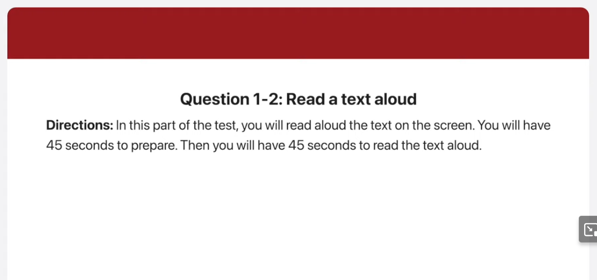
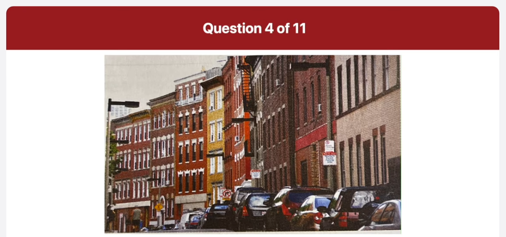
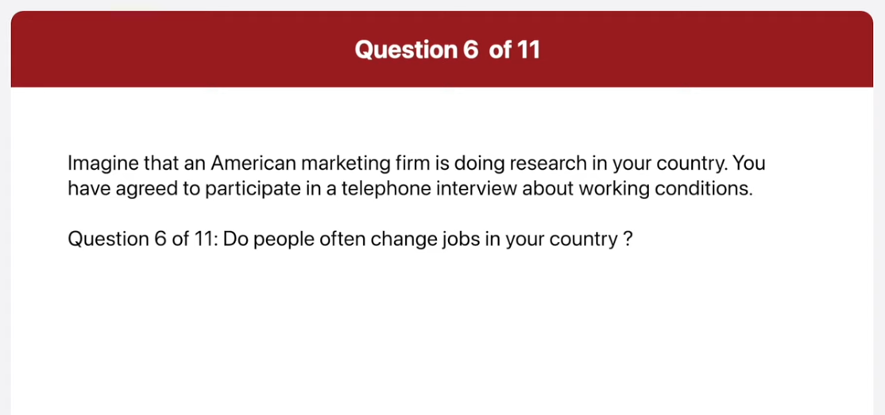
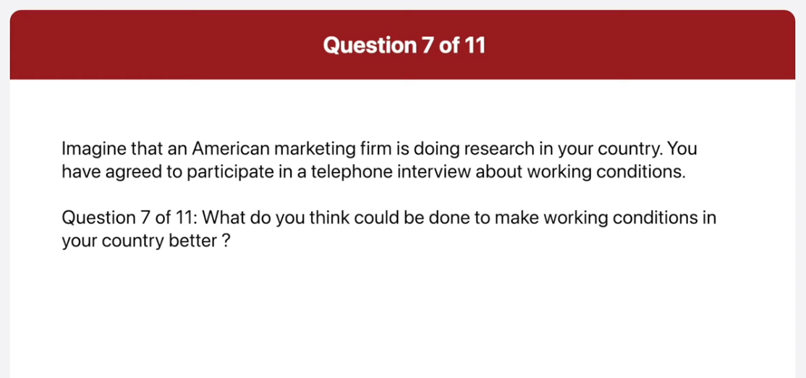

_Link: https://www.youtube.com/watch?v=lgKUIkjDTAk_

Are you hungry for the best pizza in the city? Then cause a top of the pizza for quick delivery of our fresh hot pizza. In addition to a wide selection of pizzas, and toppings, we also make delicious pasta dishes, salads, and breadsticks. For your convenience, you can even place your order online for quick pick up for or delivery. So the next time you're thinking about what to do for dinner give us a call and let us take of everything.

As a guess of Highpoint Hotel, all travelers can enjoy free access to our modern fitness center. Located on the 15th floor, the center offers you all of the latest exercise equipment to help you stay in shape. The Phoenix Center has personal trainers to make sure you get the most of your workouts. When your workout is finished, you can relax in large outdoor swimming pool that offers great views of the city.

This picture was taken in an auditorium. People are sitting on red and white seats facing the stage. On the stage, there is a man looks like he is addressing the audience. In the background, I can see an upper level of seating in the auditorium, where more people are sitting. There are various spotlights in the ceiling of the auditorium and there seems to be a screen of the wall of the stage. The auditorium looks comfortable and well equipped.

The image shows a large indoor auditorium filled with people seated in rows of red chairs. The auditorium has multiple levels, with balconies around the perimeter where more people are seated. At the front, there’s a stage with a few individuals standing, possibly addressing the audience or performing. The setting suggests a formal event or gathering, such as a lecture, concert, or theatrical performance, taking place in a well-designed hall that enhances visibility and acoustics.

The picture was taken in a quiet street. There are two people walking away in the distance only one of whom is really invisible. The man is wearing blue short and grey sleeveless shirt. He seems to be carrying a bag. These are cars parked on the right hand side of the road. Both sides of the road are lined with tall streetlights. The street looks calm and peaceful as there is no traffic and the man is working in the road.

The image shows a street lined with multistory buildings, each showcasing different architectural styles and colors. Parked cars are visible along the curb, and there are signs attached to the buildings. The sky appears overcast, giving the scene a somewhat muted ambiance. It looks like an urban residential area.

In my country the working hours are usually nine to six. Some people work longer though do people often change jobs in your country

It is quite common for people to change jobs in my country. It's okay to have had different jobs

Working conditions would be better if people felt able to leave work on time. In some companies, people think that they shouldn't live work until their boss leaves. This can mean that people are just waiting in the office, even though they have finished all their work.

Hello my name is Sam Goldsmith and I've recently been hired by your company. I'm calling to ask some questions about the upcoming orientation. Where is it going to be held? What time does it end?

It will be held at the PR Training Center, and it ends at 4 PM.

No you don't. You'll get your ID badge in your first day of work.

Do we get our ID badge on this day?

I may have to leave at lunch because of important family business. What will I miss?

If you leave at noon, you'll miss employee responsibility and conduct, which is scheduled from 1 to 2 PM. You'll also Miss information security, which is scheduled from 2 to 3 PM and computer orientation, which is from 3 to 4 PM.

If I have some free time I would choose hiking from these three options. I like hiking for two simple reasons. Firstly hiking gives me a really good opportunity to think through things. I can breathe fresh air in the forest, and this helps me to relax and think more clearly. Once, I begin hiking with a lot of stress, worrying about a family problem. But by the time, I was finished, I had a brilliant solution in mind, and I was completely stress free. Not only that, but hiking is also excellent exercise. Hiking up on actual mountains is very physically demanding, so it is effective for strengthening my muscles and increasing my stamina. I find that hiking for a few hours is much more effective than doing muscle training at the gym. Therefore, I would go hiking during my spare time.

Of these three options, I think I would choose to read a book. My main reason is that books allow me to experience things that I might never have a opportunity to experience firsthand. This includes things that are not currently possible, like traveling to other worlds or through time. Of course, movies do the same thing, but with a book I use my own imagination, while with a movie I watch someone else do it. My second reason for choosing a book is that it is very convenient. Since books are light and durable, they are easy to carry. I can read books anywhere. So when I have free time, I prefer to read a book.

