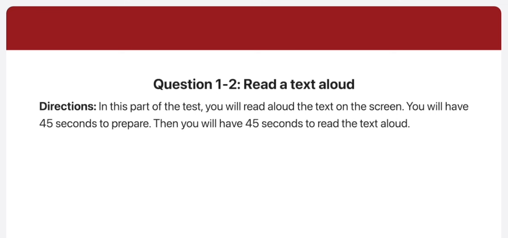
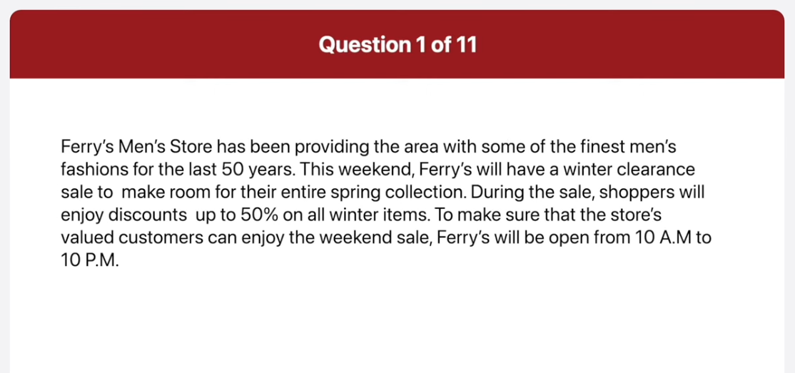
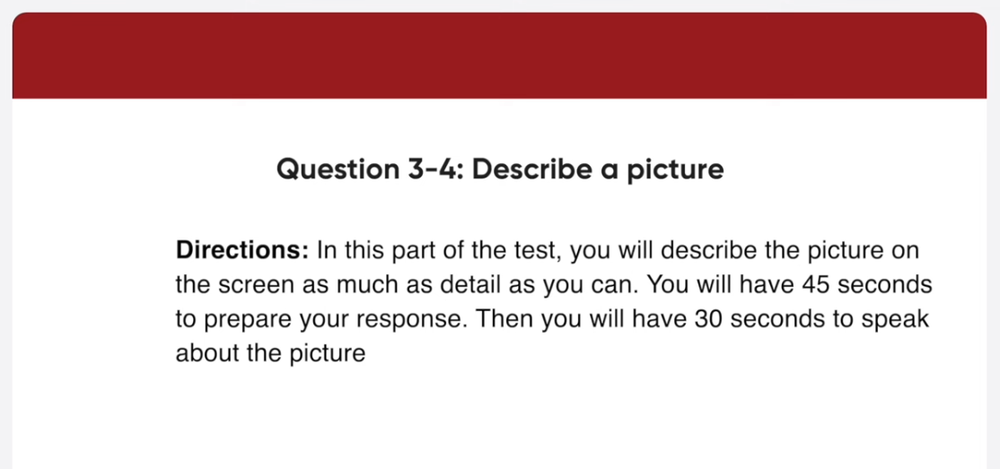
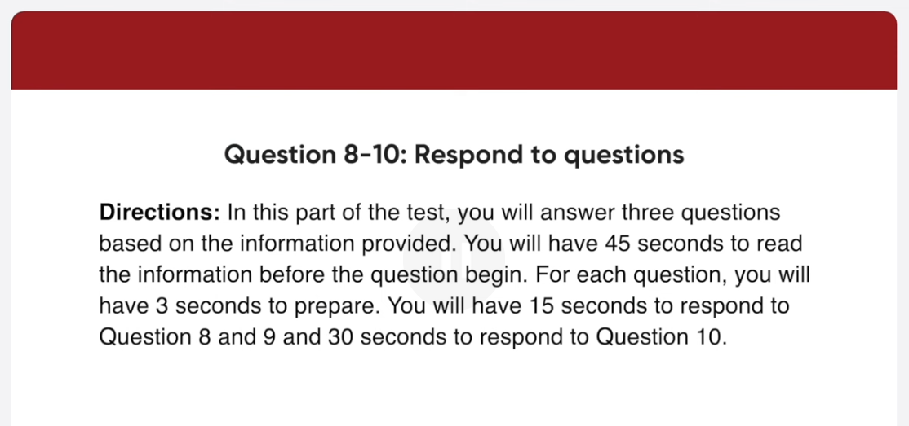
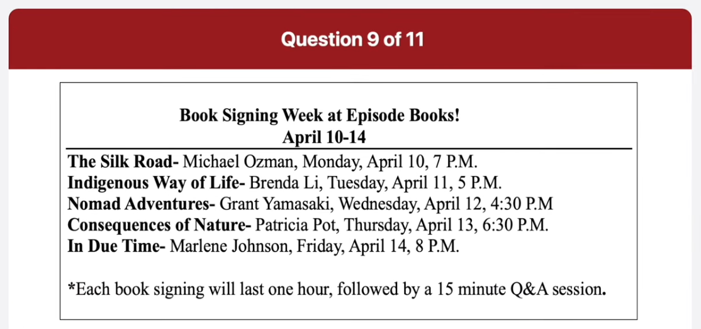
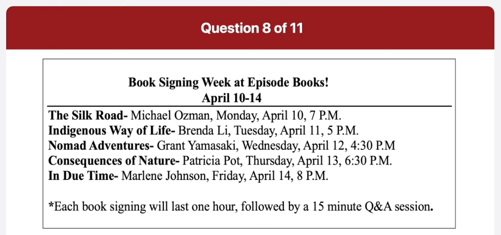
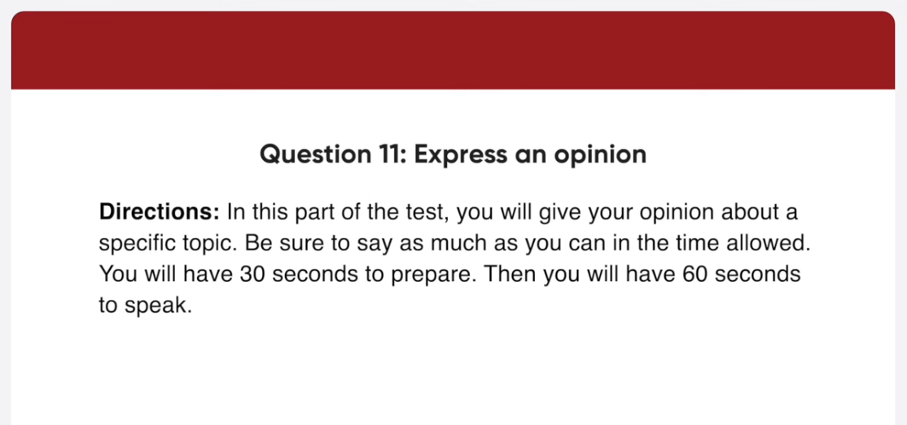

_Link: https://www.youtube.com/watch?v=lScVsWNRPA4_

Ferry's Men store has been providing the area with some of the finest man's fashions for the last 50 years. This weekend, Ferry's will have a winter clearance sale to make room for their entire spring collection. During the sale, shoppers will enjoy the scouts up to 50% on all winter items. To make sure that the store's valued customers can enjoy the weekend sale, Ferry's will be open from 10:00 A.M to 10 P.M.

The 23rd annual Movie Critics Awards will take place next Saturday at 7 p.m at the Grand Hotel. The event will award today's top actors, directors, and others who have worked to create some of the best films of the year. If you wish to attend, please contact the hotel as soon as possible since seating for the public will be limited. Cameras will not be allowed inside the hotel. Photos can be only taken outdoors before or after the event.

This is a picture of a street. There are two tram racks on the road, and there is a tram on one of the tracks. The tram is white with a red stripe along the side of each carriage. In the background, there are four large buildings. On the left-hand side of the road, I can see a man walking on the sidewalk. There are also some other buildings in the background. The tram looks like a good way to get around the city.

This picture was taken in a cobble area outside a restaurant. Some tables have been set up outside the restaurant. Each table has four wooden chairs around it. Brightly colored table cloths have been placed on the tables and cutlery and glasses with napkins inside have been laid out. In the background, there is an old brick war. There is an rectangular hole in the wall. It seems like a nice place to have a meal outdoors.

Well. I normally visit the career sections of specific companies that interest me. Many organizations post job openings directly on their websites providing detailed information about the posision requirements, company cultures and application process.

How much time do you usually spend preparing for a job interview?

Well. The amount time, I spend preparing for a job interview can vary depending on various factors such as the level of job, the industry and some circumstances. But normally, I spend about two or three days preparing for a job interview. 

When applying for a job, which aspect concerns you the most?

Well. The aspect that I'm concerned with is the salary. Although the other factors are quite important, they don't matter if you don't have enough money to have a good life. Also, it will allow me to open my business with the money in the future. So, I can say that I'd prefer to have a job with good pay than a job with lots of vacation or other non-financial benefits.

Hi I'm a huge fan of Michael Osman and I heard he's going to be at your bookstore for a book signing event. Can I ask a few questions about it. When do I have to be there to get an autograph from Mr Osman?

You should be there on Monday, April 10th, between 7 and 8 P.M

Will there be a chance to ask questions to be author?

Yes. There will be a 15 minute Q&A session after the book signing. 

Can you tell me about the rest of the authors that will be at the

Certainly, Branda Li will be there on Tuesday, and Grant Yamasaki will be there on Wednesday. On Thursday, Patricia Pot will be there and on Friday, Marlene Johnson will be there. But keep in mind that they all be there at different times.

Well. I agree that children should not be allowed to use cell phones at school for the following reasons. First of all, it can be a major distraction in school. For example, when students send text messages to one another in class, the sounds of phones beeping or vibrating make it difficult for students and teachers to concentrate. Another reason is that cell phones discourage children from being social. For instance, with the advent of the smartphones, many children spend more time playing with their phones than spending time with friends. For these reason, I believe children should not be allowed to use cell phone at school.

