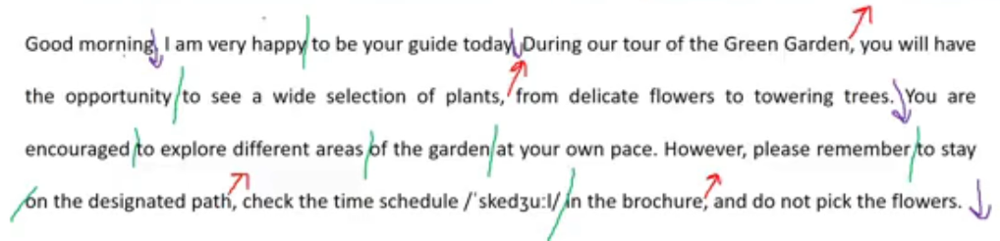
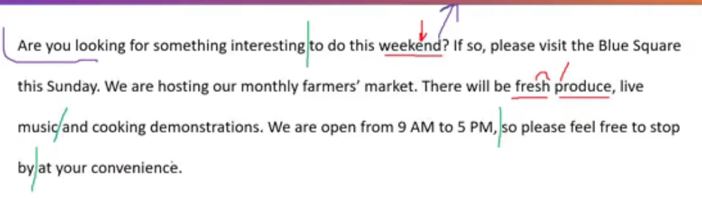
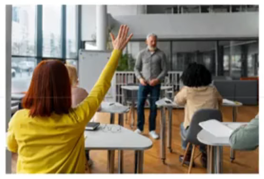
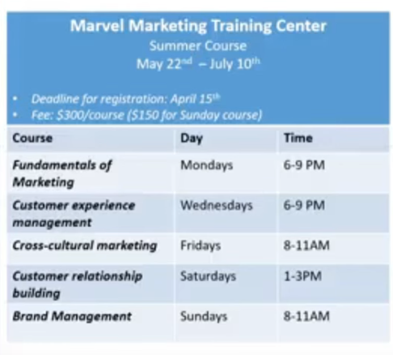

_Link: https://www.youtube.com/watch?v=x6q8YYFRPgc&list=PL4m9evEVyQlKGhW2_29dd6yNQS_qA8Vi8_

## Question 1

Good morning, I am very happy to be your guide today. During our tour of the Green Garden, you will have the opportunity to see a wide selection of plants, from delicate flowers to towering trees. You are encouraged to explore different areas of the garden at your own pace. However, please remember to stay on the designated path, check the time schedule in the brochure, and do not pick the flowers.

## Question 2

Are you looking for something interesting to do this weekend? If so, please visit the Blue Square
this Sunday. We are hosting our monthly farmers' market. There will be fresh produce, live
music and cooking demonstrations. We are open from 9 AM to 5 PM, so please feel free to stop by at your convenience.

## Question 3

This picture was taken in/at/on + [place]. There are + [no] + people. [location], a woman/ a man/ a boy + is + V-ing. On the right, a man + in + clothes + is V-ing. [location], I can see + N. It seems that they are + Adj. Maybe they are + V-ing.

This picture was taken in a room/ in a white room. There are 2 people in this picture. On the left, a woman with short hair is holding a box./ On the left, a woman is lifting/ carrying/ holding a box with a potted plant on top of it. On the right, the man is lifting a blue sofa. He is wearing a blue polo shirt./ On the right, a man in a blue polo shirt is lifting a couch = sofa. Next to her, I can see a white ladder. In the background, there is a big window/ there are some boxes scattered on the floor. It seems that they are very busy. Maybe they are clearing their room/ Maybe they are moving to another office/ Maybe they are newly married and just moved into the new apartment together/ Maybe they are reorganizing furniture of their house/ Maybe they are planning to renovate the room.

## Question 4

They are V-ing/ They are wearing/ They have + hair. [location], S + with hair/ in + clothes + is + V-ing. [location], people are V-ing. One of them is V-ing. [location], I can see + N. [location], there is/are + N.

This picture was taken in a classroom/ in a office. There are 5 people in this picture. They are having a training session. In the middle, a man with/ having a beard is standing and giving a lecture. In the foreground, four people are sitting and listening to the man in the middle. One of them, who is wearing a yellow cardigan, is raising her hand. Next to them, I can see a big window. Behind the man in the middle, I can see a flip chart.

## Question 5

Imagine that a lifestyle magazine is doing some research in your area. You have agreed to participate in a telephone interview about public transportation.

How often do you use public transportation, and what do you often do when you use it? (2-3 sentences)

I use public transportation everyday. I use public transportation once or twice a week/month/year.

When I use it, I often listen to music/ I often read books/ I often watch Youtube video.

Sometimes, I sleep if I am too tired.

## Question 6

Do you pay in cash when using public transportation? (2-3 sentences)

No, I don't pay in cash when using public transportation. I always pay with my transportation card/ pay by card. This is because using my transportation card is much more convenient and safer.

## Question 7

When commuting to school or work, do you prefer to take public transportation or drive your own vehicle? (4-5 sentences)

When commuting to school or work, I prefer to take public transportation. First, it helps me save money. This is because I don't have to pay for fuel or parking. Second, it's time-saving. Buses, subways, and other means of public transportation have their own lanes. There fore, I can get to my destination faster.

## Question 8

When is the deadline for registration and how much do your courses cost?

The deadline for registration is on April 15th.

The fee for N + is...

The fee is 150 dollars for our Sunday courses and 300 dollars for other courses.

Our Sunday courses cost 150 dollars and other courses cost 300 dollars each.

## Question 9

I was told that your courses end on August 10th. Is that correct?

No, you have the wrong information. Actually, our courses will end on July 10th.

## Question 10

Could you give me all the details of the courses that focus on customers?

There are 2 courses that focus on customers. The first course is Customer experience management on Wednesdays from 6 to 9 PM. The second course is Customer Relationship Building on Saturdays from 1 to 3 PM.

## Question 11

Do you think it's useful to check information about a product on the company's website before buying it? (8-10 sentences)

The main reason is that S + V.

No, I don't think it's useful to check information about a product on the company's website before buying it. The main reason is that information on the company's website is often incomplete.

==> reason or result

Because companies want to sell more products, they tend to mention only the good features of the product on their website and hide the bad ones. Therefore, it's difficult for customers to have a complete understanding of the product.

Let me tell you my story. Last year, I brought a smartphone after checking information about it on the company's website. According to the description on the website, it can take beautiful photos and it can store many files.

When I received the smartphone, it did take beautiful photos and it did store many files. However, It also run out of battery very quickly. This bad feature was not mentioned on the website.

That's why I think so.
