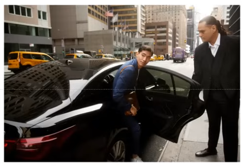

_Link https://www.youtube.com/watch?v=pjmvcduqC_Y&list=PL4m9evEVyQlKGhW2_29dd6yNQS_qA8Vi8&index=3_

## Question 1

May I have your attention please? Lunch is now being served in the cafeteria. Please note that all meals are vegan. After you have finished your lunch, please return to main hall for the remaining sessions. Enjoy your lunch!

## Question 2

Now it's time for the local news. This weekend, the city will be hosting its annual music festival. The opening night show will feature a performance by Tom Smith. Having gained national recognition, Tom is not only a single, but also a dancer and songwriter. Also, because it's rainy season, please remember to bring your raincoat or umbrella.

## Question 3

reach for something: cố với chạm tới cái gì đó.

He has + adj + hair

[location], a woman is V-ing

dreadlocks

[location], I can see + tên đồ vật

This is a picture taken in a supermarket. There are two people in this picture. On the right, a man is bending over to picking up some items. He is wearing glasses/ He has short hair. On the left, a woman is standing behind the counter and looking at the shopping cart. Opposite the man, a woman is checking some items. A woman with dreadlocks is helping the man to check out/ processing his purchases. In the background/ behind them, I can see many items displayed on the shelves. Maybe they are busy.

## Question 4

This is a picture taken on the street. There are 2 men in the picture. On the right, a man in black suit is opening the car door/ is holding the car door open. The other is stepping/ getting out of the car and looking back. In the background, I can see many tall buildings/ I can see many cars parked along the street.

## Question 5

Imagine that a marketing firm is doing some research in your area. You have agreed to participate in a telephone interview about gyms.

How do you often find information about gyms?

I often find information about gyms by asking my friends. Most of them are gym rats and they know a lot of good gyms. Therefore, they can give me useful information.

## Question 6

Do you like to get help from trainer at the gym?

Yes, I do/ Yes, I like to get help from trainers at the gym. They have a lot of knowledge and experience so they can help me exercise safely and effectively.

## Question 7

What is the most important factor to consider when you choose a gym? Location/ Price/ Service

Location is the most important factor to me. If a gym is near my house, it can help me save time. In addition, I often work out after work / after finishing my work. The streets are very crowded at that time. Therefore, if I go to a gym near my office, I can avoid traffic jams. In addition, I can save time.
