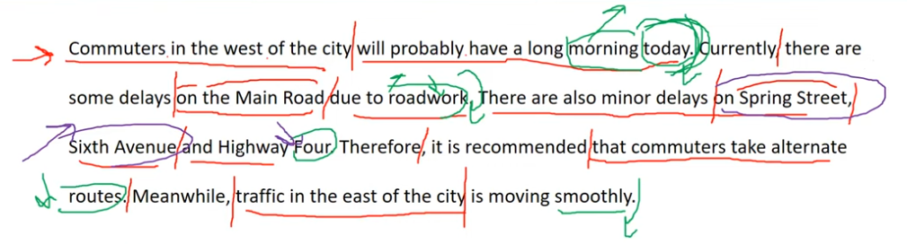
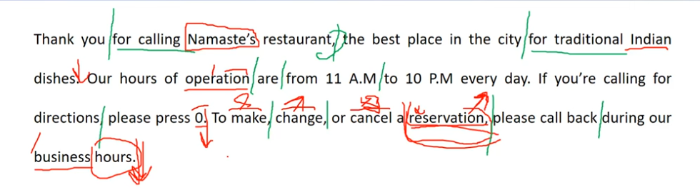

_Link https://www.youtube.com/watch?v=3Q2cb3tnAV4&list=PL4m9evEVyQlKGhW2_29dd6yNQS_qA8Vi8&index=5_

## Question 1

Commuters in the west of the city will probably have a long morning today. Currently, there are some delays on the Main Road due to roadwork. There are also minor delays on Spring Street, Six Avenue and Highway Four. Therefore, it is recommended that commuters take alternate routes. Meanwhile, traffic in the east of the city is moving smoothly.

## Question 2

Thank you for calling Namaste's restaurant, the best place in the city for traditional Indian dishes. Our hours of operation are from 11 A.M to 10 P.M every day. If you're calling for direction, please press 0. To make, change, or cancel a reservation, please call back during our business hours.

## Question 3

To pour milk into a cup

To pour water into a bucket

This is a picture taken in a garden/ in a park. There are two people in the picture. Both of them are wearing winter clothes. On the right, a little boy is watering the plant/ holding a watering can. He is wearing a black jacket. On the left, a man is holding a shovel and squatting down. In the background, I can see some trees.

## Question 4

This is a picture taken in an outdoor market/ a local market. There is a woman in the picture/ in the foreground. The woman with brown hair is holding some vegetables/ choosing some chili peppers. She is wearing an off-the-shoulder top/ purple blouse. In the background, I can see many people. Some of them are looking at items, one of them is talking on the phone/ In the background, there are some people buying products.

## Question 5

Imagine that a marketing firm is doing some research in your area. You have agreed to participate in a telephone interview about computers.

How many hours a day do you use a desktop or laptop computer?

I use my laptop computer 10 hours a day. I often use it to take note and do my homework. Sometimes, I also watch movies on it.

I spend about 2 hours using my laptop. I usually use it to learn English.

## Question 6

Are you willing to buy a used computer?

Yes, I am because it is cheap. I am a student so I do not have a lot of money.

## Question 7

Which of the following is the most important factor when you decide to buy a new computer?

-   Price.
-   Battery life.
-   Storage capacity.

Battery life is the most important factor for me. This is because it is helpful. I use my computer for 10 hours a day. Therefore, if the battery life is long, I don't have to carry a charger or find a place to charge it.

## Question 8

On what date does the winter semester start, and how much does each class cost?

The winter semester will start on December 2nd and each class costs $300.

## Question 9

I heard that there are some classes on Sundays. Is that right?

No, you have the wrong information. Actually, there are no classes on Sunday.

## Question 10

Could you please give me details of the classes for beginners?

There are 2 classes for beginners. The first class is Beginning Oil Painting at 7PM/ from 7 to 9PM on Mondays. It will be instructed/ taught by Mary Janes (The instructor is Mary Jane)

The second class is Beginning Watercolor at 3PM on Saturdays. It will be taught by Tom Smith (The instructor is Tom Smith).

## Question 11

What are some disadvantages of working from home compared to working in the office?

There are several disadvantages of working from home. First, it is inconvenient. If I want to discuss something with my colleagues, I can not get their feedback immediately. Second, it's difficult to focus on work when working from home. There are too many distractions such as family member, neighbors or household chores.

Let me tell you my story. Last year, due to the pandemic, I had to work from home. I could't concentrate on my work because of my noisy children. Therefore, I felt that I was less productive. That's why I think that working from home is a bad idea.
