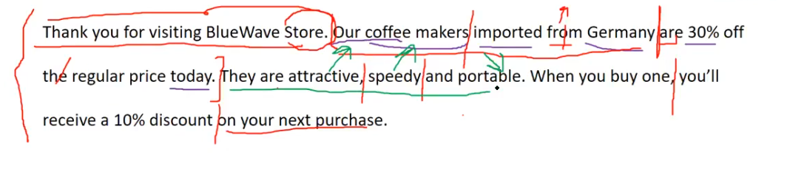
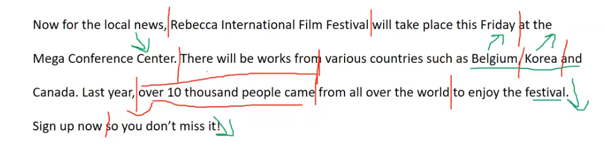
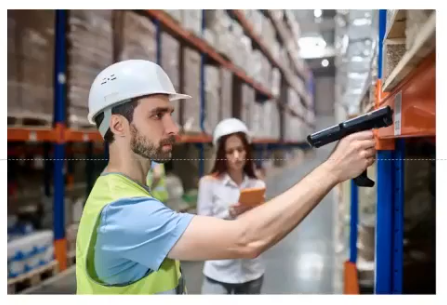
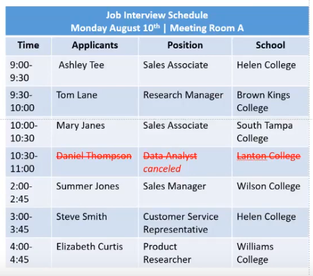

_Link https://www.youtube.com/watch?v=WaCeTGSQDwM&list=PL4m9evEVyQlKGhW2_29dd6yNQS_qA8Vi8&index=7_

## Question 1

Thank you for visiting BlueWave Store. Our coffee makers imported from Germany are 30% off the regular price today. They are attractive, speedy and portable. When you buy one, you'll receive a 10% discount on your next purchase.

## Question 2

Now for the local news, Rebecca International Film Festival will take place this Friday at the Mega Conference Center. There will be works from various countries such as Belgium, Korea and Canada. Last year, over 10 thousand people came from all over the world to enjoy the festival. Sign up now so you don't miss it.

## Question 3

Rack

This is a picture taken in a warehouse/ factory. There are two people in this picture. Both of them are wearing safety helmet. In the foreground, a man wearing protective clothes is scanning a barcode. In the background, a woman in a white shirt is looking at the document/ a tablet on her hand. I can see a lot of goods placed on the shelves.

## Question 4

This is a picture taken in a office/ a meeting room. There are two people in the picture. They are sitting at a table (They are dressing formally. They are wearing formal clothes.). In the background, a woman wearing a shirt is smiling brightly and typing/ working on a laptop (a woman is looking at the camera and typing on the keyboard). In the foreground, a man having short short hair is writing something in his notebook/ taking notes carefully. In the background, there are some chairs arranged in a row/ I can see some empty black chairs.

## Question 5

Imagine that a lifestyle magazine is doing some research in your area. You have agreed to participate in a telephone interview about bakeries.

When was the last time you visited a bakery?

The last time I visited a bakery was yesterday/ 2 weeks ago. I went there to buy a birthday cake for my sister.

I went there with my friends and brought some chocolate cakes.

## Question 6

Do you prefer to go to a bakery in the morning or in the afternoon?

I prefer to go in the morning. At that time, there are so many kinds of cakes to choose from.

## Question 7

In your opinion, which of the following would be the most important factor when visiting a bakery?

-   Price
-   Location
-   A variety of products

The most important factor to me is a variety of products. First, I like to try different kinds of products. I will get sick of eating the same thing every day. Second, I can buy different items for different occasions such as birthdays and weddings.

## Question 8

What time does the first interview start and where will it be?

The first interview will start at 9AM and it will take place in meeting room A.

## Question 9

I know I will interview Mary Jane from 10 to 10:30. However, is it possible for me to extend the interview time?

Yes, you can. Because the interview from 10:30 to 11AM has been cancelled.

## Question 10

Could you give me all the details of applicants who applied for managerial position?

There are two applicants. The first applicant is Tom Lane. His interview will start at 9:30AM to 10AM. He graduated from BKC.

The second applicant is Summer Jones. His interview will start at 2PM. She studied at Wilson College.

## Question 11

Do you think it's important to spend time outdoors?

Yes, I think that it's important to spend time outdoors. First, it helps people stay heathy. This is because they can enjoy fresh air and move their bodies when they go out. Second, it helps people to expand their relationship. When going out, they can meet and make friends with a lot of people. When I was small, I was very shy. I stayed at home all the time and never went out. As a result, I felt very lonely. One day, my mother signed me up for a swimming class. I met a lot of friends here and I also became healthier. This made me realize that spending time outdoor is very important.
