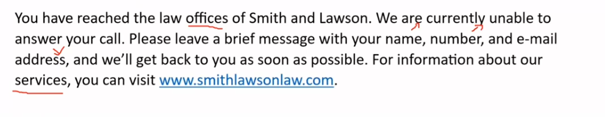
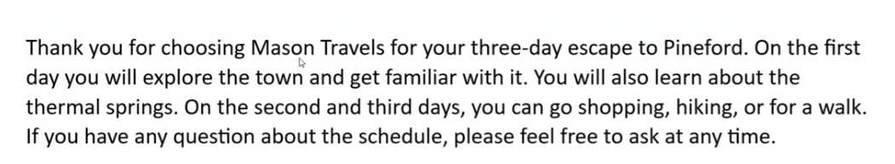
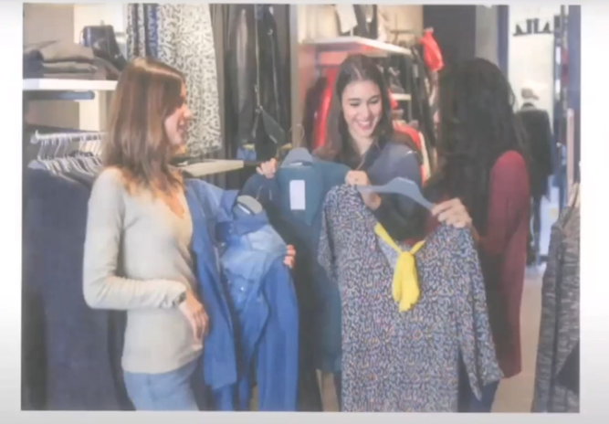
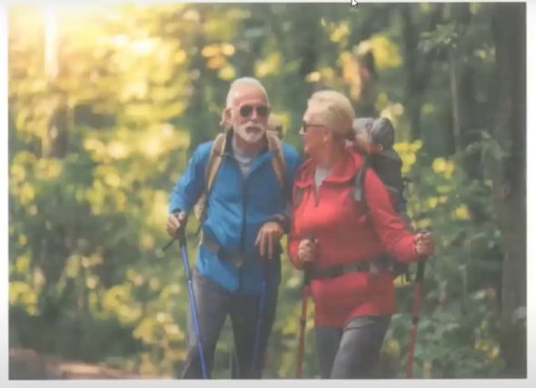
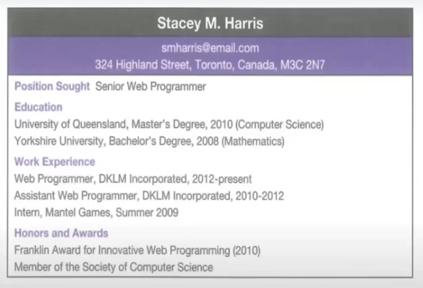

_Link https://www.youtube.com/watch?v=TQnyFE2M5zQ&list=PLiqLRyAoFR0CsjN4rtojrmqWYeQCyLJSH&index=4_

## Question 1

You have reached the law offices of Smith and Lawson. We are currently unable to answer your call. Please leave a brief message with your name, number, and e-mail address, and we'll get back to you as soon as possible. For information about our services, you can visit www.smithlawsonlaw.com

## Question 2

Thank you for choosing Mason Travels for three-day escape to Pineford. On the first day you will explore the town and get familiar with it. You will also learn about the thermal springs. On the second and third days, you can go shopping, hiking, or for a walk. If you have any question about the schedule, please feel free to ask at any time.

## Question 3

> clothing store - 3 people/ woman
>
> middle, holding up a jacket and smiling brightly
>
> right, long black hair - holding up a dress
>
> left - blond hair/ in a sweater - has a jacket over her arm
>
> many kind of clothes are on display
>
> friends

This is a picture of a clothing store with three women. In the middle, a woman is holding up a jacket and smiling brightly. On the right side, another woman with long black hair is holding up a dress. On the left side, a blond hair woman has a jacket over her arm. In the background, I can see many kind of clothes on display. It seems they are friends.

## Question 4

> forest - 2 person/ an old couple
>
> going trekking together
>
> hiking, jackets, carrying backpacks/ rugsacks, trekking poles
>
> tools to help them walk more easily
>
> woman - looking at
>
> trees, sun is shining
>
> good day - spend outdoors

This is a picture of the forest with 2 people. They are going hiking together. They are wearing jackets and sunglasses. They are also carrying backpacks/ rugsacks and holding trekking poles. The woman is looking at the man. While, the man maybe he is talking something. In the background, I can see a lot of trees and the sun is shining. It seems to be a good day.

## Question 5

Imagine that you are taking on the telephone with a colleague. You are talking about hobbies.

Who do you normally go to the movies with?

> what
>
> how often
>
> where
>
> when

Well, let me see. I usually go to the movies with my friend and sometimes, I go alone. Well actually, I am kind of enjoy my own company.

## Question 6

How far would you travel to go to a movie theater?

> would travel (up to) ... km to go ...
>
> travel 15 minutes to go ...
>
> where, who, why, when, how often, what

I would travel 5 Km to go to a movie theater.

Well. I would travel up to 20 minutes to go to movie theater and I normally go with my mother because she likes going to the movie theater with me.

## Question 7

Let me ask you this. Would you go to movie theaters more often if they had events where you could meet directors?

> yes
>
> understand my favorite movies
>
> more
>
> ask questions
>
> fun/ interesting
>
> last month - movie theater in my neighborhood - held events - show up and answer questions from the audience
>
> cast

Yes,

## Question 8

Where did she go for the Master's Degree and when did she graduate?

She went to University of Queensland for the Master's Degree. She graduated in 2010.

> graduated from ... with a master's degree in ...

## Question 9

Yes, she is. Because she got/ achieved a Franklin Award for Innovative Web Programming in 2010.

## Question 10

In the summer of 2009, she worked as an intern for Mantel Games. From 2010 to 2012, she worked as Assistant Web Programmer for DKLM Incorporated. Since 2012, she has worked as Web programmer for the same company.

## Question 11

Which of the following is the MOST important quality for a customer service agent?

-   Being friendly
-   Being a good listener
-   Being highly experienced

Choose ONE of the options and use specific reasons and examples to support your opinion.

> being friendly
>
> not satisfied with their service
>
> mobile phone - not friendly -rude - not answer
>
> next - friendly - always smile; willing to support; answer all of questions
>
> ==> recommend

> experience
>
> solve customer's complaints quickly
>
> leader - experienced customer service agent
>
> worked for many years in this field
>
> complain about the fault/ defect out of product
>
> apologized to customers, call technical department, offer 10% discount => customer satisfied => loyal customer
