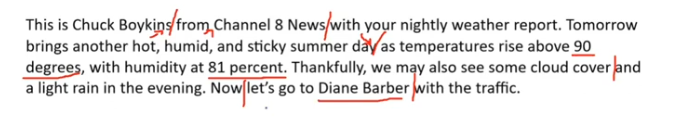

_Link https://www.youtube.com/watch?v=h1Csm0tbbsw&list=PLiqLRyAoFR0CsjN4rtojrmqWYeQCyLJSH&index=6_

## Question 1

This is Chuck Boykins from Channel 8 News with your nightly weather report. Tomorrow brings another hot, humid, and sticky summer day as temperatures rise above 90 degrees, with humidity at 81 percent. Thankfully, we may also see some cloud cover and a light rain in the evening. Now, let's go to Diane Barber with the traffic.

## Question 2

## Question 3

> construction site - several persons
>
> safety clothes - safety helmet
>
> middle, man - bending forward - a tool - spread cement around, standing - looking
>
> right, man -tool - spread cement
>
> some/ a piece of heavy equipment/ a heavy vehicle
>
> busy

## Question 4

> office - 2 persons
>
> middle, a woman - sitting at a table - using her laptop - smiling - a blue shift
>
> next, bending forward (resting his arm on the table), looking at the laptop screen - a beard
>
> a sewing machine, thread reels, pens documents, fabric, mannequin
>
> busy

This is a picture taken in a office. There are two persons in the picture.

## Question 5

Imagine that a pet magazine is preparing an article. You have agreed to participate in a telephone interview about having pets.

Do most people have pets where you live? What types of pets are popular?

Yes, they do. Most people have/ raise/ adopt a cat where I live. My parent love cat very much.

## Question 6

If you wanted to get a pet, where would you go to get one?

> pet store - convenient
>
> animal shelter - poor pet
>
> animals that need a home
>
> adopting pets ... is better

If I wanted to get a pet, I would go to animal shelter. Because it has many poor pets that need a home there.

## Question 7

What are some disadvantages of having pets?

> take up a lot of time
>
> feed them, take care of them
>
> play with them
>
> take them to the vet when they have sick
>
> clean their litter box
>
> affect out mood: can't live as long as us, leave the world before us, sad and down since our fur friend is not with us anymore.

## Question 8

When was the first performance of this fall take place? How much are the tickets?

The first performance of this fall will takt place on September 1st and the tickets are 30 dollars.

## Question 9

I heard that there is

## Question 10

## Question 11

When you are looking for work, what are the advantages of finding information about jobs online?

Use specific ideas examples to support your opinion.

> Convenient: compared to the past
